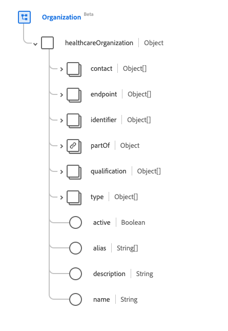
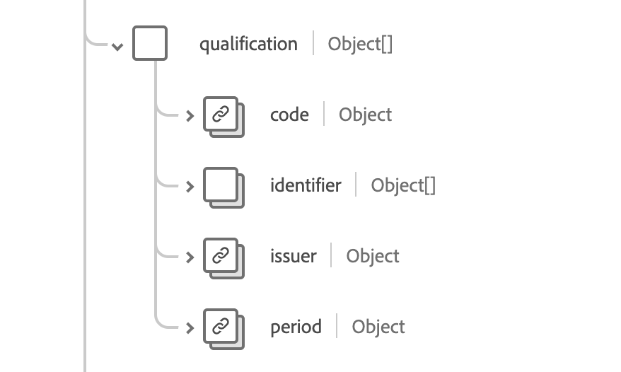

# [!UICONTROL Organization] schema field group

[!UICONTROL Organization] is a standard schema field group for the [[!DNL XDM Individual Profile] class](../../../classes/individual-profile.md) and the [[!DNL Provider class]](../../../classes/provider.md). It provides a single object-type field `healthcareOrganization` which is contains information regarding groupings of people or organizations with a common purpose.

| Display Name | Property | Data type | Description |
| ---| --- | --- | --- |
| [!UICONTROL Contact Details] | `contact` | Array of [[!UICONTROL Extended Contact Details]](../data-types/extended-contact-detail.md) | The contact details of communication devices available for the specific organization. This can include addresses, phone numbers, fax numbers, mobile numbers, email addresses, and websites. |
| [!UICONTROL End Point] | `endpoint`| Array of [[!UICONTROL Reference]](../data-types/reference.md) | Technical endpoints providing access to services operated for the organization. |
| [!UICONTROL Identifier] | `indentifier` | Array of [[!UICONTROL Identifier]](../data-types/identifier.md) | The identifier used to identify the organization across multiple disparate systems. |
| [!UICONTROL Part Of Organization] | `partOf` | [[!UICONTROL Reference]](../data-types/reference.md) | The organization this organization is part of. |
| [!UICONTROL Qualification] | `qualification` | Array of objects | The official certifications, accreditations, training, designations, and licenses that authorize and/or otherwise endorse the provision of care by the organization. See the [section below](#qualification) for more information. |
| [!UICONTROL Type] | `type` | Array of [[!UICONTROL Codeable Concept]](../data-types/codeable-concept.md) | The kind of organization it is. |
| [!UICONTROL Active] | `active` | Boolean | Whether the organization's record is still in active use. |
| [!UICONTROL Alias] | `alias` | Array of strings | A list of alternate names that the organization is known as, or was known as in the past. |
| [!UICONTROL Description] | `description` | String | The description of the organization which helps provide general context to ensure the correct organization is selected. |
| [!UICONTROL Name] | `name` | String | The name associated with the organization. |

For more details on the field group, refer to the public XDM repository:

* [Populated example](https://github.com/adobe/xdm/blob/master/extensions/industry/healthcare/fhir/fieldgroups/coverage.example.1.json)
* [Full schema](https://github.com/adobe/xdm/blob/master/extensions/industry/healthcare/fhir/fieldgroups/coverage.schema.json)

## `qualification` {#qualification}

`qualification` is provided as an array of objects. The structure of each object is described below.

| Display Name |Property | Data type | Description |
| --- | --- | --- | --- |
| [!UICONTROL Code] | `code` | [[!UICONTROL Codeable Concept]](../data-types/codeable-concept.md) | Coded representation of the qualification. |
| [!UICONTROL Identifier] | `identifier`| Array of [[!UICONTROL Identifier]](../data-types/identifier.md) | An identifier allocated to this qualification for this organization. |
| [!UICONTROL Issuer] | `issuer` | [[!UICONTROL Reference]](../data-types/reference.md) | Organization that regulates and issues the qualification. |
| [!UICONTROL Period] | `period`| [[!UICONTROL Period]](../data-types/period.md) | Period during which the qualification is valid. |
