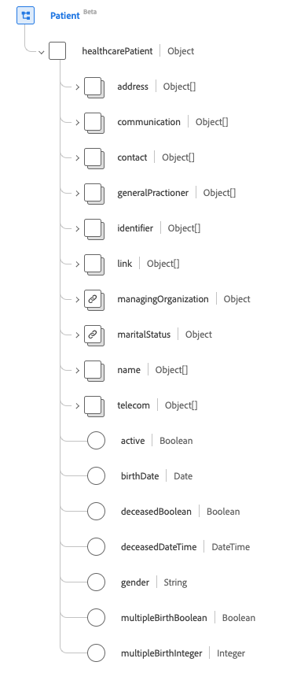
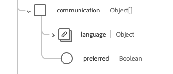
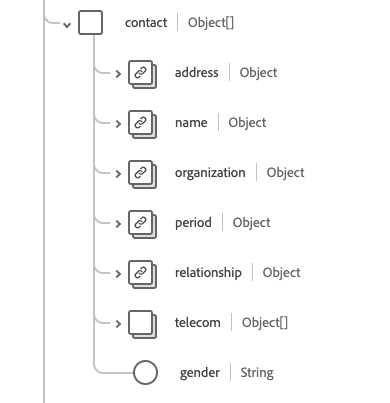
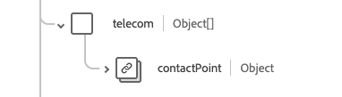
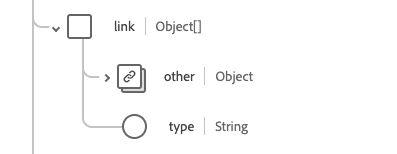

# [!UICONTROL Patient] schema field group

[!UICONTROL Patient] is a standard schema field group for the [[!DNL XDM Individual Profile] class](../../../classes/individual-profile.md). It provides a single object-type field `healthcarePatient` which captures the demographics and other administrative details about an individual or animal receiving care or other health-related services.

| Display Name | Property | Data type | Description |
| --- | --- | --- | --- |
| [!UICONTROL Address] | `address` | Array of [[!UICONTROL Address]](../data-types/address.md) | The address information for the patient. |
| [!UICONTROL Communication] | `communication`| Array of objects | A language which may be used to communicate with the patient about their health. See the [section below](#communication) for more information. |
| [!UICONTROL Patient Contacts]| `contact` | Array of objects | A patient's contact party, such as a guardian, partner, or friend. See the [section below](#contact) for more information. |
| [!UICONTROL General Practitioner] | `generalPractioner` | Array of [[!UICONTROL Reference]](../data-types/reference.md) | The patient's primary care provider. |
| [!UICONTROL Identifier] | `identifier` | Array of [[!UICONTROL Identifier]](../data-types/identifier.md) | An identifier for the patient. |
| [!UICONTROL Patient Link Details] | `link` | Array of objects | A link to a patient or related person's resource that concerns the same individual. See the [section below](#link) for more information. |
| [!UICONTROL Managing Organization] | `managingOrganization` | [[!UICONTROL Reference]](../data-types/reference.md) | The custodial organization of the patient's record. |
| [!UICONTROL Marital Status] | `maritalStatus` | [[!UICONTROL Codeable Concept]](../data-types/codeable-concept.md) | The marital status of the patient. |
| [!UICONTROL Name] | `name` | Array of [[!UICONTROL Human name]](../data-types/human-name.md) | The name associated with the patient. |
| [!UICONTROL Contact Details] | `telecom` | Array of [[!UICONTROL Contact Point]](../data-types/contact-point.md) | A contact detail, such as a telephone number or email address, by which the patient may be contacted. |
| [!UICONTROL Is Active] | `active` | Boolean | Indicates whether the patient's record is in active use. |
| [!UICONTROL Birth Date] | `birthDate` | Date | The date of birth for the patient. |
| [!UICONTROL Deceased Indicator] | `deceasedBoolean` | Boolean | Indicates if the patient is deceased or not. |
| [!UICONTROL Deceased Date Time] | `deceasedDateTime` | DateTime | The date and time of the patient's death. |
| [!UICONTROL Gender] | `gender` | String | The gender identity of the person. The value of this property must be equal to one of the following known enum values. <li> `female` </li> <li> `male` </li> <li> `other` </li> <li> `unknown`</li> |
| [!UICONTROL Is Part Of Multiple Birth] | `multipleBirthBoolean` | Boolean | Indicates if the patient is part of a multiple birth. |
| [!UICONTROL Birth Number] | `multipleBirthInteger` | Integer | The birth number in the sequence. |

For more details on the field group, refer to the public XDM repository:

* [Populated example](https://github.com/adobe/xdm/blob/master/extensions/industry/healthcare/fhir/fieldgroups/patient.example.1.json)
* [Full schema](https://github.com/adobe/xdm/blob/master/extensions/industry/healthcare/fhir/fieldgroups/patient.schema.json)

## `communication` {#communication}

`communication` is provided as an array of objects. The structure of each object is described below.

| Display Name | Property | Data type | Description |
| --- | --- | --- | --- |
| [!UICONTROL Language] | `language` | [[!UICONTROL Codeable Concept]](../data-types/codeable-concept.md) | The language which can be used to communicate with the person about their health. |
| [!UICONTROL Is Preferred Language] | `preferred`| Boolean | Indicates if the language is their preferred language or not. |

## `contact` {#contact}

`contact` is provided as an array of objects. The structure of each object is described below.

| Display Name | Property | Data type | Description |
| --- | --- | --- | --- |
| [!UICONTROL Contact Address] | `address` | [[!UICONTROL Address]](../data-types/address.md) | The address of the contact person. |
| [!UICONTROL Contact Name] | `name`| [[!UICONTROL Human Name]](../data-types/human-name.md) | The name of the contact person. |
| [!UICONTROL Contact Organization] | `organization` | [[!UICONTROL Reference]](../data-types/reference.md) | The organization that is associated with the contact person. |
| [!UICONTROL Contact Period] | `period`| [[!UICONTROL Period]](../data-types/period.md) | The time period when the contact was or is in use. |
| [!UICONTROL Relationship'] | `relationship` | [[!UICONTROL Codeable Concept]](../data-types/codeable-concept.md) | The relationship between the patient and the contact person. |
| [!UICONTROL Contact Details] | `telecom`| Array of objects | The contact details for the contact person. See the [section below](#telecom) for more information. |
| [!UICONTROL Gender] | `gender` | String | The gender identity of the person. The value of this property must be equal to one of the following known enum values. <li> `female` </li> <li> `male` </li> <li> `other` </li> <li> `unknown`</li> |

### `telecom` {#telecom}

`telecom` is provided as an array of objects. The structure of each object is described below.

| Display Name | Property | Data type | Description |
| --- | --- | --- | --- |
| [!UICONTROL Contact Point] | `contactPoint` | [[!UICONTROL Contact point]](../data-types/contact-point.md) | The contact details for the person. |

## `link` {#link}

`link` is provided as an array of objects. The structure of each object is described below.

| Display Name | Property | Data type | Description |
| --- | --- | --- | --- |
| [!UICONTROL Other] | `other` | [[!UICONTROL Reference]](../data-types/reference.md) | A link to a patient or related person's resource that concerns the same individual. |
| [!UICONTROL Type] | `type` | String | The type of link between the two patient resources. |
