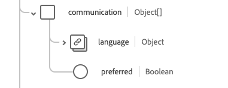

# [!UICONTROL Practioner] schema field group

[!UICONTROL Practioner] is a standard schema field group for the [[!DNL XDM Individual Profile] class](../../../classes/individual-profile.md) and the [[!DNL Provider class]](../../../classes/provider.md). It provides a single object-type field `healthcarePractioner` which is contains information about a person who is directly or indirectly involved in the provisioning of healthcare or related services.

| Display Name | Property | Data type | Description |
| --- | --- | --- | --- |
| [!UICONTROL Address] | `address` | Array of [[!UICONTROL Address]](../data-types/address.md) | Address(es) of the practioner that are beyond their place of work, such as a home address. |
| [!UICONTROL Communication] | `communication`| Array of object | A language which may be used to communicate with the practitioner. See the [section below](#communication) for more information |
| [!UICONTROL Identifier] | `identifier` | Array of [[!UICONTROL Identifier]](../data-types/identifier.md) | An identifier that applies to this person in this role. |
| [!UICONTROL Name] | `name` | Array of [[!UICONTROL Human Name]](../data-types/human-name.md) | The name(s) associated with the practitioner. |
| [!UICONTROL Qualification] | `qualification` | Array of object | The official qualifications, certifications, accreditations, training, licenses, or similar that authorize or otherwise pertain to the provision of care by the practitioner. See the [section below](#qualification) for more information. |
| [!UICONTROL Contact Details] | `telecom` | Array of [[!UICONTROL Contact Point]](../data-types/contact-point.md) | The contact details for the practitioner. |
| [!UICONTROL Active] | `active` | Boolean | Indiciates whether the practitioners record is in active use. |
| [!UICONTROL Birth Date] | `birthDate` | Date | The date of birth of the practitioner. |
| [!UICONTROL Deceased Indicator] | `deceasedBoolean` | Boolean | Indicates if the practitioner is deceased. |
| [!UICONTROL Deceased Date Time] | `deceasedDateTime` | DateTime | The date and time of the practitioner's death. |
| [!UICONTROL Gender] | `gender` | String | The gender identity of the person. The value of this property must be equal to one of the following known enum values. <li> `female` </li> <li> `male` </li> <li> `other` </li> <li> `unknown`</li> |

For more details on the field group, refer to the public XDM repository:

* [Populated example](https://github.com/adobe/xdm/blob/master/extensions/industry/healthcare/fhir/fieldgroups/practitioner.example.1.json)
* [Full schema](https://github.com/adobe/xdm/blob/master/extensions/industry/healthcare/fhir/fieldgroups/practitioner.schema.json)

## `communication` {#communication}

`communication` is provided as an array of objects. The structure of each object is described below.

| Display Name | Property | Data type | Description |
| --- | --- | --- | --- |
| [!UICONTROL Language] | `language` | [[!UICONTROL Codeable Concept]](../data-types/codeable-concept.md) | The language which can be used to communicate with the person about their health. |
| [!UICONTROL Is Preferred Language] | `preferred`| Boolean | Indicates if the language is their preferred language or not. |

## `qualification` {#qualification}

`qualification` is provided as an array of objects. The structure of each object is described below.

| Display Name | Property | Data type | Description |
| --- | --- | --- | --- |
| [!UICONTROL Code] | `code` | [[!UICONTROL Codeable Concept]](../data-types/codeable-concept.md) | The coded representation of the qualification. |
| [!UICONTROL Identifier] | `identifier`| Array of [[!UICONTROL Identifier]](../data-types/identifier.md) | An identifier for the qualification. |
| [!UICONTROL Issuer] | `issuer`| [[!UICONTROL Reference]](../data-types/reference.md) | The organization that regulates and issues the qualification. |
| [!UICONTROL Period] | `period`| [[!UICONTROL Period]](../data-types/period.md) | The period during which the qualification is valid. |
