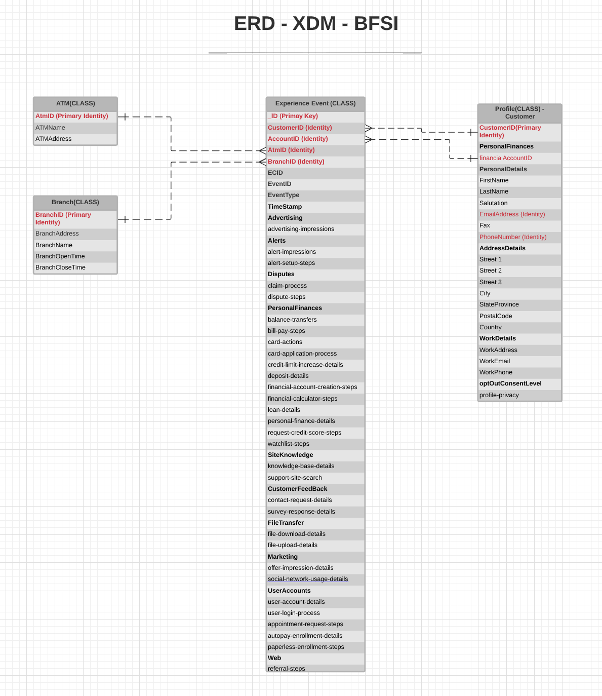

# [!UICONTROL Financial services] industry data model ERD

The following entity relationship diagram (ERD) represents a standardized data model for the banking, financial services, and insurance (BFSI) industry. The ERD is intentionally presented in a de-normalized fashion and with consideration for how data is stored in Adobe Experience Platform.

>[!NOTE]
>
>The ERD as described is a recommendation for how you should model your data for this industry use case. To make use of this data model in Platform, you must construct the recommended schemas and their relationships yourself. See the guides on managing [schemas](../../ui/resources/schemas.md) and [relationships](../../tutorials/relationship-ui.md) in the UI for more information.

Use the following legend to interpret this ERD:

* Each entity shown in is based on an underlying [Experience Data Model (XDM) class](../composition.md#class).
* For a given entity, each row marked in **bold** represents a field group or a data type, with the relevant fields it provides listed below in unbolded text.
* The most important fields for a given entity are highlighted in red.
* All the properties that could be used to identify individual customers are marked as "identity", with one of these properties marked as a "primary identity".
* Entity relationships are marked as non-dependent, since cookie-based events often cannot determine the person or individual who did the transaction.

>[!NOTE]
>
>The Experience Event entity includes an "_ID" field, which represents the unique identifier (`_id`) attribute provided by the XDM ExperienceEvent class. See the reference document on [XDM ExperienceEvent](../../classes/experienceevent.md) for more details on what is expected for this value.

## [!UICONTROL Financial services] use cases

The following table outlines the recommended classes and schema field groups for several common financial use cases.

| Use case | Recommended classes and field groups |
| --- | --- |
| Drive personalization at scale for preferred segments through omnichannel reporting insights and automating journeys to increase enrollment to a preferred rewards program. | <ul><li>**[[!UICONTROL Product]](../../classes/product.md)**:<ul><li>[[!UICONTROL Product Category]](../../field-groups/product/product-category.md)</li></ul></li><li>**[[!UICONTROL XDM ExperienceEvent]](../../classes/experienceevent.md)**:<ul><li>[[!UICONTROL Card Actions]](../../field-groups/event/card-actions.md)</li><li>[[!UICONTROL Quote Request Details]](../../field-groups/event/quote-request-details.md)</li><li>[[!UICONTROL Deposit Details]](../../field-groups/event/deposit-details.md)</li><li>[[!UICONTROL Channel Details]](../../field-groups/event/channel-details.md)</li><li>[[!UICONTROL Balance Transfers]](../../field-groups/event/balance-transfers.md)</li></ul></li><li>**[[!UICONTROL XDM Individual Profile]](../../classes/individual-profile.md)**:<ul><li>[[!UICONTROL Demographic Details]](../../field-groups/profile/demographic-details.md)</li><li>[[!UICONTROL Personal Contact Details]](../../field-groups/profile/personal-contact-details.md)</li><li>[[!UICONTROL Loyalty Details]](../../field-groups/profile/loyalty-details.md)</li></ul></li></ul> |
| Optimize cross-channel personalization across online and offline channels. | <ul><li>**[[!UICONTROL Product]](../../classes/product.md)**:<ul><li>[[!UICONTROL Product Category]](../../field-groups/product/product-category.md)</li></ul></li><li>**[[!UICONTROL XDM ExperienceEvent]](../../classes/experienceevent.md)**:<ul><li>[[!UICONTROL Channel Details]](../../field-groups/event/channel-details.md)</li></ul></li><li>**[[!UICONTROL XDM Individual Profile]](../../classes/individual-profile.md)**:<ul><li>[[!UICONTROL Demographic Details]](../../field-groups/profile/demographic-details.md)</li><li>[[!UICONTROL Personal Contact Details]](../../field-groups/profile/personal-contact-details.md)</li><li>[[!UICONTROL Loyalty Details]](../../field-groups/profile/loyalty-details.md)</li></ul></li></ul> |
| Drive new revenue opportunities by using insights gained from cross-channel behavior analysis, identifying patterns of product usage that could lead to new product offers. | <ul><li>**[[!UICONTROL Policy]](../../classes/policy.md)**</li><li>**[[!UICONTROL Product]](../../classes/product.md)**:<ul><li>[[!UICONTROL Product Category]](../../field-groups/product/product-category.md)</li></ul></li><li>**[[!UICONTROL XDM ExperienceEvent]](../../classes/experienceevent.md)**:<ul><li>[[!UICONTROL Card Actions]](../../field-groups/event/card-actions.md)</li><li>[[!UICONTROL Support Site Search]](../../field-groups/event/support-site-search.md)</li><li>[[!UICONTROL Deposit Details]](../../field-groups/event/deposit-details.md)</li><li>[[!UICONTROL Channel Details]](../../field-groups/event/channel-details.md)</li></ul></li><li>**[[!UICONTROL XDM Individual Profile]](../../classes/individual-profile.md)**:<ul><li>[[!UICONTROL Demographic Details]](../../field-groups/profile/demographic-details.md)</li><li>[[!UICONTROL Personal Contact Details]](../../field-groups/profile/personal-contact-details.md)</li><li>[[!UICONTROL Loyalty Details]](../../field-groups/profile/loyalty-details.md)</li></ul></li></ul> |
