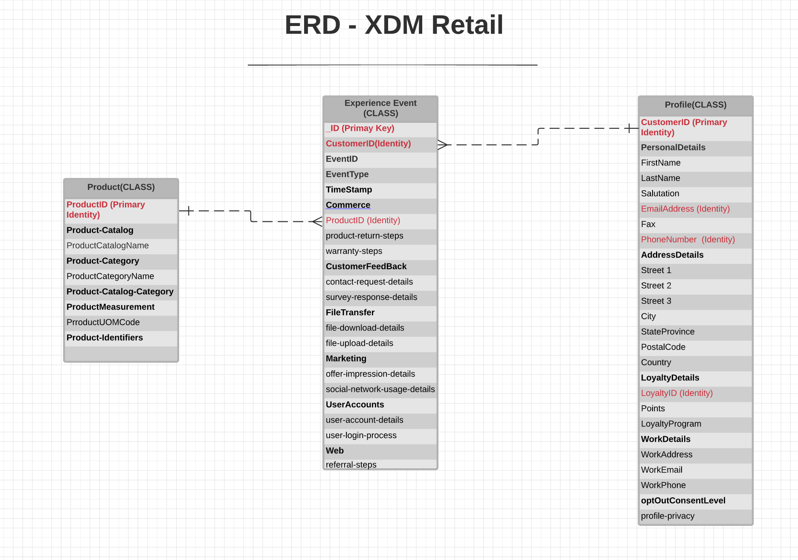

# [!UICONTROL Retail] industry data model

The following entity relationship diagram (ERD) represents a standardized data model for the retail industry. The ERD is intentionally presented in a de-normalized fashion and with consideration for how data is stored in Adobe Experience Platform.

>[!NOTE]
>
>The ERD as described is a recommendation for how you should model your data for this industry use case. To make use of this data model in Platform, you must construct the recommended schemas and their relationships yourself. See the guides on managing [schemas](../../ui/resources/schemas.md) and [relationships](../../tutorials/relationship-ui.md) in the UI for more information.

Use the following legend to interpret this ERD:

* Each entity shown in is based on an underlying [Experience Data Model (XDM) class](../composition.md#class).
* For a given entity, each row marked in **bold** represents a field group or a data type, with the relevant fields it provides listed below in unbolded text.
* The most important fields for a given entity are highlighted in red.
* All the properties that could be used to identify individual customers are marked as "identity", with one of these properties marked as a "primary identity".
* Entity relationships are marked as non-dependent, since cookie-based events often cannot determine the person or individual who did the transaction.

>[!NOTE]
>
>The Experience Event entity includes an "_ID" field, which represents the unique identifier (`_id`) attribute provided by the XDM ExperienceEvent class. See the reference document on [XDM ExperienceEvent](../../classes/experienceevent.md) for more details on what is expected for this value.

## [!UICONTROL Retail] use cases

The following table outlines the recommended classes and schema field groups for several common retail use cases.

| Use case | Recommended classes and field groups |
| --- | --- |
| Combine online and offline data sources and resolve cross-device and online/offline identity to provide holistic cross-channel and cross device attribution reporting. | <ul><li>**[XDM ExperienceEvent](../../classes/experienceevent.md)**:<ul><li>[Commerce Details](../../field-groups/event/commerce-details.md)</li><li>[Web Details](../../field-groups/event/web-details.md)</li></ul></li><li>**[Product](../../classes/product.md)**:<ul><li>[Product Catalog](../../field-groups/product/product-catalog.md)</li><li>[Product Category](../../field-groups/product/product-category.md)</li></ul></li></ul> |
| Provide targeted and personalized experiences for various segments to increase revenue and help augment the platform in omnichannel orchestration. | <ul><li>**[XDM ExperienceEvent](../../classes/experienceevent.md)**:<ul><li>[Campaign Marketing Details](../../field-groups/event/campaign-marketing-details.md)</li><li>[Channel Details](../../field-groups/event/channel-details.md)</li><li>[Commerce Details](../../field-groups/event/commerce-details.md)</li><li>[Environment Details](../../field-groups/event/environment-details.md)</li><li>[Web Details](../../field-groups/event/web-details.md)</li></ul></li><li>**[XDM Individual Profile](../../classes/individual-profile.md)**:<ul><li>[Demographic Details](../../field-groups/profile/demographic-details.md)</li><li>[Personal Contact Details](../../field-groups/profile/personal-contact-details.md)</li><li>[Work Contact Details](../../field-groups/profile/work-contact-details.md)</li></ul></li></ul> |
| Analyze multi-touch attribution to improve marketing efficiency. | <ul><li>**[XDM ExperienceEvent](../../classes/experienceevent.md)**:<ul><li>[Campaign Marketing Details](../../field-groups/event/campaign-marketing-details.md)</li><li>[Channel Details](../../field-groups/event/channel-details.md)</li><li>[Commerce Details](../../field-groups/event/commerce-details.md)</li></ul></li><li>**[XDM Individual Profile](../../classes/individual-profile.md)**:<ul><li>[Demographic Details](../../field-groups/profile/demographic-details.md)</li></ul></li></ul> |
| Improve email relevance through improved men & women's segmentation. | <ul><li>**[XDM ExperienceEvent](../../classes/experienceevent.md)**:<ul><li>[Commerce Details](../../field-groups/event/commerce-details.md)</li></ul></li><li>**[XDM Individual Profile](../../classes/individual-profile.md)**:<ul><li>[Demographic Details](../../field-groups/profile/demographic-details.md)</li></ul></li><li>**[Product](../../classes/product.md)**:<ul><li>[Product Catalog](../../field-groups/product/product-catalog.md)</li><li>[Product Category](../../field-groups/product/product-category.md)</li></ul></li></ul> |
| Ingest loyalty (partner) data to increase relevant product information across web, email, and digital marketing channels. | <ul><li>**[XDM ExperienceEvent](../../classes/experienceevent.md)**:<ul><li>[Web Details](../../field-groups/event/web-details.md)</li></ul></li><li>**[XDM Individual Profile](../../classes/individual-profile.md)**:<ul><li>[Demographic Details](../../field-groups/profile/demographic-details.md)</li><li>[Loyalty Details](../../field-groups/profile/loyalty-details.md)</li></ul></li><li>**[Product](../../classes/product.md)**:<ul><li>[Product Catalog](../../field-groups/product/product-catalog.md)</li><li>[Product Category](../../field-groups/product/product-category.md)</li></ul></li></ul> |
| Retarget cart abandoners through automated and personalized emails. | <ul><li>**[XDM ExperienceEvent](../../classes/experienceevent.md)**:<ul><li>[Commerce Details](../../field-groups/event/commerce-details.md)</li><li>[Web Details](../../field-groups/event/web-details.md)</li></ul></li><li>**[Product](../../classes/product.md)**:<ul><li>[Product Catalog](../../field-groups/product/product-catalog.md)</li><li>[Product Category](../../field-groups/product/product-category.md)</li></ul></li></ul> |

{style="table-layout:auto"}
