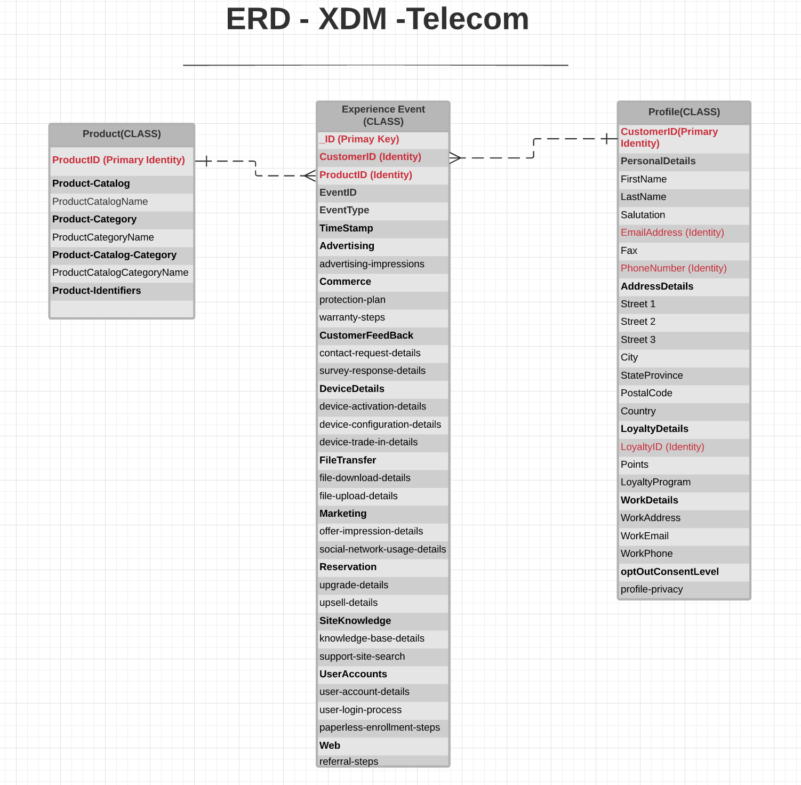

# [!UICONTROL Telecommunications] industry data model ERD

The following entity relationship diagram (ERD) represents a standardized data model for the telecom industry. The ERD is intentionally presented in a de-normalized fashion and with consideration for how data is stored in Adobe Experience Platform.

>[!NOTE]
>
>The ERD as described is a recommendation for how you should model your data for this industry use case. To make use of this data model in Platform, you must construct the recommended schemas and their relationships yourself. See the guides on managing [schemas](../../ui/resources/schemas.md) and [relationships](../../tutorials/relationship-ui.md) in the UI for more information.

Use the following legend to interpret this ERD:

* Each entity shown in is based on an underlying [Experience Data Model (XDM) class](../composition.md#class).
* For a given entity, each row marked in **bold** represents a field group or a data type, with the relevant fields it provides listed below in unbolded text.
* The most important fields for a given entity are highlighted in red.
* All the properties that could be used to identify individual customers are marked as "identity", with one of these properties marked as a "primary identity".
* Entity relationships are marked as non-dependent, since cookie-based events often cannot determine the person or individual who did the transaction.

>[!NOTE]
>
>The Experience Event entity includes an "_ID" field, which represents the unique identifier (`_id`) attribute provided by the XDM ExperienceEvent class. See the reference document on [XDM ExperienceEvent](../../classes/experienceevent.md) for more details on what is expected for this value.

## [!UICONTROL Telecommunications] use cases

The following table outlines the recommended classes and schema field groups for several common use cases for the telecom industry.

| Use case | Recommended classes and field groups |
| --- | --- |
| Understand customers who are good candidates for upsell or cross-sell opportunities based on their current holdings and their browsing behavior. | <ul><li>**[XDM ExperienceEvent](../../classes/experienceevent.md)**:<ul><li>[[!UICONTROL Upsell Details]](../../field-groups/event/upsell-details.md)</li><li>[[!UICONTROL Upgrade Details]](../../field-groups/event/upgrade-details.md)</li></ul></li><li>**[[!UICONTROL XDM Individual Profile]](../../classes/individual-profile.md)**:<ul><li>[[!UICONTROL Telecom Subscription]](../../field-groups/profile/telecom-subscription.md)</li><li>[[!UICONTROL Demographic Details]](../../field-groups/profile/demographic-details.md)</li><li>[[!UICONTROL Personal Contact Details]](../../field-groups/profile/personal-contact-details.md)</li></ul></li></ul> |
| Retarget cart abandoners through relevant ads and automated personalized emails. Suppress ads when they convert. | <ul><li>**[XDM ExperienceEvent](../../classes/experienceevent.md)**:<ul><li>[[!UICONTROL Commerce Details]](../../field-groups/event/upsell-details.md) (To capture cart abandons)</li></ul></li><li>**[[!UICONTROL XDM Individual Profile]](../../classes/individual-profile.md)**:<ul><li>[[!UICONTROL Telecom Subscription]](../../field-groups/profile/telecom-subscription.md)</li><li>[[!UICONTROL Demographic Details]](../../field-groups/profile/demographic-details.md)</li><li>[[!UICONTROL Personal Contact Details]](../../field-groups/profile/personal-contact-details.md)</li></ul></li></ul> |
| When a customer is marked as likely to churn (based on an employee interaction or an automated machine-learning algorithm), send the customer details to digital and non-digital channels. | <ul><li>**[XDM ExperienceEvent](../../classes/experienceevent.md)**:<ul><li>[[!UICONTROL Campaign Marketing Details]](../../field-groups/event/campaign-marketing-details.md)</li><li>[[!UICONTROL Channel Details]](../../field-groups/event/channel-details.md)</li><li>A custom field group containing personalized content</li></ul></li><li>**[[!UICONTROL XDM Individual Profile]](../../classes/individual-profile.md)**:<ul><li>[[!UICONTROL Demographic Details]](../../field-groups/profile/demographic-details.md)</li><li>[[!UICONTROL Personal Contact Details]](../../field-groups/profile/personal-contact-details.md)</li></ul></li></ul> |

{style="table-layout:auto"}
