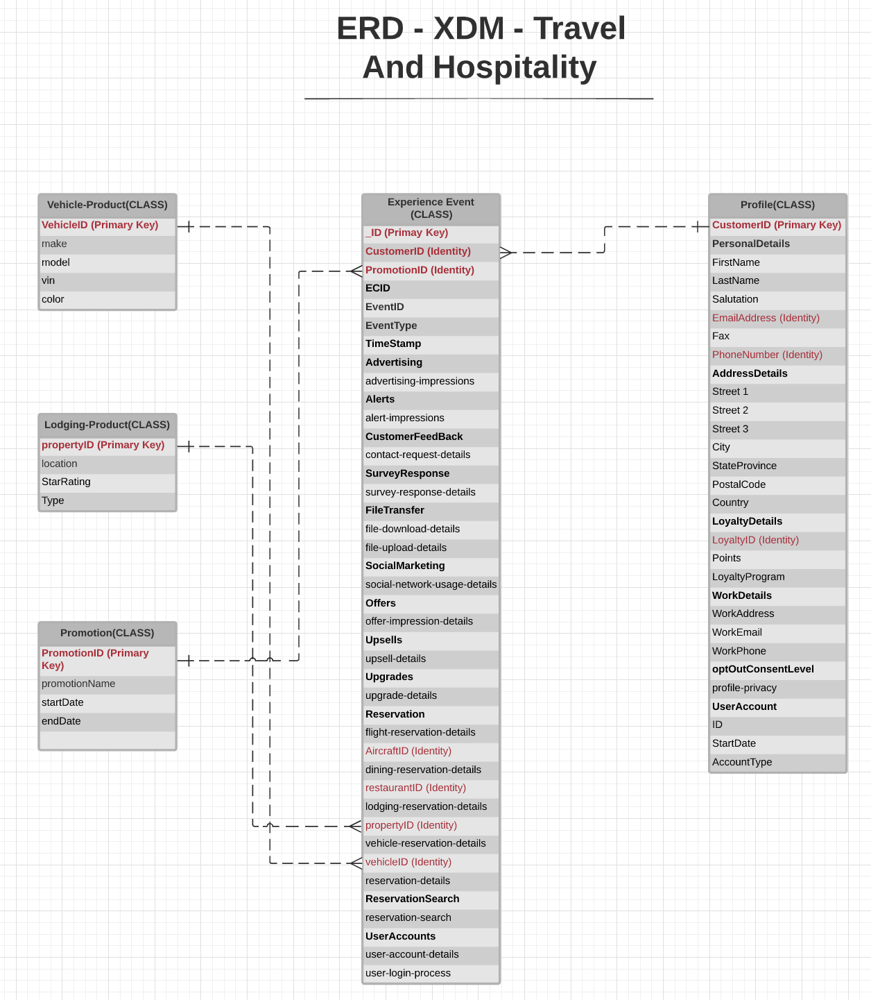

# [!UICONTROL Travel and hospitality] industry data model ERD

The following entity relationship diagram (ERD) represents a standardized data model for the travel and hospitality industry. The ERD is intentionally presented in a de-normalized fashion and with consideration for how data is stored in Adobe Experience Platform.

>[!NOTE]
>
>The ERD as described is a recommendation for how you should model your data for this industry use case. To make use of this data model in Platform, you must construct the recommended schemas and their relationships yourself. See the guides on managing [schemas](../../ui/resources/schemas.md) and [relationships](../../tutorials/relationship-ui.md) in the UI for more information.

Use the following legend to interpret this ERD:

* Each entity shown in is based on an underlying [Experience Data Model (XDM) class](../composition.md#class).
* For a given entity, each row marked in **bold** represents a field group or a data type, with the relevant fields it provides listed below in unbolded text.
* The most important fields for a given entity are highlighted in red.
* All the properties that could be used to identify individual customers are marked as "identity", with one of these properties marked as a "primary identity".
* Entity relationships are marked as non-dependent, since cookie-based events often cannot determine the person or individual who did the transaction.

>[!NOTE]
>
>The Experience Event entity includes an "_ID" field, which represents the unique identifier (`_id`) attribute provided by the XDM ExperienceEvent class. See the reference document on [XDM ExperienceEvent](../../classes/experienceevent.md) for more details on what is expected for this value.

## [!UICONTROL Travel and hospitality] use cases

The following table outlines the recommended classes and schema field groups for several common use cases for the travel and hospitality industry.

| Use case | Recommended classes and field groups |
| --- | --- |
| Cross-sell dining and other resident attractions to in-market guests and guests with upcoming hotel reservations. | <ul><li>**[XDM ExperienceEvent](../../classes/experienceevent.md)**:<ul><li>[Reservation Details](../../field-groups/event/reservation-details.md)</li><li>[Lodging Reservation](../../field-groups/event/lodging-reservation.md)</li><li>[Dining Reservation](../../field-groups/event/dining-reservation.md)</li></ul></li><li>**[XDM Individual Profile](../../classes/individual-profile.md)**:<ul><li>[Demographic Details](../../field-groups/profile/demographic-details.md)</li><li>[Personal Contact Details](../../field-groups/profile/personal-contact-details.md)</li><li>[Work Contact Details](../../field-groups/profile/work-contact-details.md)</li></ul></li></ul> |
| Up-sell dining and other resident attractions to in-market guests and guests with upcoming hotel reservations. | <ul><li>**[XDM ExperienceEvent](../../classes/experienceevent.md)**:<ul><li>[Reservation Details](../../field-groups/event/reservation-details.md)</li><li>[Dining Reservation](../../field-groups/event/dining-reservation.md)</li></ul></li><li>**[XDM Individual Profile](../../classes/individual-profile.md)**:<ul><li>[Demographic Details](../../field-groups/profile/demographic-details.md)</li><li>[Personal Contact Details](../../field-groups/profile/personal-contact-details.md)</li><li>[Work Contact Details](../../field-groups/profile/work-contact-details.md)</li><li>[Loyalty Details](../../field-groups/profile/loyalty-details.md)</li></ul></li></ul> |
| Up-sell hotel and other resident attractions to in-market guests and guests with upcoming hotel reservations. | <ul><li>**[XDM ExperienceEvent](../../classes/experienceevent.md)**:<ul><li>[Reservation Details](../../field-groups/event/reservation-details.md)</li><li>[Lodging Reservation](../../field-groups/event/lodging-reservation.md)</li></ul></li><li>**[XDM Individual Profile](../../classes/individual-profile.md)**:<ul><li>[Demographic Details](../../field-groups/profile/demographic-details.md)</li><li>[Personal Contact Details](../../field-groups/profile/personal-contact-details.md)</li><li>[Work Contact Details](../../field-groups/profile/work-contact-details.md)</li><li>[Loyalty Details](../../field-groups/profile/loyalty-details.md)</li></ul></li></ul> |
| Up-sell flight and other resident attractions to in-market guests and guests with upcoming hotel reservations. | <ul><li>**[XDM ExperienceEvent](../../classes/experienceevent.md)**:<ul><li>[Reservation Details](../../field-groups/event/reservation-details.md)</li><li>[Flight Reservation](../../field-groups/event/flight-reservation.md)</li></ul></li><li>**[XDM Individual Profile](../../classes/individual-profile.md)**:<ul><li>[Demographic Details](../../field-groups/profile/demographic-details.md)</li><li>[Personal Contact Details](../../field-groups/profile/personal-contact-details.md)</li><li>[Work Contact Details](../../field-groups/profile/work-contact-details.md)</li><li>[Loyalty Details](../../field-groups/profile/loyalty-details.md)</li></ul></li></ul> |

{style="table-layout:auto"}
