# Create a schema using the [!DNL Schema Editor]

The [!DNL Schema Registry] provides a user interface and RESTful API from which you can view and manage all resources in the Adobe Experience Platform [!DNL Schema Library]. The [!DNL Schema Library] contains resources made available to you by Adobe, Experience Platform partners, and vendors whose applications you use, as well as resources that you define and save to the [!DNL Schema Registry].

This tutorial covers the steps for creating a schema using the Schema Editor within [!DNL Experience Platform]. If you would prefer to compose a schema using the Schema Registry API, please begin by reading the [Schema Registry developer guide](../api/getting-started.md) before attempting the tutorial [creating a schema using the API](create-schema-api.md).

This tutorial also includes steps to [define a new class](#create-new-class) that you could then use to compose a schema.

## Getting started

This tutorial requires a working understanding of the various aspects of Adobe Experience Platform involved in using the Schema Editor. Before beginning this tutorial, please review the documentation for the following concepts:

* [!DNL Experience Data Model (XDM)](../home.md): The standardized framework by which Platform organizes customer experience data.
* [Basics of schema composition](../schema/composition.md): An overview of XDM schemas and their building blocks, including classes, mixins, data types, and fields.
* [!DNL Real-time Customer Profile](../../profile/home.md): Provides a unified, real-time consumer profile based on aggregated data from multiple sources.

This tutorial requires you to have access to [!DNL Experience Platform]. If you do not have access to an IMS Organization in [!DNL Experience Platform], please speak to your system administrator before proceeding. 

## Browse existing schemas in the Schemas workspace {#browse}

The Schemas workspace within [!DNL Experience Platform] provides a visualization of the [!DNL Schema Library], allowing you to view and manage all of the schemas available to you, as well as compose new ones. The workspace also includes the Schema Editor, the canvas on which you will compose a schema throughout this tutorial.

After logging into [!DNL Experience Platform], click **[!UICONTROL Schemas]** in the left-hand navigation and you will be taken to the Schemas workspace. You will see a list of schemas (a representation of the [!DNL Schema Library]) where you can view, manage, and customize all schemas available to you. The list includes the name, type, class, and behavior (record or time-series) on which the schema is based, as well as the date and time the schema was last modified. 

Click the filter icon next to the Search bar to use filtering capabilities for all resources in the registry, including classes, mixins, and data types.

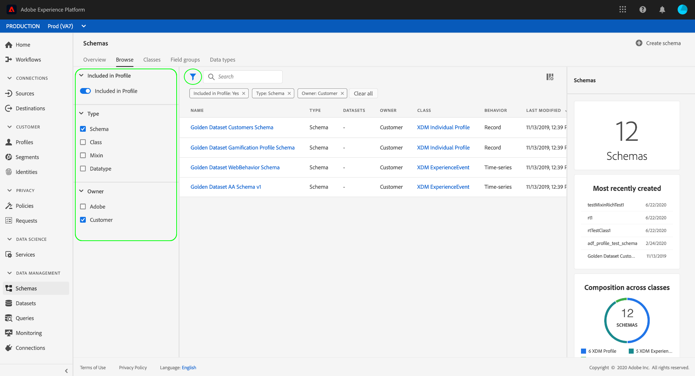

## Create and name a schema {#create}

To begin composing a schema, click **[!UICONTROL Create Schema]** in the top right corner of the Schemas workspace. 

The *Schema Editor* appears. This is the canvas upon which you will compose your schema. When you arrive at the editor, an "Untitled Schema" in the *Structure* section of the canvas is automatically created for you to begin customizing.

On the right-hand side of the editor are *Schema Properties* where you can provide a name for the schema (using the **[!UICONTROL Display Name]** field). Once a name is entered, the canvas updates to reflect the new name of the schema.

There are several important considerations to make when deciding on a name for your schema:

* Schema names should be short and descriptive so that the schema can be easily found in the library later. 
* Schema names must be unique, meaning it should also be specific enough that it will not be reused in the future. For example, if your organization had separate loyalty programs for different brands, it would be wise to name your schema "Brand A Loyalty Members" to make it easy to distinguish from other loyalty-related schemas you might define later.
* Optionally, you can provide additional information about the schema using the **[!UICONTROL Description]** field.

This tutorial composes a schema to ingest data related to the members of a loyalty program, therefore the schema is named "Loyalty Members".

## Assign a class {#class}

On the left-hand side of the editor is the *Composition* section. It currently contains two sub-sections: *[!UICONTROL Schema]* and *[!UICONTROL Class]*. 

Now that the schema has a name, it is time to assign the class that the schema will implement. Click **[!UICONTROL Assign]** next to *[!UICONTROL Class]*.

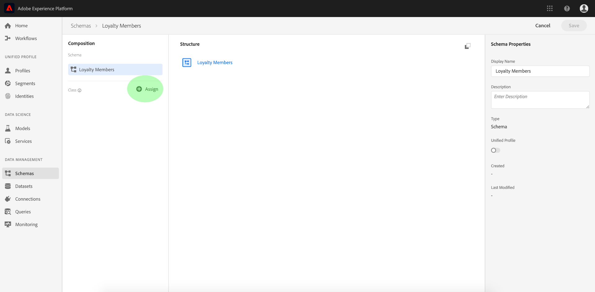

The *[!UICONTROL Assign Class]* dialog appears. This window displays a list of all available classes, including any defined by your organization (the owner being "Customer") as well as standard classes defined by Adobe. 

Click on the class name to display the description of the class. You can also choose to **[!UICONTROL Preview Class Structure]** to see the fields and metadata associated with the class.

This tutorial uses the [!DNL XDM Individual Profile] class. Click the radio button beside the class to select it, then click **[!UICONTROL Assign Class]**.

The canvas reappears. The *[!UICONTROL Class]* section now contains the class you selected ([!DNL XDM Individual Profile]) and the fields contributed by the [!DNL XDM Individual Profile] class are now visible within the *[!UICONTROL Structure]* section.

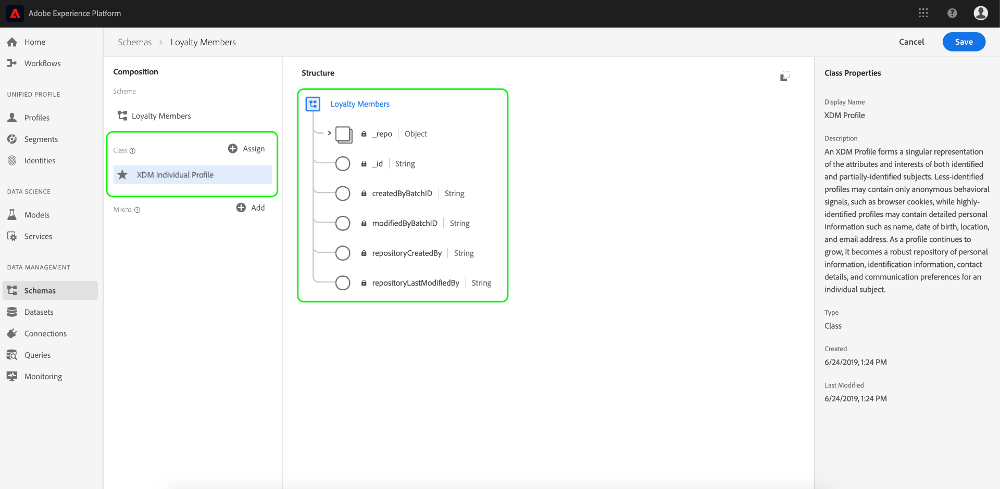

The fields appear in the format "fieldName | Data Type". Steps for defining schema fields in the UI are provided later in this tutorial.

>[!NOTE]
>
>You can [change the class of a schema](#change-class) at any point during the initial composition process before the schema has been saved, but this should be done with extreme caution. Mixins are only compatible with certain classes, therefore changing the class will reset the canvas and any fields you have added. 

## Add a mixin {#mixin}

Now that a class has been assigned, the *Composition* section contains a third sub-section: *[!UICONTROL Mixins]*. 

You can now begin to add fields to your schema by adding mixins. A mixin is a group of one or more fields that describe a particular concept. This tutorial uses mixins to describe the members of the loyalty program and capture key information such as name, birthday, phone number, address, and more.

To add a mixin, click **Add** in the *Mixins* sub-section.

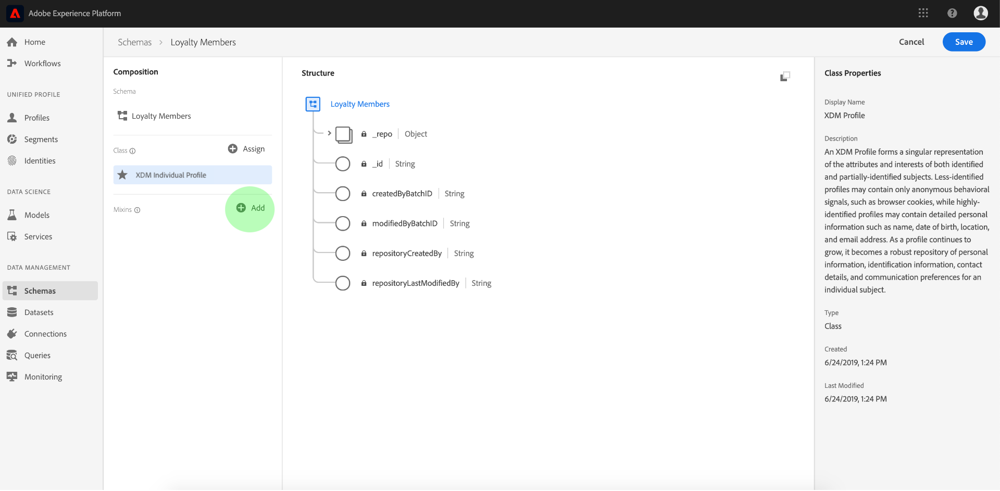

The *[!UICONTROL Add Mixin]* dialog appears. Mixins are only intended for use with specific classes, therefore the list of mixins shows only those compatible with the class you selected (in this case, the [!DNL XDM Individual Profile] class).

Selecting the radio button next to a mixin will give you the option to **[!UICONTROL Preview Mixin Structure]**. Select the "Profile Person Details" mixin, then click **[!UICONTROL Add Mixin]**.

The schema canvas reappears. The *[!UICONTROL Mixins]* section now lists the "[!UICONTROL Profile Person Details]" mixin and the *[!UICONTROL Structure]* section includes the fields contributed by the mixin. 

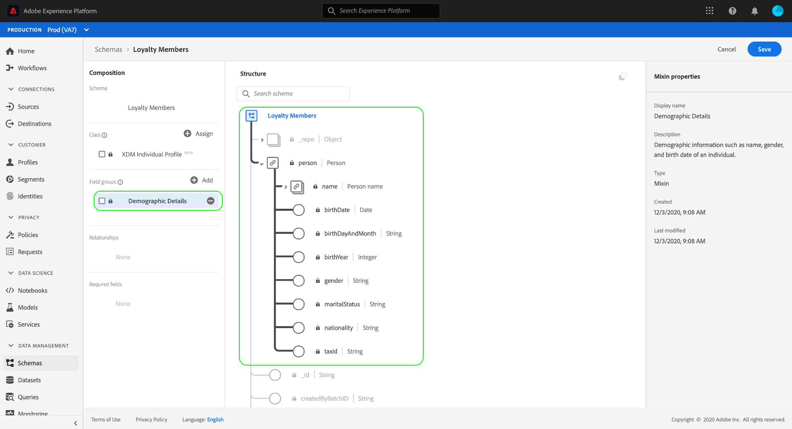

This mixin contributes several fields under the top-level name "person" with the data type "Person". This group of fields describes information about an individual, including name, birth date, and gender. 

>[!NOTE]
>
>Remember that fields may use scalar types (such as string, integer, array, or date) as their data type, as well as any "data type" (a group of fields representing a common concept) in the [!DNL Schema Registry]. 

Notice that the "[!UICONTROL name]" field has a data type of "[!UICONTROL Person Name]", meaning it too describes a common concept and contains name-related sub-fields such as first name, last name, and full name.

Click on different fields within the canvas to see any additional fields they contribute to the schema structure.

## Add another mixin {#mixin-2}

You can now repeat the same steps to add another mixin. When you view the *[!UICONTROL Add Mixin]* dialog this time, notice that the "[!UICONTROL Profile Person Details]" mixin has been greyed out and the radio button next to it cannot be selected. This prevents you from accidentally duplicating mixins that you have already included in the current schema.

You can now add the "[!DNL Profile Personal Details" mixin] from the *[!UICONTROL Add Mixin]* dialog.

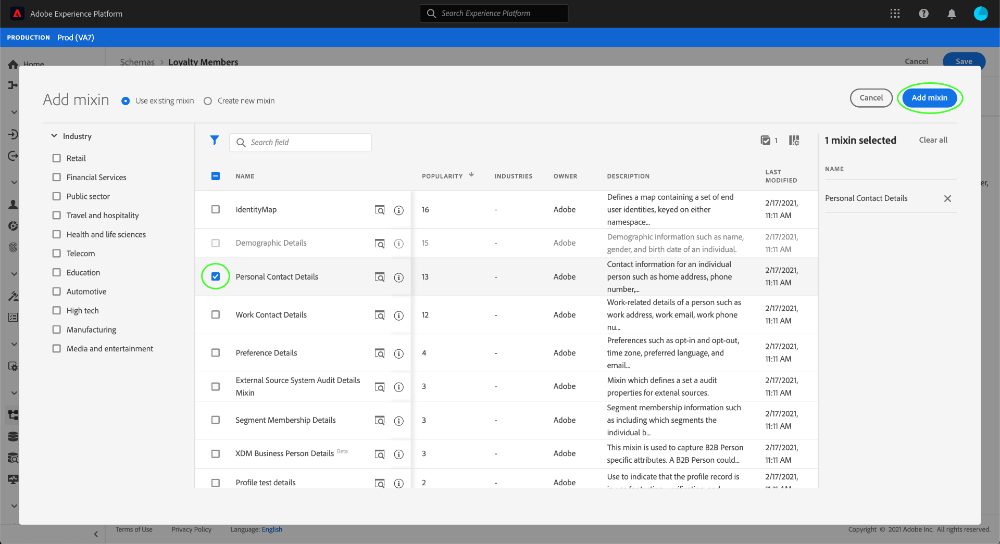

Once added, the canvas reappears. The "[!UICONTROL Profile Personal Details]" is now listed under *[!UICONTROL Mixins]* in the *[!UICONTROL Composition]* section, and fields for home address, mobile phone, and more have been added under *[!UICONTROL Structure]*.

Similar to the "[!UICONTROL name]" field, the fields you just added represent multi-field concepts. For example, "[!UICONTROL homeAddress]" has a data type of "[!UICONTROL Address]" and "[!UICONTROL mobilePhone]" has a data type of "[!UICONTROL Phone Number]". You can click on each of these fields to expand them and see the additional fields included in the data type.

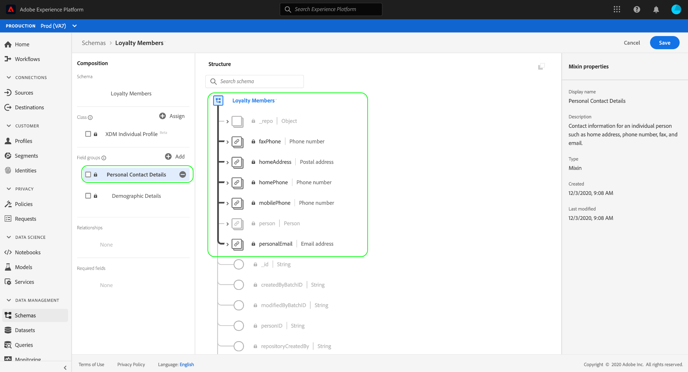

## Define a new mixin {#define-mixin}

The "[!UICONTROL Loyalty Members]" schema is meant to capture data related to the members of a loyalty program, so it will require some specific loyalty-related fields. There are no standard mixins available that contain the necessary fields, therefore you will need to define a new mixin.

This time, when you open the *[!UICONTROL Add Mixin]* dialog, select **[!UICONTROL Create New Mixin]**. You will then be asked to provide a **[!UICONTROL Display Name]** and **[!UICONTROL Description]** for your mixin. 

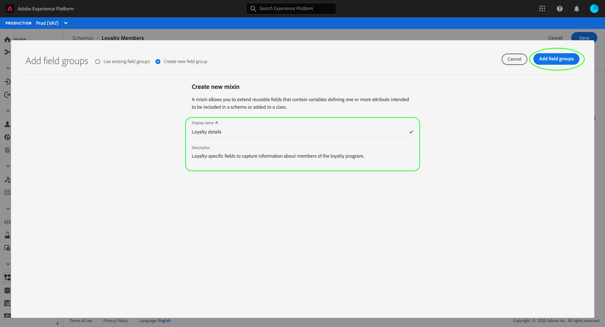

As with class names, the mixin name should be short and simple, describing what the mixin will contribute to the schema. These too are unique, so you will not be able to reuse the name and must therefore ensure it is specific enough. 

For this tutorial, name the new mixin "[!UICONTROL Loyalty Details]".

Click **[!UICONTROL Add Mixin]** to return to the schema editor. "[!UICONTROL Loyalty Details]" should now appear under *[!UICONTROL Mixins]* on the left-side of the canvas, but there are no fields associated with it yet and therefore no new fields appear under *[!UICONTROL Structure]*.

## Add fields to the mixin {#mixin-fields}

Now that you have created the "[!UICONTROL Loyalty Details]" mixin, it is time to define the fields that the mixin will contribute to the schema.

To begin, click on the mixin name in the *[!UICONTROL Mixins]* section. Once you do this, *[!UICONTROL Mixin Properties]* will appear on the right-hand side of the editor and an **[!UICONTROL Add Field]** button will appear next to the name of the schema under *[!UICONTROL Structure]*.

Click **[!UICONTROL Add Field]** next to "[!UICONTROL Loyalty Members]" to create a new node in the structure. This node (called "_tenantId" in this example) represents your IMS Organization's tenant ID, preceded by an underscore. The presence of the tenant ID indicates that the fields you are adding are contained in your organization's namespace. 

In other words, the fields you are adding are unique to your organization and are going to be saved in the [!DNL Schema Registry] in a specific area accessible only to your IMS Org. Fields you define must always be added to your namespace to prevent collisions with names from other standard classes, mixins, data types, and fields.

Inside that namespaced node is a "[!UICONTROL New Field]". This is the beginning of the "[!UICONTROL Loyalty Details]" mixin.

Using *[!UICONTROL Field Properties]* on the right-hand side of the editor, start by creating a "[!UICONTROL loyalty]" field with type "[!UICONTROL Object]" that will be used to hold your loyalty-related fields. When finished, click **[!UICONTROL Apply]**.

The changes are applied and the newly created "[!UICONTROL loyalty]" object appears. Click **[!UICONTROL Add Field]** next to the object to add additional loyalty-related fields. A "New Field" appears and the *[!UICONTROL Field Properties]* section is visible on the right-hand side of the canvas.

Each field requires the following information:

* **[!UICONTROL Field Name]:** The name of the field, written in camel case. Example: loyaltyLevel
* **[!UICONTROL Display Name]:** The name of the field, written in title case. Example: Loyalty Level
* **[!UICONTROL Type]:** The data type of the field. This includes basic scalar types and any data types defined in the [!DNL Schema Registry]. Examples: string, integer, boolean, Person, Address, Phone Number, etc.
* **[!UICONTROL Description]:** An optional description of the field should be included, written in sentence case. (200 character max.)

The first field for the Loyalty object will be a string called "[!UICONTROL loyaltyId]". When setting the new field's type to "[!UICONTROL String]", the *[!UICONTROL Field Properties]* window becomes populated with several options for applying constraints, including **[!UICONTROL Default Value]**, **[!UICONTROL Format]**, and **[!UICONTROL Maximum Length]**.

Different constraint options are available depending on the data type selected. Since "[!UICONTROL loyaltyId]" will be an email address, select "[!UICONTROL email]" from the **[!UICONTROL Format]** dropdown menu. Select **[!UICONTROL Apply]** to apply your changes.

## Add more fields to mixin {#mixin-fields-2}

Now that you have added the "[!UICONTROL loyaltyId]" field, you can add additional fields to capture loyalty-related information such as:

* Points (Integer)
* Member Since (Date)

Each field is added by clicking **[!UICONTROL Add Field]** on the loyalty object and filling in the required information.

When complete, the Loyalty object will contain fields for: Loyalty ID, Points, and Member Since.

## Add 'enum' field to mixin {#enum}

When defining fields in the Schema Editor, there are some additional options that you can apply to basic field types in order to provide further constraints on the data the field can contain. 

An example of this would be a "[!UICONTROL Loyalty Level]" field, where the value can only be one of four possible options. To add this field to the schema, click **[!UICONTROL Add Field]** beside the "[!UICONTROL loyalty]" object and fill in the required fields under *[!UICONTROL Field Properties]*. 

For **[!UICONTROL Type]**, select "String" and you will see additional checkboxes appear for **[!UICONTROL Array]**, **[!UICONTROL Enum]**, and **[!UICONTROL Identity]**. 

Select the **[!UICONTROL Enum]** checkbox to open the *[!UICONTROL Enum Values]* section below. Here you can input the **[!UICONTROL Value]** (in camelCase) and **[!UICONTROL Label]** (an optional, reader-friendly name in Title Case) for each acceptable loyalty level.

When you have completed all field properties, click **[!UICONTROL Apply]** and the "[!UICONTROL loyaltyLevel]" field will be added to the "loyalty" object.

More information about available additional constraints:

* **[!UICONTROL Required]:** Indicates that the field is required for data ingestion. Any data uploaded to a dataset based on this schema that does not contain this field will fail upon ingestion.
* **[!UICONTROL Array]:** Indicates that the field contains an array of values, each with the data type specified. For example, selecting a data type of "String" and checking the "Array" checkbox means that the field will contain an array of strings.
* **[!UICONTROL Enum]:** Indicates that this field must contain one of the values from an enumerated list of possible values.  
* **[!UICONTROL Identity]:** Indicates that this field is an identity field. More information regarding identity fields is provided [later in this tutorial](#identity-field).

## Convert a multi-field object into a data type {#datatype}

After adding several loyalty-specific fields, the "[!UICONTROL loyalty]" object now contains a common data structure that could be useful in other schemas. 

When you feel that a multi-field structure might be reusable, and you would like to have the flexibility to use that same data structure elsewhere, the Schema Editor makes it possible to convert that structure into a data type. 

Data types allow for the consistent use of multi-field structures and provide more flexibility than a mixin because they can be used anywhere within a schema. This is done by setting the **[!UICONTROL Type]** of a field in a mixin to that of any data type defined in the registry.

To convert the "[!UICONTROL loyalty]" object to a data type, click on the "loyalty" field under *[!UICONTROL Structure]* and select **[!UICONTROL Convert to New Data Type]** on the right-hand-side of the editor under *[!UICONTROL Field Properties]*. A small green pop-up appears confirming "[!UICONTROL Object Converted to Data Type]". 

Now, when you look under *[!UICONTROL Structure]*, you can see that the "[!UICONTROL loyalty]" field has a data type of "[!UICONTROL Loyalty]" and the fields have small lock icons beside them indicating they are no longer individual fields, but rather part of a multi-field structure.

In a future schema, you could now assign a field the **[!UICONTROL Type]** of "[!UICONTROL Loyalty]" and it would automatically include Loyalty Level, Points, Member Since, and Loyalty ID fields.

## Set a schema field as an identity field {#identity-field}

Schemas are used for ingesting data into [!DNL Experience Platform], and that data is ultimately used to identify individuals and stitch together information coming from multiple sources. To help with this process, key fields can be marked as "[!UICONTROL Identity]" fields. 

[!DNL Experience Platform] makes it easy to denote an identity field through the use of an **[!UICONTROL Identity]** checkbox in the [!DNL Schema Editor].

For example, there may be thousands of members of the loyalty program belonging to the same "level", but each member of the loyalty program has a unique "loyaltyId" (which in this instance is the individual member's email address). The fact that "loyaltyId" is a unique identifier for each member makes it a good candidate for an identity field, whereas "level" is not.

In the *[!UICONTROL Structure]* section of the editor, click on the "[!UICONTROL loyaltyId]" field that you created and you will see the **[!UICONTROL Identity]** checkbox appear under *[!UICONTROL Field Properties]*. Check the box and you will have the option to set this as the **[!UICONTROL Primary Identity]**. Check that box as well. 

Next, you must provide an **[!UICONTROL Identity Namepsace]**. There are several pre-defined namespaces, but since the "[!UICONTROL loyaltyId]" is the member's email address, select "Email" from the dropdown list. You can now click **[!UICONTROL Apply]** to confirm the updates to the "[!UICONTROL loyaltyId]" field.

Now all data ingested into the "[!UICONTROL loyaltyId]" field will be used to help identify that individual and stitch together a single view of that customer.

>[!NOTE]
>
>Once a schema field has been set as the primary identity, you will receive an error message if you later attempt to set another field in the schema as the primary. Each schema may contain only one primary identity field.

To learn more about working with identities, please review the [!DNL Identity Service](../../identity-service/home.md) documentation.

<!-- ## Relationship

Schemas define a static view of a concept, but do not provide specific details on how data based on these schemas (datasets, etc) may relate to one another. Adobe Experience Platform allows you to describe these relationships through the **Relationship** checkbox in the schema editor. 

In order to define a relationship, click on the field and check the **Relationship** checkbox on the right-side of the canvas. 

More information about relationships and other schema metadata can be found in the [Schema Registry API Developer Guide](../schema_registry_developer_guide.md). -->

## Enable the schema for use in [!DNL Real-time Customer Profile] {#profile}

The Schema Editor provides the ability to enable a schema for use with [!DNL Real-time Customer Profile](../../profile/home.md). [!DNL Profile] provides a holistic view of each individual customer by building a robust, 360&deg; profile of customer attributes as well as a timestamped account of every interaction that customer has had across any system integrated with [!DNL Experience Platform]. 

In order for a schema to be enabled for use with [!DNL Real-time Customer Profile], it must have a primary identity defined. You will receive a "Missing Primary Identity" error message if you attempt to enable a schema without first defining a primary identity.

 

To enable the "Loyalty Members" schema for use in [!DNL Profile], begin by clicking on "Loyalty Members" in the *Structure* section of the editor. 

On the right-hand side of the editor, under *Schema Properties*, information is shown about the schema including its display name, description, and type. In addition to this information, there is a toggle button entitled **[!UICONTROL Profile]**.

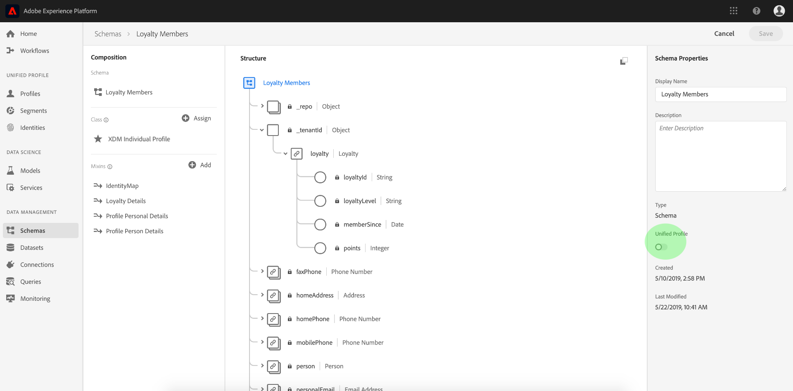

Click **[!UICONTROL Profile]** and a pop-up appears, asking you to confirm that you wish to enable the schema for [!DNL Profile]. 

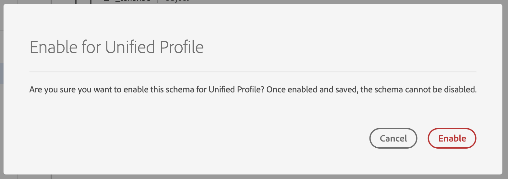

>[!NOTE]
>
>Once a schema has been enabled for [!DNL Real-time Customer Profile] and saved, it cannot be disabled.

## Next steps and additional resources

Now that you have finished composing a "[!UICONTROL Loyalty Members]" schema, you can see the complete schema in the *Structure* section of the editor. Click **[!UICONTROL Save]** and the schema will be saved to the [!DNL Schema Library], making it accessible by the [!DNL Schema Registry].

Your new schema is now able to be used to ingest data into [!DNL Platform]. Remember that once the schema has been used to ingest data, only additive changes may be made. See the [basics of schema composition](../schema/composition.md) for more information on schema versioning.

The "[!UICONTROL Loyalty Members]" schema is also available to be viewed and managed using the [!DNL Schema Registry] API. To begin working with the API, start by reading the [Schema Registry API developer guide](../api/getting-started.md).

>[!WARNING]
>
>The [!DNL Platform] UI shown in the following videos are out-of-date. Please refer to the documentation above for the latest UI screenshots and functionality.

The following video shows how to create a simple schema in the [!DNL Platform] UI.

>[!VIDEO](https://video.tv.adobe.com/v/27012?quality=12&learn=on)

The following video is intended to reinforce your understanding of working with mixins and classes.

>[!VIDEO](https://video.tv.adobe.com/v/27013?quality=12&learn=on)

## Appendix

The following information is supplemental to the Schema Editor Tutorial.

### Create a new class {#create-new-class}

[!DNL Experience Platform] provides the flexibility to define a schema based on a class that is unique to your organization. 

Open the *[!UICONTROL Assign Class]* dialog by clicking **[!UICONTROL Assign]** in the *[!UICONTROL Class]* section of the Schema Editor. Within the dialog, select **C[!UICONTROL reate New Class]**.

You can then give your new class a **[!UICONTROL Display Name]** (a short, descriptive, unique, and user-friendly name for the class), a **[!UICONTROL Description]**, and a **[!UICONTROL Behavior]** ("[!UICONTROL Record]" or "[!UICONTROL Time Series]") for the data the schema will define. 

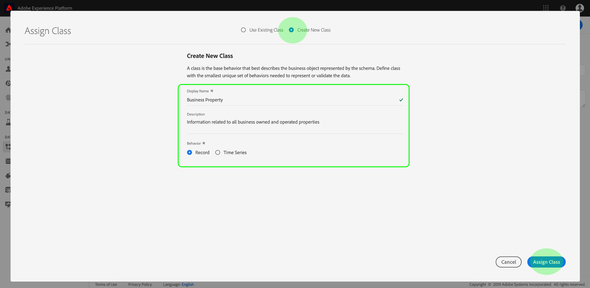

>[!NOTE]
>
>When building a schema that implements a class defined by your organization, remember that mixins are available for use only with compatible classes. Since the class you defined is new, there are no compatible mixins listed in the *Add Mixin* dialog. Instead, you will need to select **[!UICONTROL Create New Mixin]** and define a mixin for use with that class. The next time you compose a schema that implements the new class, the mixin that you defined will be listed and available for use.

### Change the class of a schema {#change-class}

At any time during the initial schema composition process, before the schema is saved, you can change the class upon which the schema is based. 

>[!WARNING]
>
>Please exercise caution before changing the class. Mixins are only compatible with certain classes, therefore changing the class resets the canvas and removes any fields you have added to that point. 

To change the class, click **[!UICONTROL Assign]** next to *[!UICONTROL Class]* in the *[!UICONTROL Composition]* section of the editor. 

When the *[!UICONTROL Assign Class]* dialog opens, you can choose a new class from the available list. Click **[!UICONTROL Assign Class]** and a new dialog opens asking you to confirm that you wish to assign a new class. 

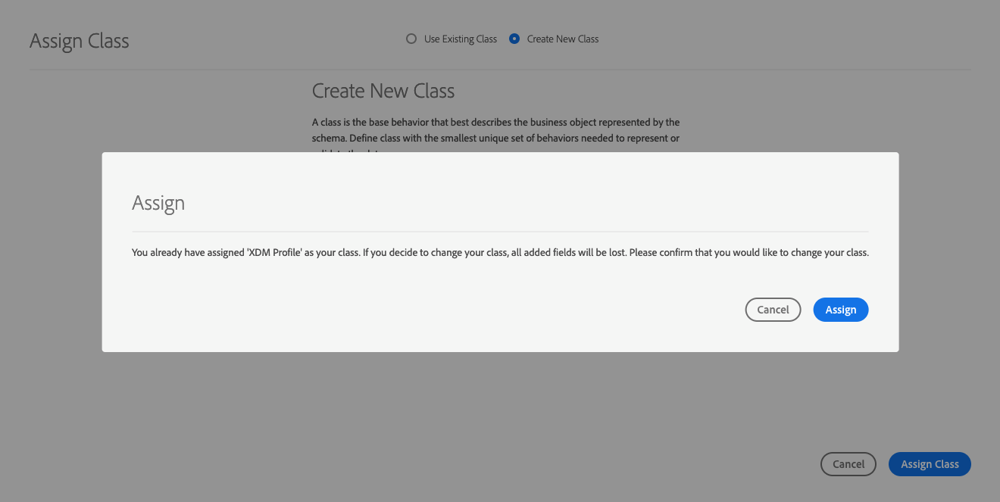

If you confirm the class change, the canvas will be reset and all composition progress will be lost.