# Create a schema using the [!DNL Schema Editor]

The Adobe Experience Platform user interface allows you to create and manage [!DNL Experience Data Model] (XDM) schemas in an interactive visual canvas called the [!DNL Schema Editor]. This tutorial covers how to create a schema using the [!DNL Schema Editor].

For demonstration purposes, the steps in this tutorial involve creating an example schema that describes members of a customer loyalty program. While you can use these steps to create a different schema for your own purposes, it is recommended that you first follow along with creating the example schema to learn the capabilities of the [!DNL Schema Editor].

>[!NOTE]
>
>If you are ingesting CSV data into Platform, you can [map that data to an XDM schema created by AI-generated recommendations](../../ingestion/tutorials/map-csv/recommendations.md) (currently in beta) without having to manually create the schema yourself.
>
>If you prefer to compose a schema using the [!DNL Schema Registry] API, start by reading the [[!DNL Schema Registry] developer guide](../api/getting-started.md) before attempting the tutorial on [creating a schema using the API](create-schema-api.md).

## Getting started

This tutorial requires a working understanding of the various aspects of Adobe Experience Platform involved in schema creation. Before beginning this tutorial, please review the documentation for the following concepts:

* [[!DNL Experience Data Model (XDM)]](../home.md): The standardized framework by which [!DNL Platform] organizes customer experience data.
    * [Basics of schema composition](../schema/composition.md): An overview of XDM schemas and their building blocks, including classes, schema field groups, data types, and individual fields.
* [[!DNL Real-Time Customer Profile]](../../profile/home.md): Provides a unified, real-time consumer profile based on aggregated data from multiple sources.

## Open the [!UICONTROL Schemas] workspace {#browse}

The [!UICONTROL Schemas] workspace in the [!DNL Platform] UI provides a visualization of the [!DNL Schema Library], allowing you to view manage the schemas available for your organization. The workspace also includes the [!DNL Schema Editor], the canvas on which you can compose a schema throughout this tutorial.

After logging into [!DNL Experience Platform], select **[!UICONTROL Schemas]** in the left navigation to open the **[!UICONTROL Schemas]** workspace. The **[!UICONTROL Browse]** tab displays a list of schemas (a representation of the [!DNL Schema Library]) for you to view and customize. The list includes the name, type, class, and behavior (record or time-series) on which the schema is based, as well as the date and time the schema was last modified. 

See the guide on [exploring existing XDM resources in the UI](../ui/explore.md) for more information.

## Create and name a schema {#create}

To begin composing a schema, select **[!UICONTROL Create schema]** in the top-right corner of the **[!UICONTROL Schemas]** workspace. 

![The [!UICONTROL Schemas] workspace [!UICONTROL Browse] tab with [!UICONTROL Create schema] highlighted.](../images/tutorials/create-schema/create-schema-button.png)

The [!UICONTROL Create schema] workflow appears. Next, choose a base class for the schema. You can choose between the core classes of [!UICONTROL XDM Individual Profile] and [!UICONTROL XDM ExperienceEvent], or [!UICONTROL Other] if these classes do not suit your purposes. The [!UICONTROL Other] classes option allows you to either [create a new class](#create-new-class) or choose from other pre-existing classes.

See the [XDM individual profile](../classes/individual-profile.md) and [XDM ExperienceEvent](../classes/experienceevent.md) documentation for more information on these classes. For the purposes of this tutorial, select **[!UICONTROL XDM Individual Profile]** followed by **[!UICONTROL Next]**.

<!--  -->

<!-- You can  by selecting either **[!UICONTROL Individual Profile]**, **[!UICONTROL Experience Event]**, or **[!UICONTROL Other]**, followed by **[!UICONTROL Next]** to confirm your choice.  -->

![The [!UICONTROL Create schema] workflow with the [!UICONTROL XDM individual profile] options and [!UICONTROL Next] highlighted.](../images/tutorials/create-schema/individual-profile-base-class.png)

After you have selected a class, the [!UICONTROL Name and review] section appears. In this section, you provide a name and description to identify your schema. There are several important considerations to make when deciding on a name for your schema:

* Schema names should be short and descriptive so that the schema can be easily found later. 
* Schema names must be unique, meaning it should also be specific enough that it will not be reused in the future. For example, if your organization had separate loyalty programs for different brands, it would be wise to name your schema "Brand A Loyalty Members" to make it easy to distinguish from other loyalty-related schemas you might define later.
* You can also use the schema description to provide any additional contextual information regarding the schema.

This tutorial composes a schema to ingest data related to the members of a loyalty program, and therefore the schema is named "[!DNL Loyalty Members]".

​The schema's base structure (provided by the class) is shown in the canvas for you to review and verify your selected class and schema structure.

Enter a human-friendly [!UICONTROL Schema display name] in the text field. Next, enter a suitable description to help identify your schema. When you have reviewed your schema structure and are happy with your settings, select **[!UICONTROL Finish]** to create your schema. 

![The [!UICONTROL Name and review] section of the [!UICONTROL Create schema] workflow with the [!UICONTROL Schema display name], [!UICONTROL Description], and [!UICONTROL Finish] highlighted.](../images/ui/resources/schemas/name-and-review.png)

The [!DNL Schema Editor] appears. This is the canvas upon which you will compose your schema. The self-titled schema is automatically created in the **[!UICONTROL Structure]** section of the canvas when you arrive in the editor, along with the standard fields included in the base class that you selected. The assigned class for the schema is also listed under **[!UICONTROL Class]** in **[!UICONTROL Composition]** section. 

>[!NOTE]
>
>You can update the display name and optional description for the schema from the  **[!UICONTROL Schema properties]** sidebar. Once a new name is entered, the canvas automatically updates to reflect the new name of the schema.

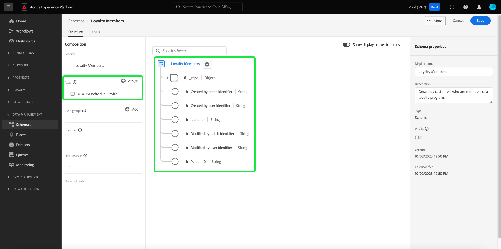

>[!NOTE]
>
>You can [change the class of a schema](#change-class) at any point during the initial composition process before the schema has been saved, but this should be done with extreme caution. Field groups are only compatible with certain classes, and therefore changing the class will reset the canvas and any fields you have added.

## Add a field group {#field-group}

You can now begin to add fields to your schema by adding field groups. A field group is a group of one or more fields that are often used together to describe a particular concept. This tutorial uses field groups to describe the members of the loyalty program and capture key information such as name, birthday, phone number, address, and more.

To add a field group, select **[!UICONTROL Add]** in the **[!UICONTROL Field groups]** sub-section.

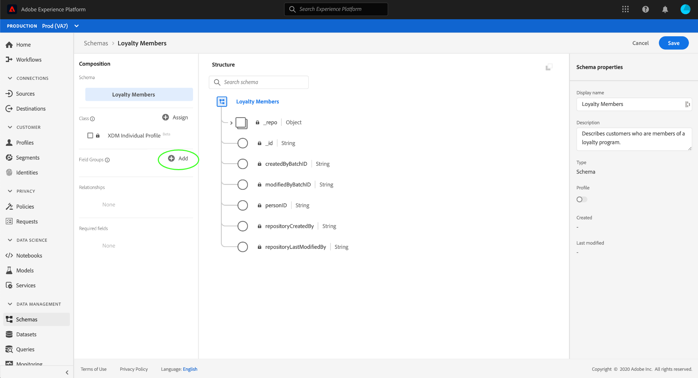

A new dialog appears, displaying a list of available field groups. Each field group is only intended for use with a specific class, therefore the dialog only lists field groups that are compatible with the class you selected (in this case, the [!DNL XDM Individual Profile] class). If you are using a standard XDM class, the list of field groups will be intelligently sorted based on usage popularity.

![The [!UICONTROL Add field groups] dialog.](../images/tutorials/create-schema/field-group-popularity.png)

You can select one of the filters in the left rail to narrow down the list of standard field groups to specific [industries](../schema/industries/overview.md) like retail, financial services, and healthcare.

![The [!UICONTROL Add field groups] dialog with the industry field groups highlighted.](../images/tutorials/create-schema/industry-field-groups.png)

Selecting a field group from the list causes it to appear in the right rail. You can select multiple field groups if desired, adding each one to the list in the right rail before confirming. In addition, an icon appears on the right side of the currently selected field group which allows you to preview the structure of the fields it provides.

![The [!UICONTROL Add field groups] dialog with the selected field group preview icon highlighted.](../images/tutorials/create-schema/preview-field-group-button.png)

When previewing a field group, a detailed description of the field group's schema is provided in the right rail. You can also navigate through the field group's fields in the provided canvas. As you select different fields, the right rail updates to show details about the field in question. Select **[!UICONTROL Back]** when you are finished previewing to return to the field group selection dialog. 

![The [!UICONTROL Preview field group] dialog with the Demographic Details field group previewed.](../images/tutorials/create-schema/preview-field-group.png)

For this tutorial, select the **[!UICONTROL Demographic Details]** field group, then select **[!UICONTROL Add field group]**.

![The [!UICONTROL Add field groups] dialog with the Demographic Details field group selected and [!UICONTROL Add field groups] highlighted.](../images/tutorials/create-schema/demographic-details.png)

The schema canvas reappears. The **[!UICONTROL Field groups]** section now lists "[!UICONTROL Demographic Details]" and the **[!UICONTROL Structure]** section includes the fields contributed by the field group. You can select the field group's name under the **[!UICONTROL Field groups]** section to highlight the specific fields it provides within the canvas.

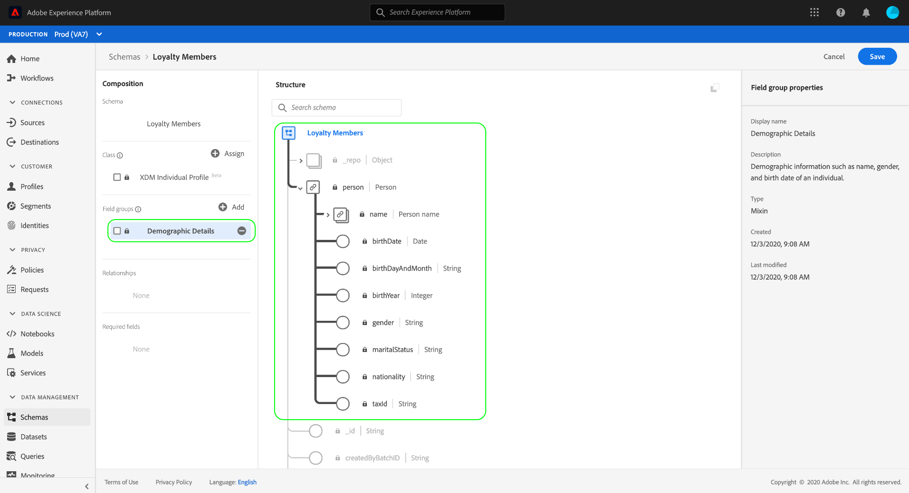

This field group contributes several fields under the top-level name `person` with the data type "[!UICONTROL Person]". This group of fields describes information about an individual, including name, birth date, and gender. 

>[!NOTE]
>
>Remember that fields may use scalar types (such as string, integer, array, or date), as well as any data type (a group of fields representing a common concept) defined within the [!DNL Schema Registry]. 

Notice that the `name` field has a data type of "[!UICONTROL Full name]", meaning it too describes a common concept and contains name-related sub-fields such as first name, last name, courtesy title, and suffix.

Select the different fields within the canvas to reveal any additional fields they contribute to the schema structure.

## Add more field groups {#field-group-2}

You can now repeat the same steps to add another field group. When you view the **[!UICONTROL Add field group]** dialog this time, notice that the "[!UICONTROL Demographic Details]" field group has been greyed out and the checkbox next to it cannot be selected. This prevents you from accidentally duplicating field groups that you have already included in the current schema.

For this tutorial, select the standard field groups **[!UICONTROL Personal Contact Details]** and **[!UICONTROL Loyalty Details]** from the list, then select **[!UICONTROL Add field groups]** to add them to the schema.

![The [!UICONTROL Add field groups] dialog with two new field groups selected and [!UICONTROL Add field groups] highlighted.](../images/tutorials/create-schema/more-field-groups.png)

The canvas reappears with the added field groups listed under **[!UICONTROL Field groups]** in the **[!UICONTROL Composition]** section, and their composite fields added to the schema structure.

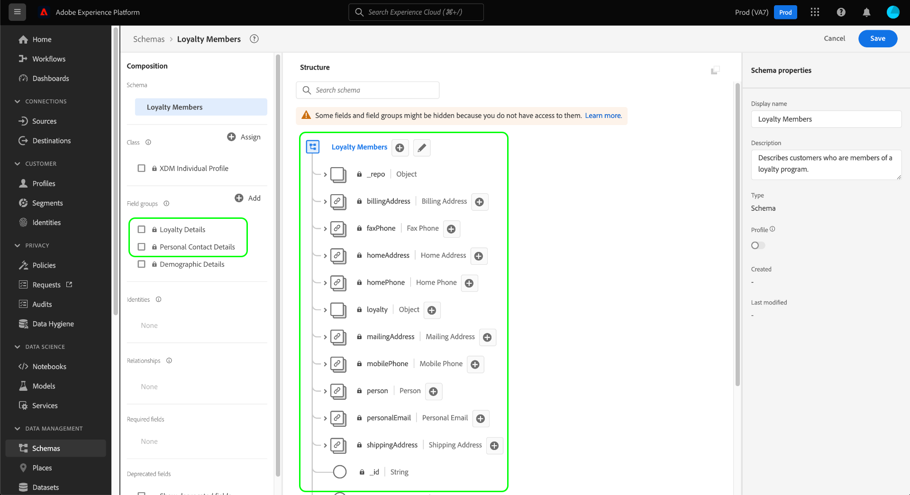

## Define a custom field group {#define-field-group}

The [!UICONTROL Loyalty Members] schema is meant to capture data related to the members of a loyalty program, and the standard [!UICONTROL Loyalty Details] field group that you added to the schema provides most of these, including the program type, points, join date, and more.

However, there may be a scenario where you want to include additional custom fields not covered by standard field groups in order to achieve your use cases. In the case of adding custom loyalty fields, you have two options:

1. Create a new custom field group to capture these fields. This is the method that will be covered in this tutorial.
1. Extend the standard [!UICONTROL Loyalty Details] field group with custom fields. This causes [!UICONTROL Loyalty Details] to be converted to a custom field group, and the original standard field group will no longer be available. See the [!UICONTROL Schemas] UI guide for more information on [adding custom fields to the structure of standard field groups](../ui/resources/schemas.md#custom-fields-for-standard-groups).

To create a new field group, select **[!UICONTROL Add]** in the **[!UICONTROL Field groups]** sub-section like before, but this time select **[!UICONTROL Create New Field group]** near the top of the dialog that appears. You are then asked to provide a display name and description for the new field group. For this tutorial, name the new field group "[!DNL Custom Loyalty Details]", then select **[!UICONTROL Add field groups]**. 

![The [!UICONTROL Add field groups] dialog with [!UICONTROL Create new field group], [!UICONTROL Display name] and [!UICONTROL Description] highlighted.](../images/tutorials/create-schema/create-new-field-group.png)

>[!NOTE]
>
>As with class names, the field group name should be short and simple, describing what the field group will contribute to the schema. These too are unique, so you will not be able to reuse the name and must therefore ensure it is specific enough. 

"[!DNL Custom Loyalty Details]" should now appear under **[!UICONTROL Field groups]** on the left side of the canvas, but there are no fields associated with it yet and therefore no new fields appear under **[!UICONTROL Structure]**.

## Add fields to the field group {#field-group-fields}

Now that you have created the "[!DNL Custom Loyalty Details]" field group, it is time to define the fields that the field group will contribute to the schema.

To begin, select the **plus (+)** icon next to the name of the schema in the canvas.

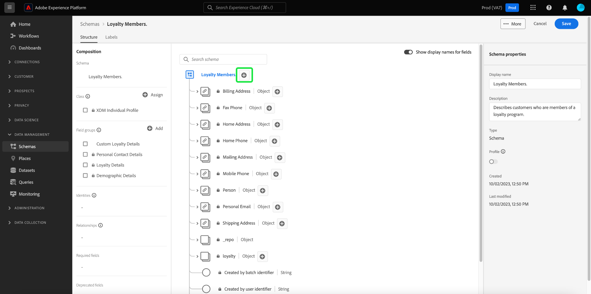

An "[!UICONTROL Untitled Field]" placeholder appears in the canvas, and the right rail updates to reveal configuration options for the field.

![The Schema Editor with an [!UICONTROL Untitled Field] and the schema [!UICONTROL Field properties] highlighted.](../images/tutorials/create-schema/untitled-field.png)

In this scenario, the schema needs to have an object-type field that describes the person's current loyalty tier in detail. Using the controls in the right rail, start creating a `loyaltyTier` field with type "[!UICONTROL Object]" that will be used to hold your related fields.

Under **[!UICONTROL Assign to]**, you must select a field group to assign the field to. Remember that all schema fields belong to either a class or a field group, and since this schema uses a standard class, your only option is to select a field group. Start typing in the name "[!DNL Custom Loyalty Details]", then select the field group from the list.

When finished, select **[!UICONTROL Apply]**.

![The Schema Editor with the Loyalty Tier object added to the schema [!UICONTROL Field properties] highlighted.](../images/tutorials/create-schema/loyalty-tier-object.png)

The changes are applied and the newly created `loyaltyTier` object appears. Since this is a custom field, it is automatically nested within an object namespaced to your organization's tenant ID, preceded by an underscore (`_tenantId` in this example).

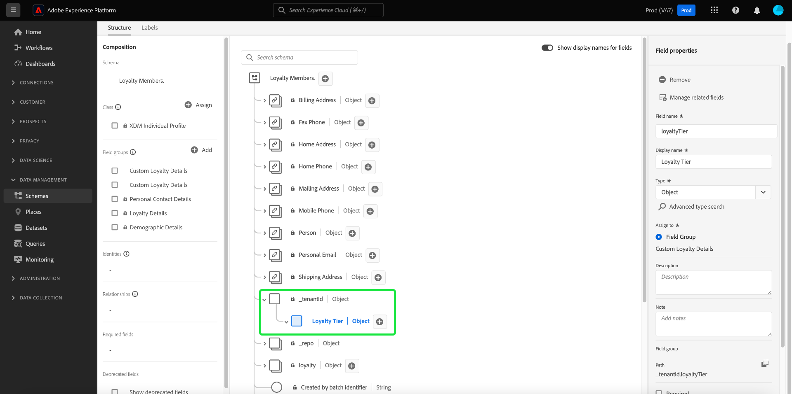

>[!NOTE]
>
>The presence of the tenant ID object indicates that the fields you are adding are contained in your organization's namespace. 
>
>In other words, the fields you are adding are unique to your organization and are going to be saved in the [!DNL Schema Registry] in a specific area accessible only to your organization. Fields you define must always be added to your tenant namespace to prevent collisions with names from other standard classes, field groups, data types, and fields.

Select the **plus (+)** icon next to the `loyaltyTier` object to start adding sub-fields. A new field placeholder appears and the **[!UICONTROL Field properties]** section is visible on the right side of the canvas.

Each field requires the following information:

* **[!UICONTROL Field Name]:** The name of the field, preferably written in camelCase. No space characters are allowed. This is the name used to reference the field in code and in other downstream applications. 
    * Example: loyaltyLevel
* **[!UICONTROL Display Name]:** The name of the field, written in title case. This is the name that will be displayed in the canvas when viewing or editing the schema.
    * Example: Loyalty Level
* **[!UICONTROL Type]:** The data type of the field. This includes basic scalar types and any data types defined in the [!DNL Schema Registry]. Examples: [!UICONTROL String], [!UICONTROL Integer], [!UICONTROL Boolean], [!UICONTROL Person], [!UICONTROL Address], [!UICONTROL Phone number], etc.
* **[!UICONTROL Description]:** An optional description of the field should be included with a maximum of 200 characters.

The first field for the `loyaltyTier` object will be a string called `id`, representing the ID of the loyalty member's current tier. The tier ID will be unique for each loyalty member, since this company sets different loyalty tier point thresholds for each customer based on different factors. Set the new field's type to "[!UICONTROL String]", and the **[!UICONTROL Field properties]** section becomes populated with several options for applying constraints, including default value, format, and maximum length. See the documentation on [best practices for data validation fields](../schema/best-practices.md#data-validation-fields) to learn more.

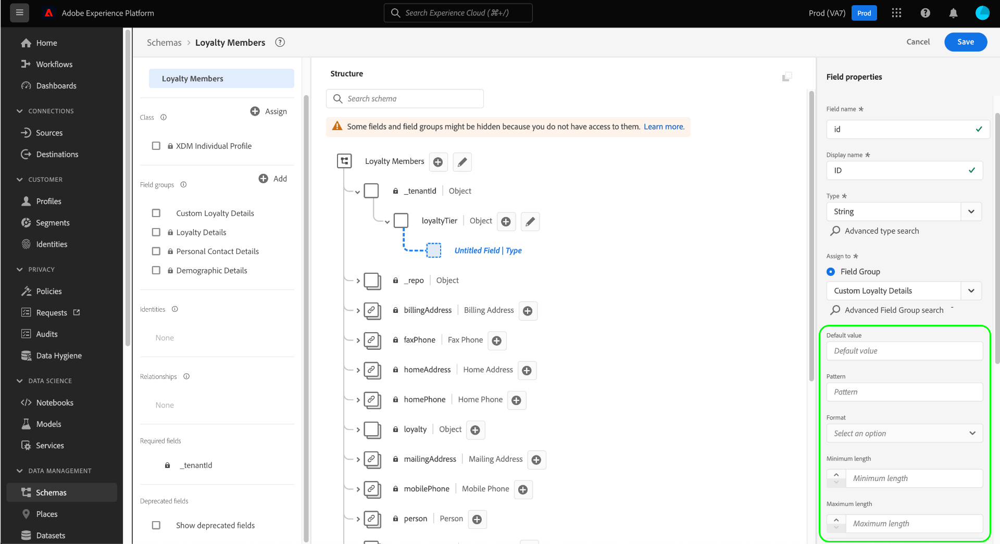   

Since `id` will be a randomly generated freeform string, no further constraints are necessary. Select **[!UICONTROL Apply]** to apply your changes.

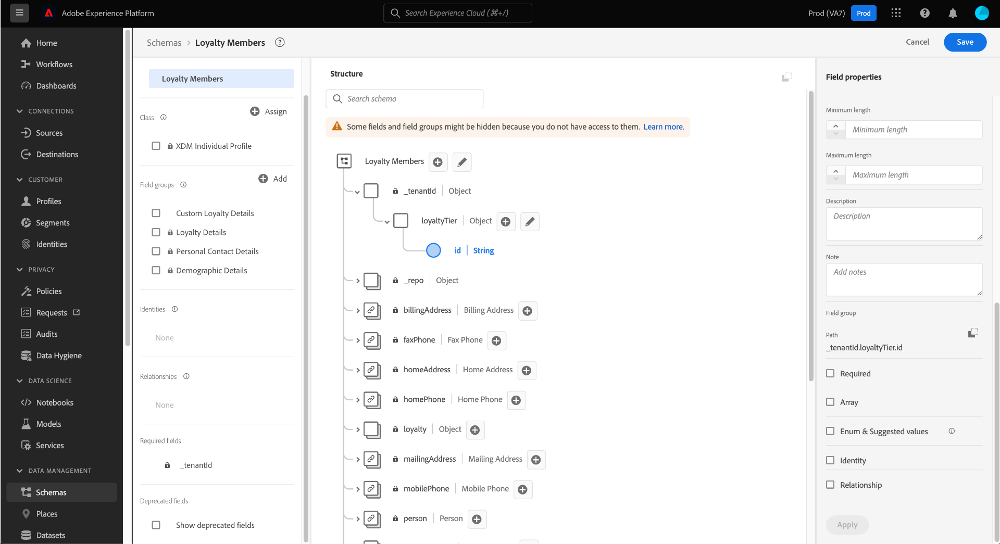

## Add more fields to the field group {#field-group-fields-2}

Now that you have added the `id` field, you can add additional fields to capture loyalty tier information such as:

* Current point threshold (integer): The minimum number of loyalty points the member must maintain to remain in the current tier.
* Next tier point threshold (integer): The number of loyalty points the member must accrue to graduate to the next tier.
* Effective date (date-time): The date that the loyalty member joined this tier.

To add each field to the schema, select the **plus (+)** icon next to the `loyalty` object and fill in the required information.

When complete, the `loyaltyTier` object will contain fields for `id`, `currentThreshold`, `nextThreshold`, and `effectiveDate`.

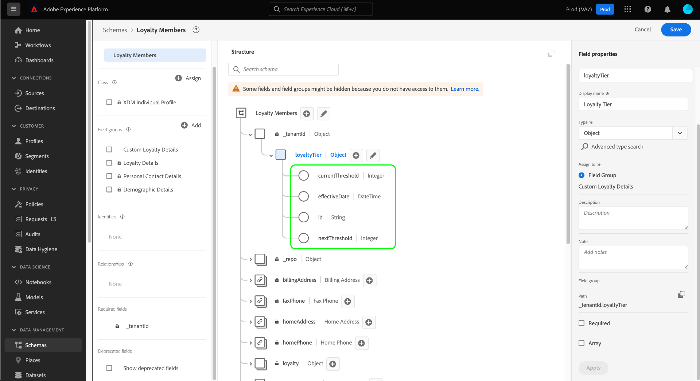

## Add an enum field to the field group {#enum}

When defining fields in the [!DNL Schema Editor], there are some additional options that you can apply to basic field types in order to provide further constraints on the data the field can contain. The use cases for these constrains are explained in the following table:

| Constraint | Description |
| --- | --- |
| [!UICONTROL Required] | Indicates that the field is required for data ingestion. Any data uploaded to a dataset based on this schema that does not contain this field will fail upon ingestion. |
| [!UICONTROL Array] | Indicates that the field contains an array of values, each with the data type specified. For example, using this constraint on a field with a data type of "[!UICONTROL String]" specifies that the field will contain an array of strings. |
| [!UICONTROL Enum & Suggested Values] | An enum indicates that this field must contain one of the values from an enumerated list of possible values. Alternatively, you can also use this option to just provide a list of suggested values for a string field without constraining the field to those values. |
| [!UICONTROL Identity] | Indicates that this field is an identity field. More information regarding identity fields is provided [later in this tutorial](#identity-field). |
| [!UICONTROL Relationship] | While schema relationships can be inferred through the use of the union schema and [!DNL Real-Time Customer Profile], this only applies to schemas that share the same class. The [!UICONTROL Relationship] constraint indicates that this field references the primary identity of a schema based on a different class, implying a relationship between the two schemas. See the tutorial on [defining a relationship](./relationship-ui.md) for more information. |

{style="table-layout:auto"}

>[!NOTE]
>
>Any required, identity, or relationship fields are listed in their respective sections in the left rail, allowing you to locate these fields easily regardless of the schema's complexity.

For this tutorial, the `loyaltyTier` object in the schema requires a new enum field that describes the tier class, where the value can only be one of four possible options. To add this field to the schema, select the **plus (+)** icon beside the `loyaltyTier` object and fill in the required fields for **[!UICONTROL Field name]** and **[!UICONTROL Display name]**. For **[!UICONTROL Type]**, select "[!UICONTROL String]".

![The Schema Editor with the Tier Class object added and highlighted in the [!UICONTROL Field properties].](../images/tutorials/create-schema/tier-class-type.png)

Additional checkboxes appear for the field after its type has been selected, including checkboxes for **[!UICONTROL Array]**, **[!UICONTROL Enum & Suggested Values]**, **[!UICONTROL Identity]**, and **[!UICONTROL Relationship]**. 

Select the **[!UICONTROL Enum & Suggested Values]** checkbox, then select **[!UICONTROL Enum]**. Here you can input the **[!UICONTROL Value]** (in camelCase) and **[!UICONTROL Display Name]** (an optional, reader-friendly name in Title Case) for each acceptable loyalty tier class.

When you have completed all field properties, select **[!UICONTROL Apply]** to add the `tierClass` field to the `loyaltyTier` object.

![The enum and suggest values field properties completed with [!UICONTROL Apply] highlighted.](../images/tutorials/create-schema/tier-class-enum.png)

## Convert a multi-field object into a data type {#datatype}

The `loyaltyTier` object now contains several fields and represents a common data structure that could be useful in other schemas. The [!DNL Schema Editor] allows you to readily apply reusable multi-field objects by converting the structure of those objects into data types. 

Data types allow for the consistent use of multi-field structures and provide more flexibility than a field group because they can be used anywhere within a schema. This is done by setting the field's **[!UICONTROL Type]** value to that of any data type defined in the [!DNL Schema Registry].

To convert the `loyaltyTier` object to a data type, select the `loyaltyTier` field in the canvas, then select **[!UICONTROL Convert to new data type]** on the right side of the editor under **[!UICONTROL Field properties]**. 

![The Schema Editor with the loyaltyTier object and [!UICONTROL Convert to new data type] highlighted.](../images/tutorials/create-schema/convert-data-type.png)

A notification appears, confirming that the object has been successfully converted. In the canvas you can now see that the `loyaltyTier` field now has a link icon, and the right rail indicates it has a data type of "[!DNL Loyalty Tier]".

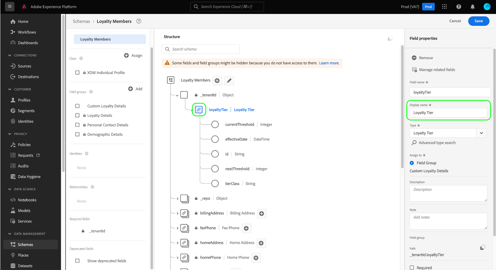

In a future schema, you could now assign a field as a "[!DNL Loyalty Tier]" type and it would automatically include fields for ID, tier class, point thresholds, and effective date.

>[!NOTE]
>
>You can also create and edit custom data types independently from editing schemas. See the guide on [creating and editing data types](../ui/resources/data-types.md) for more information.

## Search and filter schema fields

Your schema now contains several field groups in addition to the fields provided by its base class. When working with larger schemas, you can select the checkboxes next to field group names in the left rail to filter the displayed fields to only those provided by the field groups you are interested in.

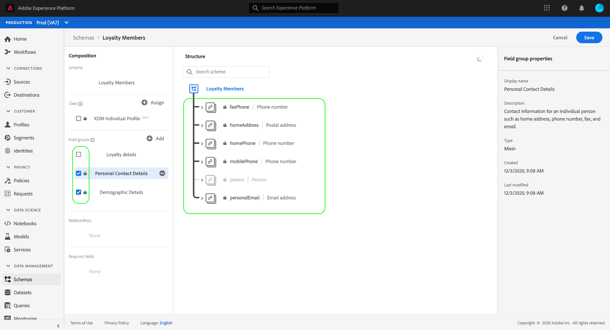

If you are looking for a specific field in your schema, you can also use the search bar to filter displayed fields by name, regardless of which field group they are provided under.

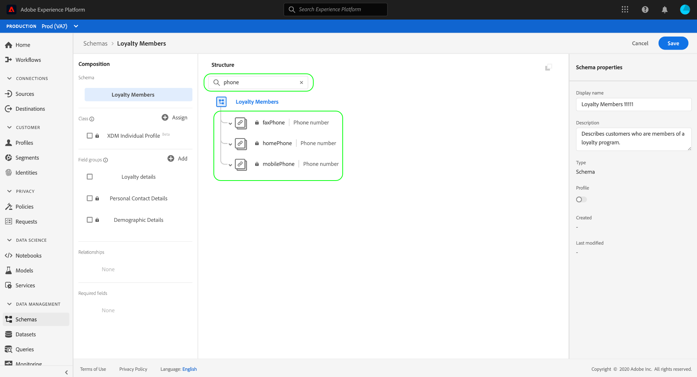

>[!IMPORTANT]
>
>The search function takes any selected field group filters into account when displaying matching fields. If a search query is not displaying the results you expect, you may need to double-check that you are not filtering out any relevant field groups.

## Set a schema field as an identity field {#identity-field}

The standard data structure that schemas provide can be leveraged to identify data belonging to the same individual across multiple sources, allowing for various downstream use cases such as segmentation, reporting, data science analysis, and more. In order to stitch data based on individual identities, key fields must be marked as [!UICONTROL Identity] fields within applicable schemas. 

[!DNL Experience Platform] makes it easy to denote an identity field through the use of an **[!UICONTROL Identity]** checkbox in the [!DNL Schema Editor]. However, you must determine which field is the best candidate to use as an identity, based on the nature of your data.

For example, there may be thousands of loyalty program members belonging to the same loyalty level, and several that may share the same physical address. In this scenario, however, on enrollment each member of the loyalty program provides their personal email address. Since personal email addresses are usually managed by one person, the field `personalEmail.address` (provided by the [!UICONTROL Personal Contact Details] field group) is a good candidate for an identity field.

>[!IMPORTANT]
>
>The steps outlined below cover how to add an identity descriptor to an existing schema field. As an alternative to defining identity fields within the structure of the schema itself, you can also use an `identityMap` field to contain identity information instead.
>
>If you plan on using `identityMap`, keep in mind that it will override any primary identity you add to the schema directly. See the section on `identityMap` in the [basics of schema composition guide](../schema/composition.md#identityMap) for more information. 

Select the `personalEmail.address` field in the canvas, and the **[!UICONTROL Identity]** checkbox appears under **[!UICONTROL Field properties]**. Check the box and the option to set this as the **[!UICONTROL Primary identity]** appears. Select this box as well. 

>[!NOTE]
>
>Each schema may contain only one primary identity field. Once a schema field has been set as the primary identity, you will receive an error message if you later attempt to set another identity field in the schema as the primary.

Next, you must provide an **[!UICONTROL Identity namespace]** from the list of pre-defined namespaces in the dropdown. Since this field is the customer's email address, select "[!UICONTROL Email]" from the dropdown. Select **[!UICONTROL Apply]** to confirm the updates to the `personalEmail.address` field.

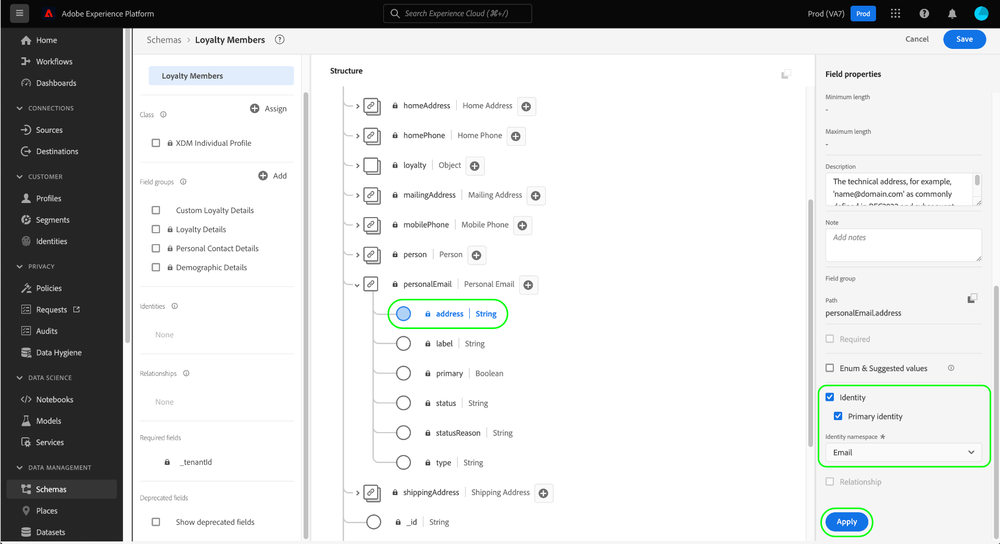

>[!NOTE]
>
>For a list of standard namespaces and their definitions, see the [[!DNL Identity Service] documentation](../../identity-service/troubleshooting-guide.md#standard-namespaces).

After applying the change, the icon for `personalEmail.address` shows a fingerprint symbol, indicating that it is now an identity field. The field is also listed in the left rail under **[!UICONTROL Identities]**.

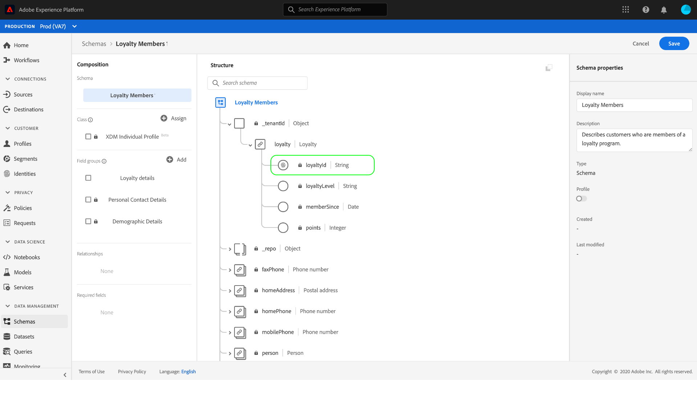

Now all data ingested into the `personalEmail.address` field will be used to help identify that individual and stitch together a single view of that customer. To learn more about working with identities in [!DNL Experience Platform], please review the [[!DNL Identity Service]](../../identity-service/home.md) documentation.

## Enable the schema for use in [!DNL Real-Time Customer Profile] {#profile}

[[!DNL Real-Time Customer Profile]](../../profile/home.md) leverages identity data in [!DNL Experience Platform] to provide a holistic view of each individual customer. The service builds robust, 360&deg; profiles of customer attributes as well as timestamped accounts of every interaction customers have had across any system integrated with [!DNL Experience Platform]. 

In order for a schema to be enabled for use with [!DNL Real-Time Customer Profile], it must have a primary identity defined. You will receive an error message if you attempt to enable a schema without first defining a primary identity.

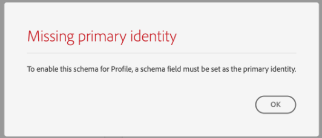

To enable the "Loyalty Members" schema for use in [!DNL Profile], begin by selecting the schema title in the canvas.

On the right side of the editor, information is shown about the schema including its display name, description, and type. In addition to this information, there is a **[!UICONTROL Profile]** toggle button.

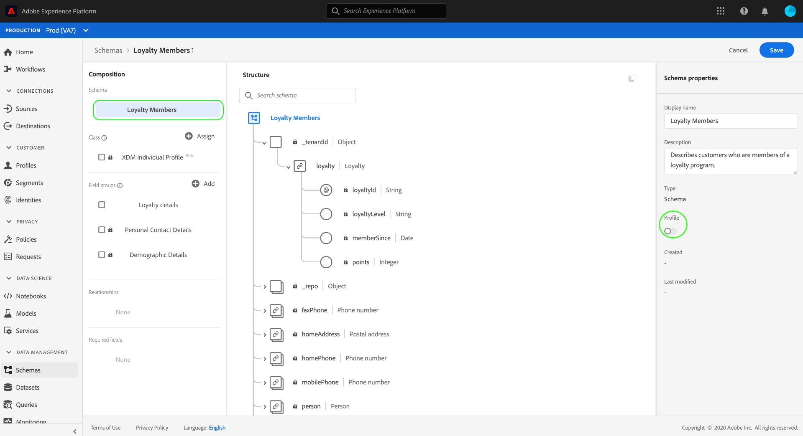

Select **[!UICONTROL Profile]** and a popover appears, asking you to confirm that you wish to enable the schema for [!DNL Profile]. 

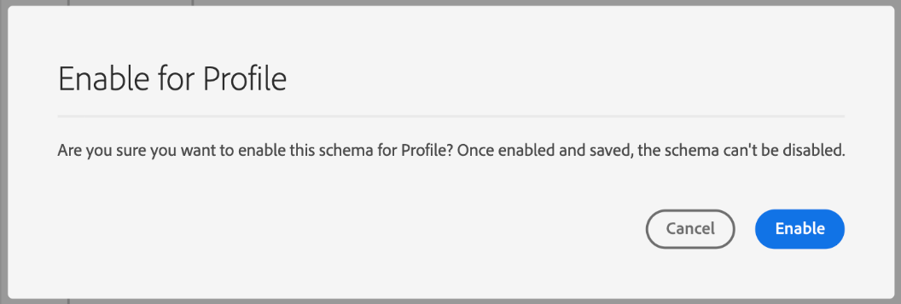

>[!WARNING]
>
>Once a schema has been enabled for [!DNL Real-Time Customer Profile] and saved, it cannot be disabled.

Select **[!UICONTROL Enable]** to confirm your choice. You can select the **[!UICONTROL Profile]** toggle again to disable the schema if you wish, but once the schema has been saved while [!DNL Profile] is enabled, it can no longer be disabled.

## More actions {#more}

Within the Schema Editor you can also conduct quick actions to copy the JSON structure of the schema or delete the schema if it has not been enabled for Real-Time Customer Profile or has associated datasets. Select [!UICONTROL More] at the top of the view to display a drop down with quick actions. 

The Copy JSON structure functionality allows you to see what a sample payload would look like while you are still building the schema and your data pipelines. It is especially helpful for situations where there are complex object map structures in the schema such as an identity map.

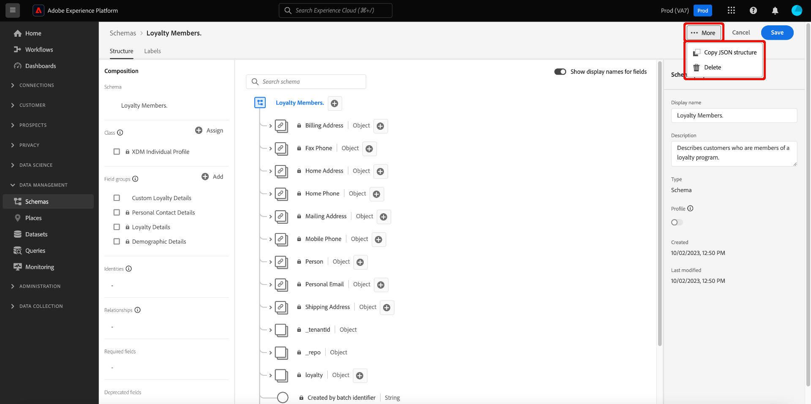

## Next steps and additional resources

Now that you have finished composing the schema, you can see the complete schema in the canvas. Select **[!UICONTROL Save]** and the schema will be saved to the [!DNL Schema Library], making it accessible by the [!DNL Schema Registry].

Your new schema can now be used to ingest data into [!DNL Platform]. Remember that once the schema has been used to ingest data, only additive changes may be made. See the [basics of schema composition](../schema/composition.md) for more information on schema versioning.

You can now follow the tutorial on [defining a schema relationship in the UI](./relationship-ui.md) to add a new relationship field to the "Loyalty Members" schema.

The "Loyalty Members" schema is also available to be viewed and managed using the [!DNL Schema Registry] API. To begin working with the API, start by reading the [[!DNL Schema Registry API] developer guide](../api/getting-started.md).

### Video resources

>[!WARNING]
>
>The [!DNL Platform] UI shown in the following videos are out of date. Please refer to the documentation above for the latest UI screenshots and functionality.

The following video shows how to create a simple schema in the [!DNL Platform] UI.

>[!VIDEO](https://video.tv.adobe.com/v/27012?quality=12&learn=on)

The following video is intended to reinforce your understanding of working with field groups and classes.

>[!VIDEO](https://video.tv.adobe.com/v/27013?quality=12&learn=on)

## Appendix

The following sections provide addition information information regarding the use of the [!DNL Schema Editor].

### Create a new class {#create-new-class}

[!DNL Experience Platform] provides the flexibility to define a schema based on a class that is unique to your organization. To learn how to create a new class, see the guide on [creating and editing classes in the UI](../ui/resources/classes.md#create).

### Change the class of a schema {#change-class}

You can change the class of a schema at any point during the initial composition process before the schema has been saved.

>[!WARNING]
>
>Reassigning the class for a schema should be done with extreme caution. Field groups are only compatible with certain classes, and therefore changing the class will reset the canvas and any fields you have added. 

To learn how to change the class of a schema, see the guide on [managing schemas in the UI](../ui/resources/schemas.md#change-class).
