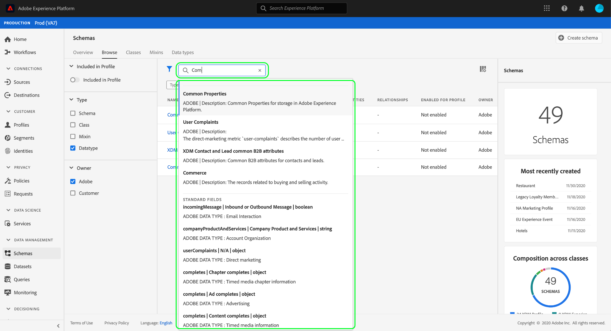
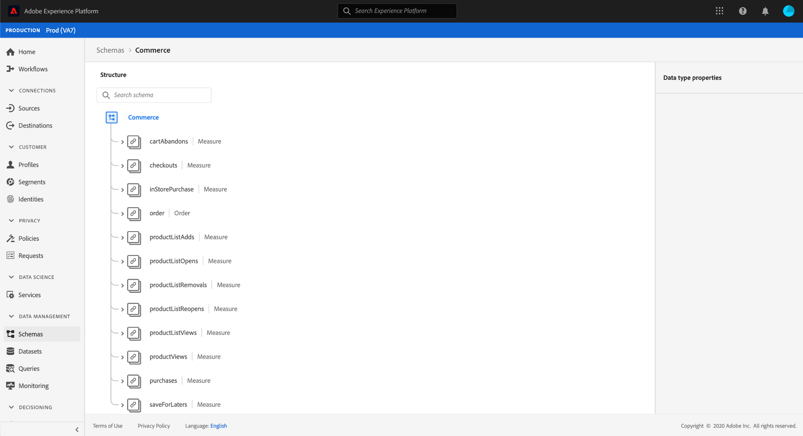
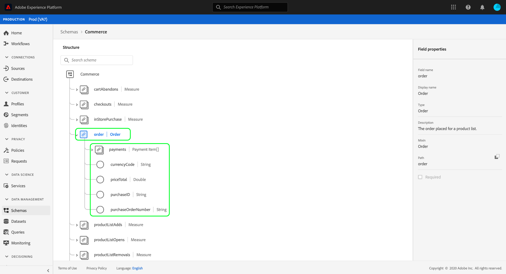
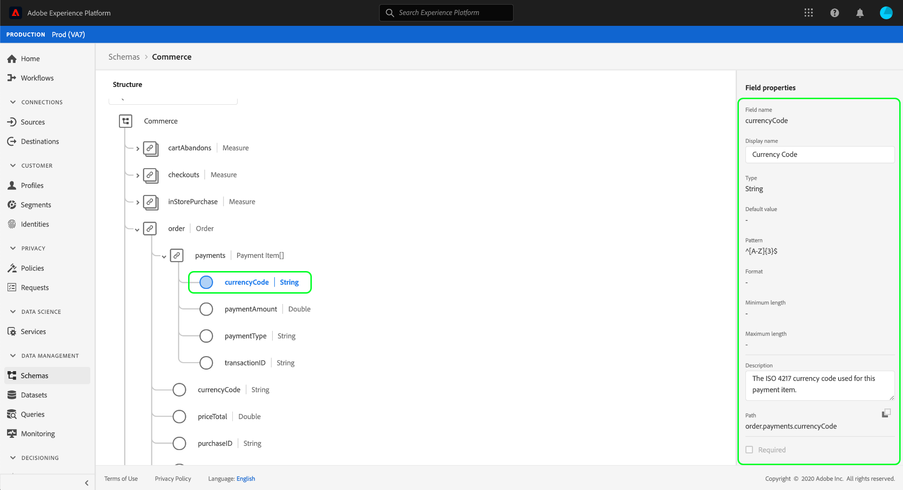

# Explore XDM resources in the UI

In Adobe Experience Platform, all Experience Data Model (XDM) resources are stored in the [!DNL Schema Library], including standard resources provided by Adobe and custom resources defined by your organization. In the Experience Platform UI, you can view the structure and fields of any existing schema, class, mixin, or data type in the [!DNL Schema Library]. This is especially useful when planning and preparing for data ingestion, as the UI provides information on the expected data types and use cases of each field provided by these XDM resources.

This tutorial covers the steps for exploring existing schemas, classes, mixins, and data types in the Experience Platform UI.

## Look up an XDM resource to explore

In the Platform UI, select **[!UICONTROL Schemas]** in the left navigation. The [!UICONTROL Schemas] workspace provides a **[!UICONTROL Browse]** tab to explore all existing XDM resources in your organization, along with additional dedicated tabs for exploring **[!UICONTROL Classes]**, **[!UICONTROL Mixins]**, and **[!UICONTROL Data types]** specifically.

On the [!UICONTROL Browse] tab, you can use the search bar or filter icon () to narrow down listed results.

For example, to filter the list to only show standard data types provided by Adobe, select the filter icon to open the filter rail. Under **[!UICONTROL Type]**, select **[!UICONTROL Datatype]**, and under **[!UICONTROL Owner]**, select **[!UICONTROL Adobe]**. 

You can use the search bar to narrow results even further. Any resources whose titles match the search query appear at the top of the list. Under **[!UICONTROL Standard Fields]**, all resources that contain standard fields matching the search query are listed.

When you have found the resource you want to explore, select its name from the list to view its structure in the canvas.

## Explore the resource in the canvas

Once you select a resource, its structure opens in the canvas.

Any object-type fields at the root level will be collapsed by default. To show the sub-properties of any field, select its icon in the canvas.

### Data types

Note that for each field shown in the canvas, its corresponding data type is shown next to its name, indicating at a glance the type of data that field expects for data ingestion.

Any data type that is appended with square brackets (`[]`) represents an array of that data type. For example, a data type of **[!UICONTROL String]\[]** indicates that the field expects an array of string values. A data type of **[!UICONTROL Payment Item]\[]**

## Next steps