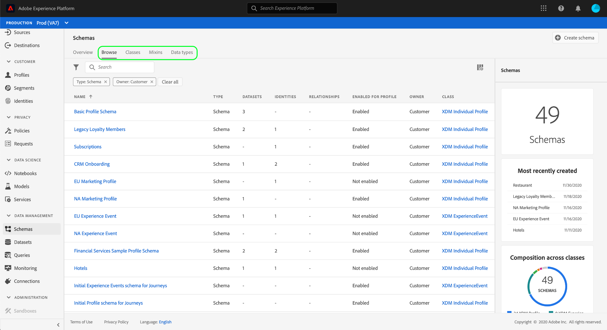
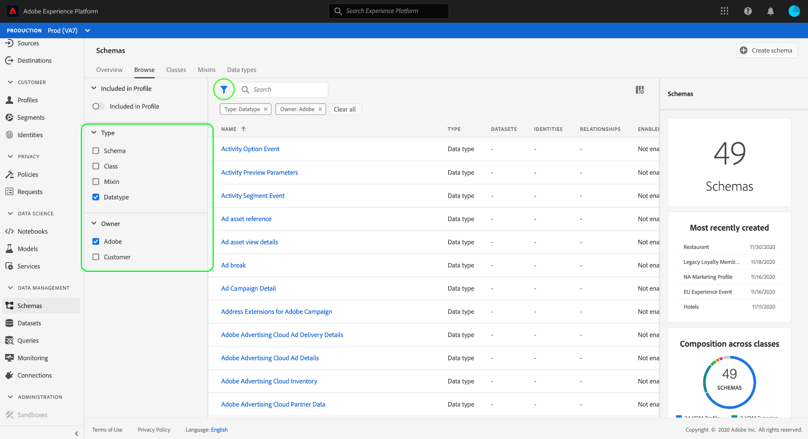
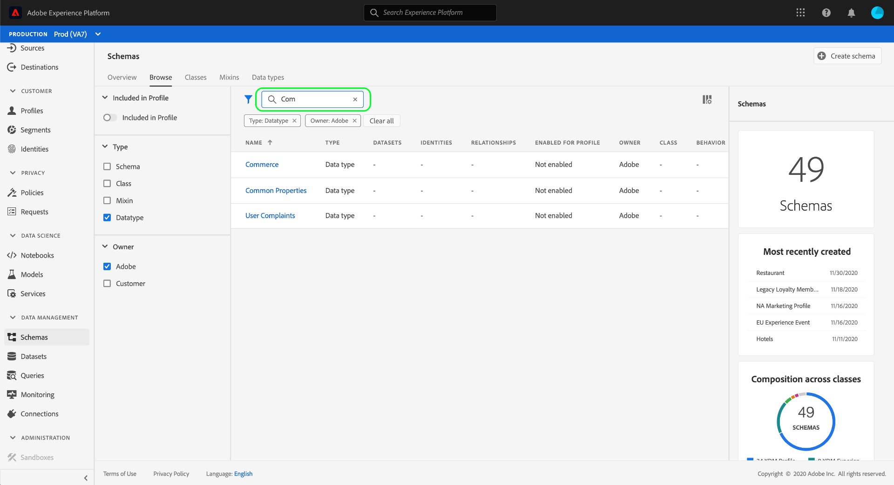

# Explore XDM resources in the UI

In Adobe Experience Platform, all Experience Data Model (XDM) resources are stored in the [!DNL Schema Library], including standard resources provided by Adobe and custom resources defined by your organization. In the Experience Platform UI, you can view the structure and fields of any existing schema, class, mixin, or data type in the [!DNL Schema Library]. This is especially useful when planning and preparing for data ingestion, as the UI provides information on the expected data types and use cases of each field provided by these XDM resources.

This tutorial covers the steps for exploring existing schemas, classes, mixins, and data types in the Experience Platform UI.

## Look up an XDM resource to explore

In the Platform UI, select **[!UICONTROL Schemas]** in the left navigation. The [!UICONTROL Schemas] workspace provides a **[!UICONTROL Browse]** tab to explore all existing XDM resources in your organization, along with additional dedicated tabs for exploring **[!UICONTROL Classes]**, **[!UICONTROL Mixins]**, and **[!UICONTROL Data types]** specifically.

On the [!UICONTROL Browse] tab, you can use the search bar or filter icon () to narrow down listed results.

For example, if you wanted to look up the standard data type

## Explore the resource in the canvas

## Next steps