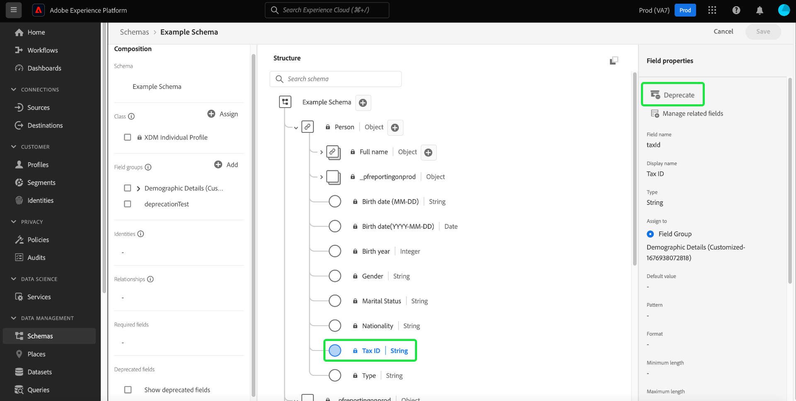
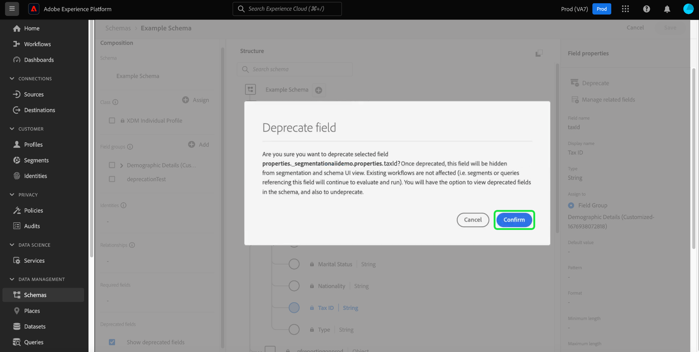
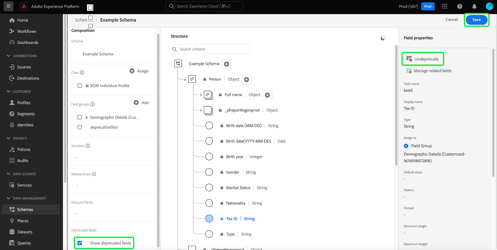

# Deprecate an XDM field in the UI

Experience Data Model (XDM) offers you the flexibility to manage your data model as your business needs change by deprecating schema fields even after data has ben ingested. Unwanted fields can be deprecated to remove them from the UI view and also hide them from downstream UIs. Conveniently, you can also show deprecated fields using a toggle in the Schema Editor, and even undeprecate them should you need.  

<!-- Once deprecated, downstream UIs such as Segmentation dashboards, Customer Journey Analytics, and Adobe Journey Optimizer, no longer display deprecated fields as part of their workflow. Although, they all retain the option to show deprecated fields if needed.  -->

As deprecated fields are hidden from the UI by default, this streamlines your schema in the Schema Editor and prevents unwanted fields from being added to downstream dependencies such as the segment builder, journey designer, and so on. Field deprecation is also backward compatible. Other systems that use deprecated fields such as segments and queries will continue to evaluate them as intended. If a deprecated field is used in an existing segment it is treated normally, meaning that the field shows up as expected in the segment builder canvas or is evaluated based on any data available in the deprecated fields. This is a non-breaking change that does not negatively affect any existing data flows.

Before data is ingested into a schema, you can remove unnecessary field groups. See the documentation on [how to remove a field group from a schemas](../ui/resources/schemas.md#remove-fields) for more information. Once data has been ingested into your schema, you can no longer remove fields from the schema without making breaking changes. In this case, you can deprecate an unwanted field within a schema or custom resource by using the [Schema Editor](./create-schema-ui.md) or the [Schema Registry API](https://developer.adobe.com/experience-platform-apis/references/schema-registry/). 

This document covers how to deprecate fields for different XDM resources using the Schema Editor in the Experience Platform user interface. For steps on deprecating an XDM field using the API, see the tutorial on [deprecating an XDM field using the Schema Registry API](./field-deprecation-api.md).

## Deprecate a field {#deprecate}

To deprecate a custom field, navigate to the Schema Editor for the schema you want to edit. Select the field that you want to deprecate from the [!UICONTROL Structure] section of the canvas followed by **[!UICONTROL Deprecate]** from the [!UICONTROL Field Properties].

A dialog appears to confirm your choices and notify you that the field will be removed from the UI view of the union schema, and hidden from downstream UIs. Select **[!UICONTROL Confirm]** to complete the action. 

The field is now removed from the UI view.

>[!NOTE]
>
>Once deprecated, downstream UIs such as Segmentation dashboards, Customer Journey Analytics, and Adobe Journey Optimizer, no longer display deprecated fields as part of their workflow. However, downstream UIs have the option to show deprecated fields if needed, and continue to treat the deprecated field as normal. See their respective documentation for more information. Queries and segments that use the deprecated field will continue to run as expected.

## Show deprecated fields {#show-deprecated}

To view previously deprecated fields, navigate to the relevant schema in the Schema Editor. In the [!UICONTROL Composition] section of the canvas, select the **[!UICONTROL Show deprecated fields]** checkbox.

The field now appears in the UI view. Select **[!UICONTROL Save]** to confirm your settings.

## Undeprecate fields {#undeprecate-fields}

To undeprecate a deprecated field, first [display the deprecated field](#show-deprecated) as described in the process above, then select the deprecated field from the [!UICONTROL Structure] section of the editor. Next, select **[!UICONTROL Undeprecate]** from the [!UICONTROL Field properties] sidebar.

The [!UICONTROL Undeprecate field] dialog appears. This dialog asks you to confirm your choice. Select **[!UICONTROL Confirm]**

![The [!UICONTROL Undeprecate field] dialog with Confirm highlighted.](../images/tutorials/field-deprecation/undeprecate-field-dialog.png)

The field now displays as standard in the UI view and also in downstream UIs. Again, you now have the option to deprecate the field.

## Next steps

This document covered how to deprecate XDM fields using the Schema Editor UI. For more information on configuring fields for custom resources, see the guide on [defining XDM fields in the API](./custom-fields-api.md). For more information on managing descriptors, see the [descriptors endpoint guide](../api/descriptors.md).
