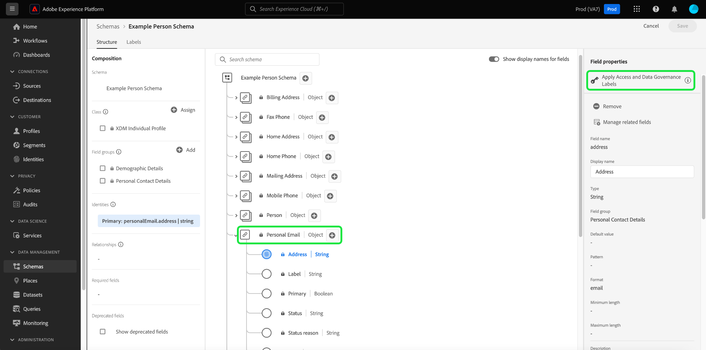
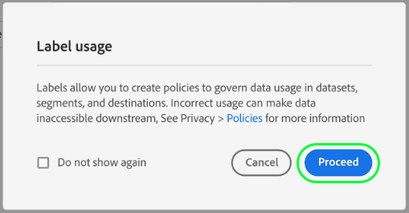
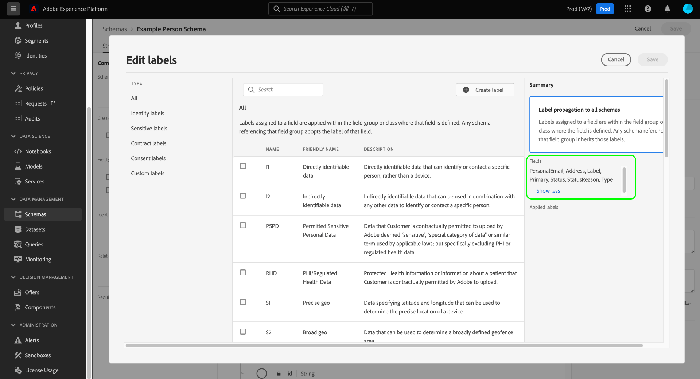
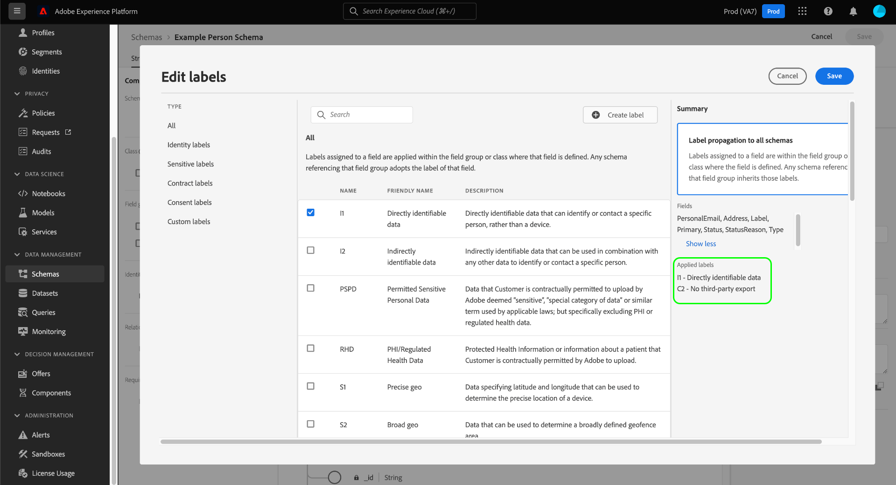
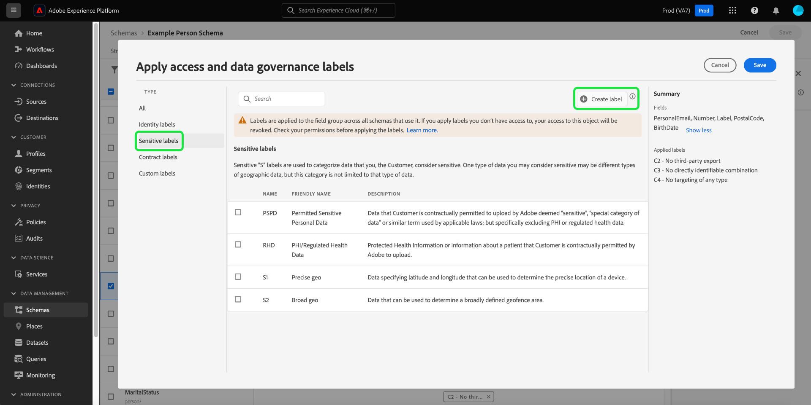
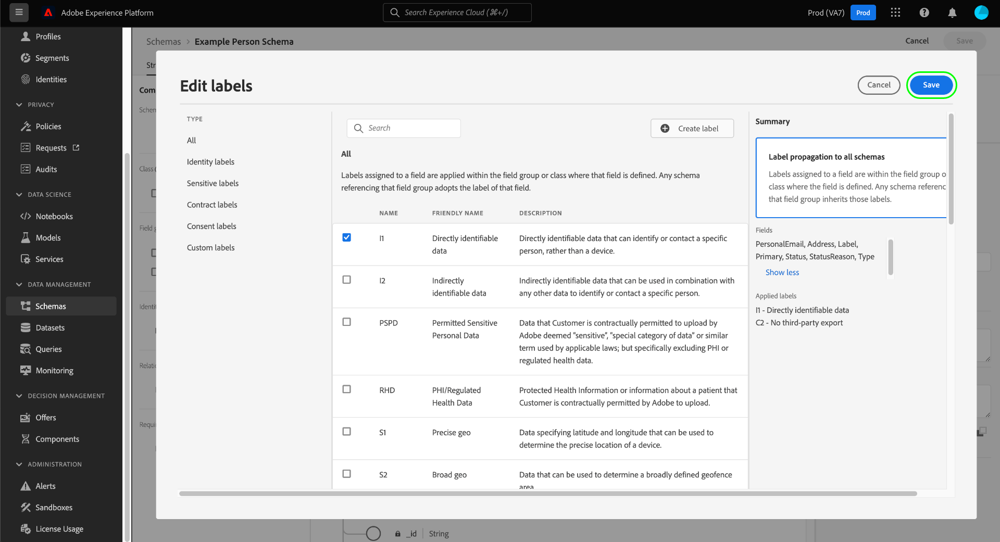
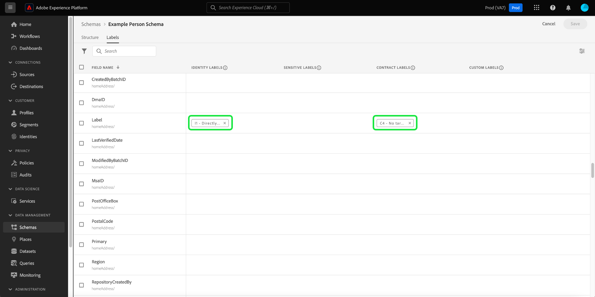

# Manage data usage labels for a schema

>[!IMPORTANT]
>
>Schema-based labeling is part of [attribute-based access control](../../access-control/abac/overview.md), which is currently available in a limited release for US-based healthcare customers. This capability will be available to all Adobe Real-Time Customer Data Platform customers once it is fully released.

All data that is brought into Adobe Experience Platform is constrained by Experience Data Model (XDM) schemas. This data may be subject to usage restrictions defined by your organization or by legal regulations. To account for this, the Platform allows you to restrict the usage of certain datasets and fields through the use of [data usage labels](../../data-governance/labels/overview.md).

A label applied to a schema field indicates the usage policies that apply to the data contained in that specific field. 

Labels can be applied to applied to individual schemas, and fields within those schemas. When labels are applied directly to a schema, those labels are propagated to all existing and future datasets that are based on that schema.

In addition, any field label that you add in one schema propagates to all other schemas that employ the same field from a shared class or field group. This helps to ensure that usage rules for similar fields are consistent across your entire data model.

This tutorial covers the steps for adding labels to a schema using the Schema Editor in the Platform UI.

## Getting started

This guide requires a working understanding of the following components of Adobe Experience Platform:

* [[!DNL Experience Data Model (XDM) System]](../home.md): The standardized framework by which [!DNL Experience Platform] organizes customer experience data.
  * [Schema Editor](../ui/overview.md): Learn how to create and manage schemas and other resources in the Platform UI.
* [[!DNL Adobe Experience Platform Data Governance]](../../data-governance/home.md): Provides the infrastructure for enforcing data usage restrictions on Platform operations, using policies that define which marketing actions can (or cannot) be performed on labeled data.

## Select a schema or field to add labels to {#select-schema-field}

>[!CONTEXTUALHELP]
>id="platform_schemas_editgovernancelabels"
>title="Edit governance labels"
>abstract="Apply a label to a schema field to indicate the usage policies that apply to the data contained in that specific field."

To start adding labels, you must first [select an existing schema to edit](../ui/resources/schemas.md#edit) or [create a new schema](../ui/resources/schemas.md#create) to view its structure in the Schema Editor.

To edit the labels for an individual field, you can select the field in the canvas and then select **[!UICONTROL Manage access]** in the right rail.

>[!IMPORTANT]
>
>A maximum of 300 labels can be applied to any schema.

You can also select the **[!UICONTROL Labels]** tab, choose the desired field from the list, and select **[!UICONTROL Apply Access and Data Governance Labels]** in the right rail.

![Select a field from the [!UICONTROL Labels] tab](../images/tutorials/labels/select-field-on-labels-tab.png)

To edit the labels for the entire schema, in the **[!UICONTROL Labels]** tab, select the checkbox under the filter icon. This selects every available field in the schema. Next, select **[!UICONTROL Apply Access and Data Governance Labels]** in the right rail.

![Select the schema name from the [!UICONTROL Labels] tab](../images/tutorials/labels/select-schema-on-labels-tab.png)

>[!NOTE]
>
>A disclaimer message appears when you first attempt to edit the labels for a schema or field, explaining how label usage affects downstream operations depending on your organization's policies. Select **[!UICONTROL Proceed]** to continue editing.
>
>

## Edit the labels for the schema or field {#edit-labels}

A dialog appears that allows you to edit the labels for the selected field. If you selected an individual object-type field, the right rail lists the sub-fields that the applied labels will propagate to.

>[!NOTE]
>
>If you are editing fields for the whole schema, the right rail does not list the applicable fields and displays the schema name instead.

Use the displayed list to select the labels you want to add to the schema or field. As labels are chosen, the **[!UICONTROL Applied labels]** section updates to show the labels that have been selected so far.

To filter the displayed labels by type, select the desired category in the left rail. To create a new custom label, select **[!UICONTROL Create label]**.

Once you are satisfied with your chosen labels, select **[!UICONTROL Save]** to apply them to the field or schema. 

The **[!UICONTROL Labels]** tab reappears, showing the applied labels for the schema.

## Next steps

This guide covered how to manage data usage labels for schemas and fields. For information on managing data usage labels, including how to add them to specific datasets rather than at the schema level, see the [data usage labels UI guide](../../data-governance/labels/user-guide.md).
