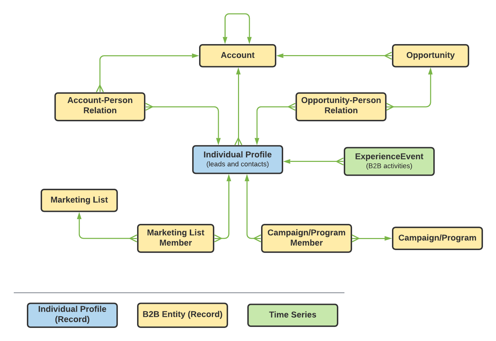
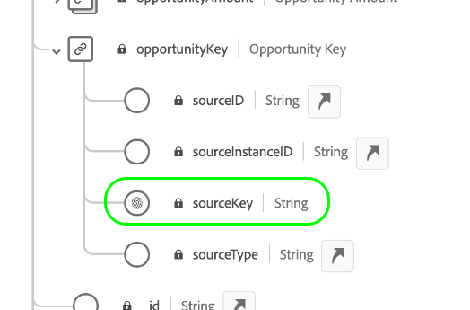
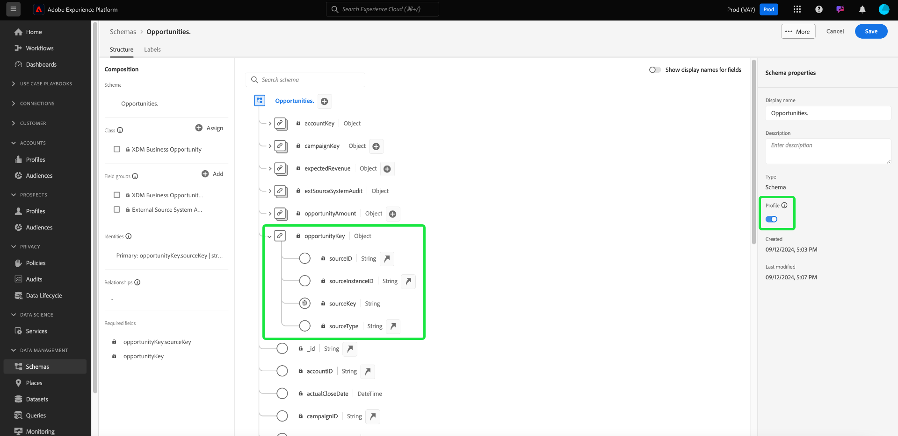
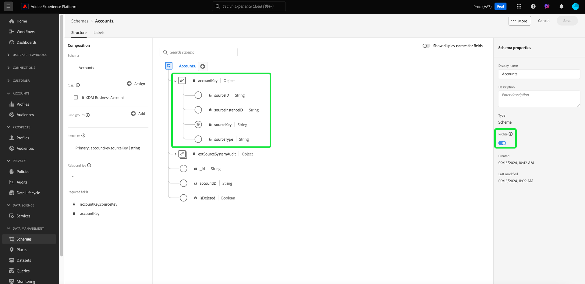
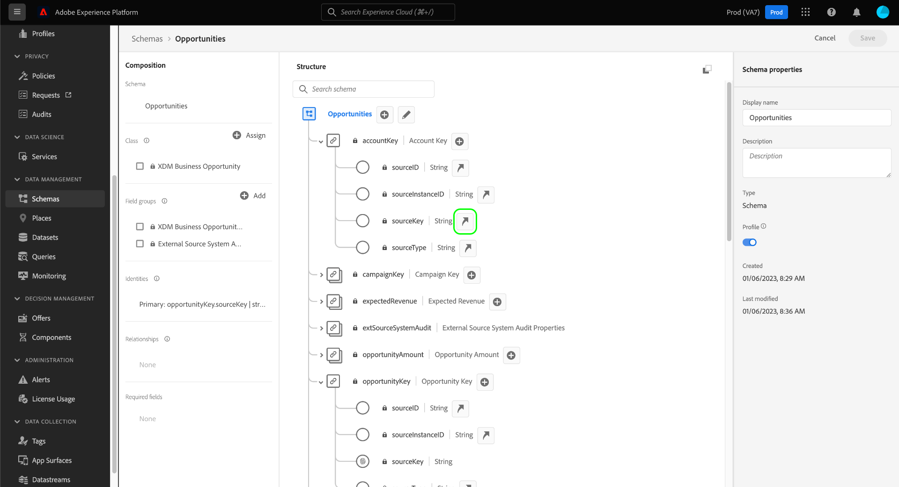
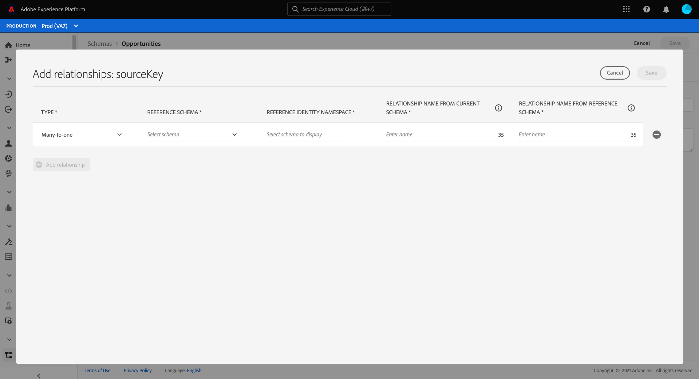
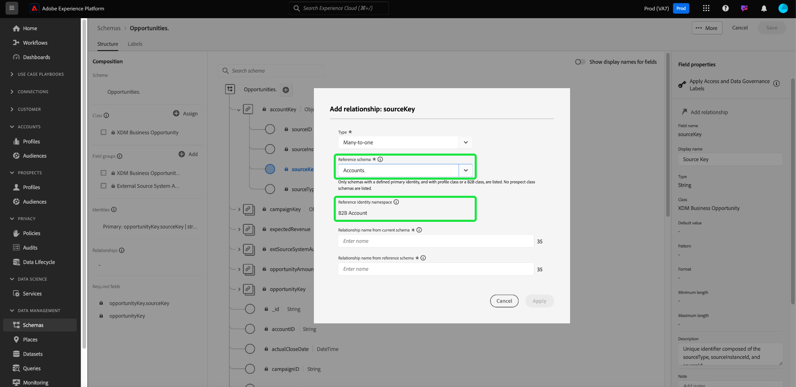
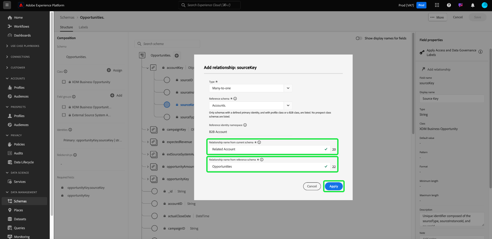

# Define a many-to-one relationship between two schemas in Real-Time Customer Data Platform B2B Edition {#relationship-b2b}

>[!CONTEXTUALHELP]
>id="platform_xdm_b2b_reference_schema"
>title="Reference schema"
>abstract="Select the schema you want to establish a relationship with. Depending on the schema's class, it may also have existing relationships with other entities in the B2B context. See the documentation to learn how B2B schema classes relate to each other."

Adobe Real-Time Customer Data Platform B2B Edition provides several Experience Data Model (XDM) classes that capture fundamental B2B data entities, including [accounts](../classes/b2b/business-account.md), [opportunities](../classes/b2b/business-opportunity.md), [campaigns](../classes/b2b/business-campaign.md), and more. By building schemas based on these classes and enabling them for use in [Real-Time Customer Profile](../../profile/home.md), you can merge data from disparate sources into a unified representation called a union schema.

However, union schemas can only contain fields captured by schemas that share the same class. This is where schema relationships come in. By implementing relationships in your B2B schemas, you can describe how these business entities relate to each other and can include attributes from multiple classes in downstream segmentation use cases.

The following diagram provides an example of how the different B2B classes can relate to each other in a basic implementation:

This tutorial covers the steps to define a many-to-one relationship between two schemas in Real-Time CDP B2B Edition.

>[!NOTE]
>
>If you are not using Real-Time Customer Data Platform B2B Edition or want to create a one-to-one relationship, see the guide on [creating a one-to-one relationship](./relationship-ui.md) instead.
>
>This tutorial focuses on how to manually establish relationships between B2B schemas in the Platform UI. If you are bringing in data from a B2B source connection, you can use an auto-generation utility to create the required schemas, identities, and relationships instead. See the sources documentation on B2B namespaces and schemas for more information on [using the auto-generation utility](../../sources/connectors/adobe-applications/marketo/marketo-namespaces.md).

## Getting started

This tutorial requires a working understanding of [!DNL XDM System] and the Schema Editor in the [!DNL Experience Platform] UI. Before beginning this tutorial, please review the following documentation:

* [XDM System in Experience Platform](../home.md): An overview of XDM and its implementation in [!DNL Experience Platform].
* [Basics of schema composition](../schema/composition.md): An introduction of the building blocks of XDM schemas.
* [Create a schema using the [!DNL Schema Editor]](create-schema-ui.md): A tutorial covering the basics of how to build and edit schemas in the UI.

## Define a source and reference schema

It is expected that you have already created the two schemas that will be defined in the relationship. For demonstration purposes, this tutorial creates a relationship between business opportunities (defined in an "[!DNL Opportunities]" schema) and their associated business account (defined in an "[!DNL Accounts]" schema).

Schema relationships are represented by a dedicated field within a **source schema** that references the primary identity field of a **reference schema**. In the steps that follow, "[!DNL Opportunities]" serves as the source schema, while "[!DNL Accounts]" acts as the reference schema.

### Understanding identities in B2B relationships

>[!CONTEXTUALHELP]
>id="platform_xdm_b2b_identity_namespace"
>title="Reference identity namespace"
>abstract="The namespace (type) for the reference schema's primary identity field. The reference schema must have an established primary identity field in order to participate in a relationship. See the documentation to learn more about identities in B2B relationships."

In order to establish a relationship, the reference schema must have a defined primary identity. When setting a primary identity for a B2B entity, keep in mind that string-based entity IDs may overlap if you are collecting them across different systems or locations, which could lead to data conflicts in Platform.

To account for this, all standard B2B classes contain "key" fields that conform to the [[!UICONTROL B2B Source] data type](../data-types/b2b-source.md). This data type provides fields for a string identifier for the B2B entity along with other contextual information about the identifier's source. One of these fields, `sourceKey`, concatenates the values of the other fields in the data type to produce a wholly unique identifier for the entity. This field should always be used as the primary identity for B2B entity schemas.

>[!NOTE]
>
>When [setting an XDM field as an identity](../ui/fields/identity.md), you must provide an identity namespace to define the identity under. This can be a standard namespace provided by Adobe, or a custom namespace defined by your organization. In practice, the namespace is simply a contextual string and can be set to any value you like, provided that it is meaningful to your organization for categorizing the identity type. See the overview on [identity namespaces](../../identity-service/features/namespaces.md) for more information.

For reference purposes, the following sections describe the structure of each schema used in this tutorial before a relationship has been defined. Take note of where the primary identities have been defined in the schema structure and the custom namespaces they use.

### [!DNL Opportunities] schema

The source schema "[!DNL Opportunities]" is based on the [!UICONTROL XDM Business Opportunity] class. One of the fields provided by the class, `opportunityKey`, serves as the identifier for the schema. Specifically, the `sourceKey` field under the `opportunityKey` object is set as the schema's primary identity under a custom namespace called [!DNL B2B Opportunity]. 

As seen under **[!UICONTROL Schema Properties]**, this schema has been enabled for use in [!DNL Real-Time Customer Profile].

### [!DNL Accounts] schema

The reference schema "[!DNL Accounts]" is based on the [!UICONTROL XDM Account] class. The root-level `accountKey` field contains the `sourceKey` that acts as its primary identity under a custom namespace called [!DNL B2B Account]. This schema has also been enabled for use in Profile.

## Define a relationship field for the source schema {#relationship-field}

>[!CONTEXTUALHELP]
>id="platform_xdm_b2b_relationship_name_current"
>title="Relationship name from current schema"
>abstract="A label that describes the relationship from the current schema to the reference schema (for example, 'Related Account'). This label is used in Profile and Segmentation to give context to data from related B2B entities. See the documentation to learn more about building B2B schema relationships."

>[!CONTEXTUALHELP]
>id="platform_xdm_b2b_relationship_name_reference"
>title="Relationship name from reference schema"
>abstract="A label that describes the relationship from the reference schema to the current schema (for example, 'Related Opportunities'). This label is used in Profile and Segmentation to give context to data from related B2B entities. See the documentation to learn more about building B2B schema relationships."

In order to define a relationship between two schemas, the source schema must have a dedicated field that indicates the primary identity of the reference schema. Standard B2B classes include dedicated source key fields for commonly related business entities. For example, the [!UICONTROL XDM Business Opportunity] class contains source key fields for a related account (`accountKey`) and a related campaign (`campaignKey`). However, you can also add other [!UICONTROL B2B Source] fields to the schema by using custom field groups if you require more than the default components.

>[!NOTE]
>
>Currently, only many-to-one and one-to-one relationships can be defined from a source schema to a reference schema. For one-to-many relationships, you must define the relationship field in the schema that represents the "many".

To set a relationship field, select the arrow icon () next to the field in question within the canvas. In the case of the [!DNL Opportunities] schema, this is the `accountKey.sourceKey` field since the goal is to establish a many-to-one relationship with an account.

A dialog appears that allows you to specify the details about the relationship. The relationship type is automatically set to **[!UICONTROL Many-to-one]**.

Under **[!UICONTROL Reference Schema]**, use the search bar to find the name of the reference schema. When you highlight the reference schema's name, the **[!UICONTROL Reference Identity Namespace]** field automatically updates to the namespace of the schema's primary identity.

Under **[!UICONTROL Relationship Name From Current Schema]** and **[!UICONTROL Relationship Name From Reference Schema]**, provide friendly names for the relationship in the context of the source and reference schemas, respectively. When finished, select **[!UICONTROL Save]** to apply the changes and save the schema.

The canvas reappears, with the relationship field now marked with the friendly name you provided earlier. The relationship name is also listed under the left rail for easy reference.

If you view the structure of the reference schema, the relationship marker appears next to the schema's primary identity field and in the left rail.

## Next steps

By following this tutorial, you have successfully created a many-to-one relationship between two schemas using the [!DNL Schema Editor]. Once data has been ingested using datasets based on these schemas and that data has been activated in the Profile data store, you can use attributes from both schemas for [multi-class segmentation use cases](../../rtcdp/segmentation/b2b.md).
