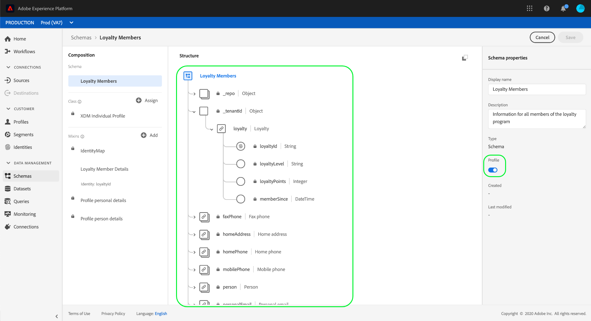
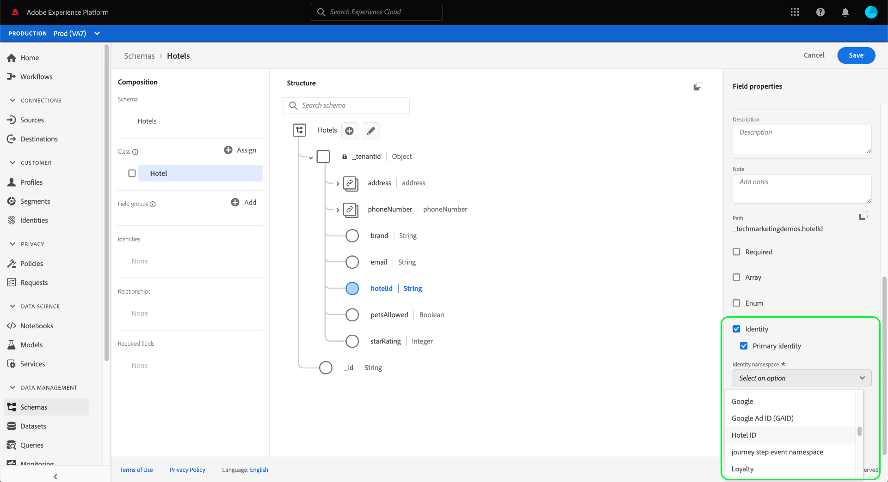
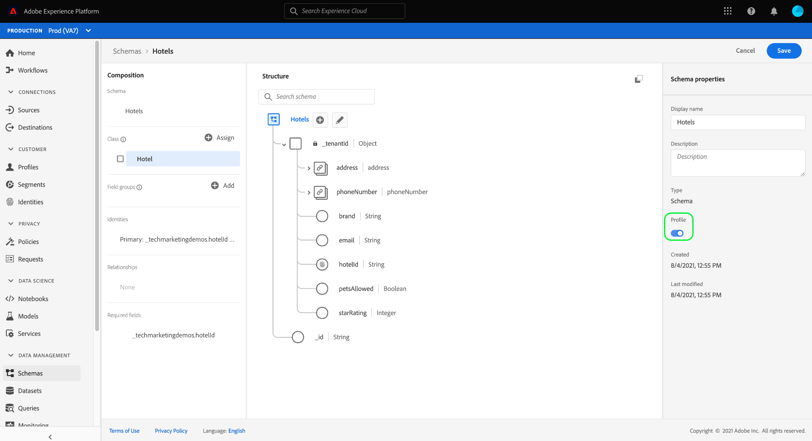
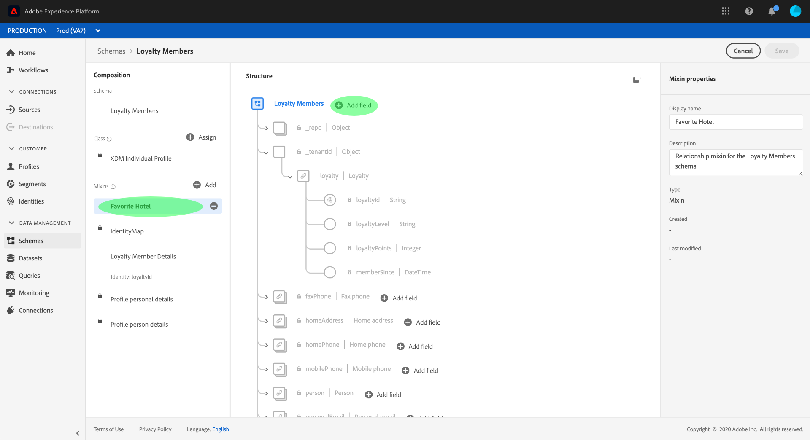
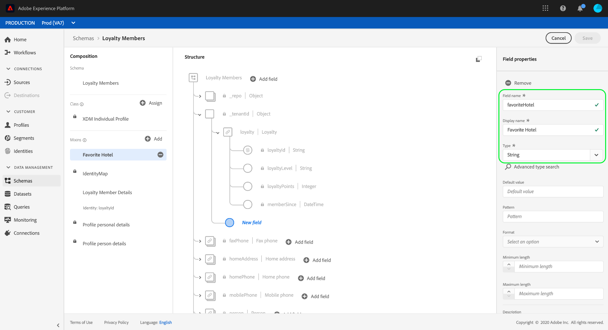
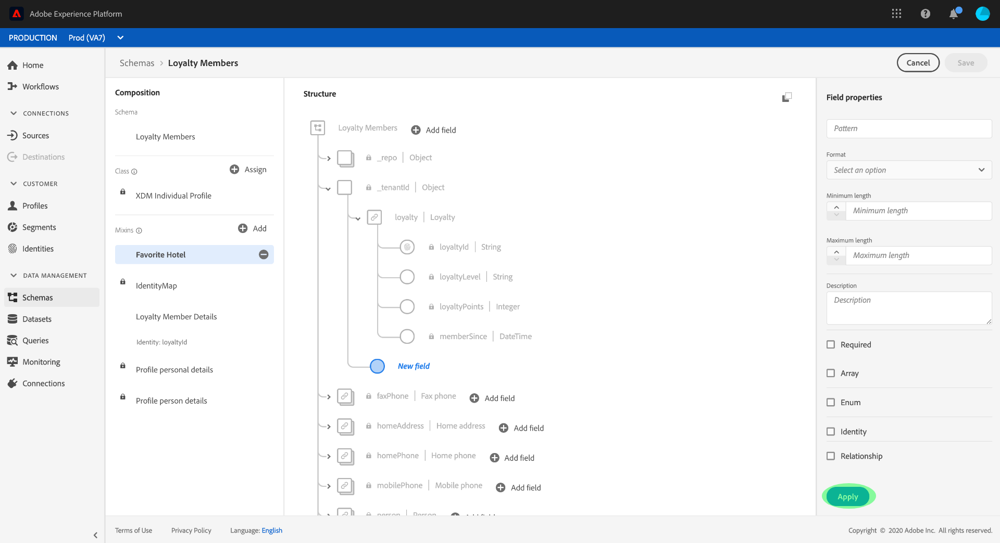
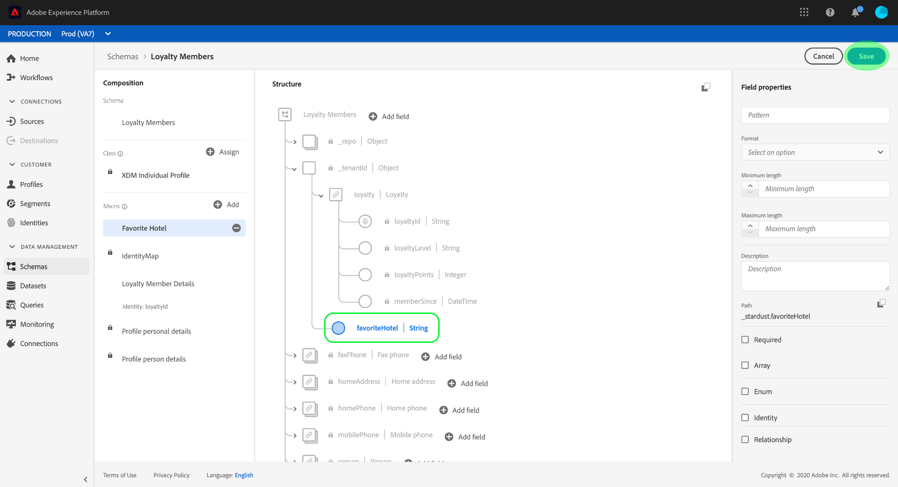
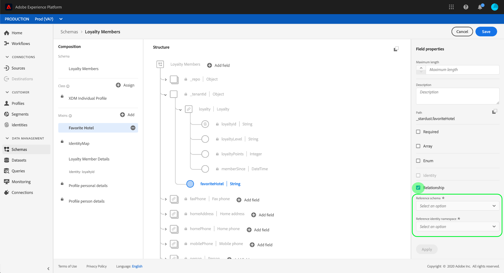
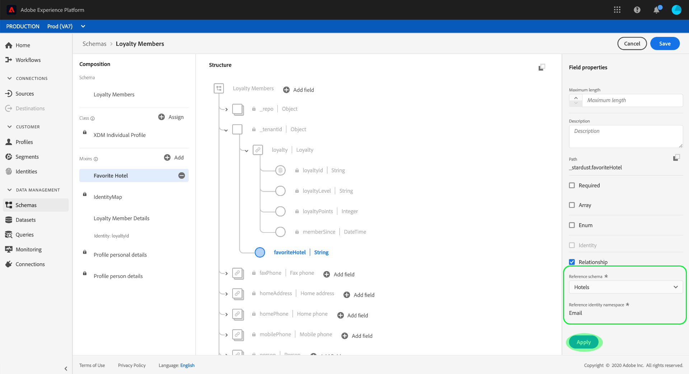
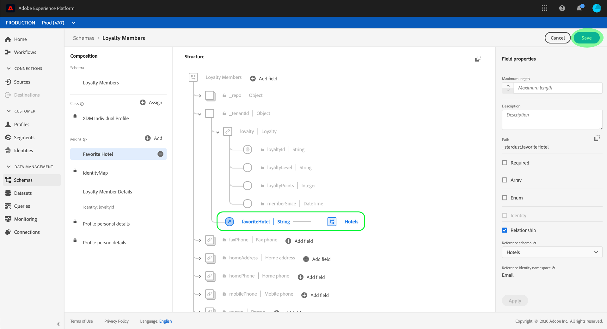

# Define a one-to-one relationship between two schemas using the [!DNL Schema Editor] {#relationship-ui}

>[!CONTEXTUALHELP]
>id="platform_schemas_relationships"
>title="Schema relationships"
>abstract="Schemas belonging to different classes can be contextually linked through relationship fields, allowing you to build more complex segmentation rules. See the documentation for more information on schema relationships."

>[!CONTEXTUALHELP]
>id="platform_xdm_1to1_reference_schema"
>title="Reference schema"
>abstract="Select the schema that you want to establish a relationship with. This schema can be a different class from the current schema. See the documentation for more information on schema relationships."

>[!CONTEXTUALHELP]
>id="platform_xdm_1to1_identity_namespace"
>title="Reference identity namespace"
>abstract="The namespace (type) for the reference schema's primary identity field. The reference schema must have an established primary identity field in order to participate in a relationship. See the documentation for more information on schema relationships."

The ability to understand the relationships between your customers and their interactions with your brand across various channels is an important part of Adobe Experience Platform. Defining these relationships within the structure of your [!DNL Experience Data Model] (XDM) schemas allows you to gain complex insights into your customer data.

While schema relationships can be inferred through the use of the union schema and [!DNL Real-Time Customer Profile], this only applies to schemas that share the same class. To establish a relationship between two schemas belonging to different classes, a dedicated relationship field must be added to a source schema, which references the identity of a destination schema.

This document provides a tutorial for defining a relationship between two schemas using the Schema Editor in the [!DNL Experience Platform] user interface. For steps on defining schema relationships using the API, see the tutorial on [defining a relationship using the Schema Registry API](relationship-api.md).

>[!NOTE]
>
>For steps on how to create a many-to-one relationship in Adobe Real-Time Customer Data Platform B2B Edition, see the guide on [creating B2B relationships](./relationship-b2b.md).

## Getting started

This tutorial requires a working understanding of [!DNL XDM System] and the Schema Editor in the [!DNL Experience Platform] UI. Before beginning this tutorial, please review the following documentation:

* [XDM System in Experience Platform](../home.md): An overview of XDM and its implementation in [!DNL Experience Platform].
* [Basics of schema composition](../schema/composition.md): An introduction of the building blocks of XDM schemas.
* [Create a schema using the [!DNL Schema Editor]](create-schema-ui.md): A tutorial covering the basics of working with the [!DNL Schema Editor].

## Define a source and destination schema

It is expected that you have already created the two schemas that will be defined in the relationship. For demonstration purposes, this tutorial creates a relationship between members of an organization's loyalty program (defined in a "[!DNL Loyalty Members]" schema) and their favorite hotel (defined in a "[!DNL Hotels]" schema).

>[!IMPORTANT]
>
>In order to establish a relationship, both schemas must have defined primary identities and be enabled for [!DNL Real-Time Customer Profile]. See the section on [enabling a schema for use in Profile](./create-schema-ui.md#profile) in the schema creation tutorial if you require guidance on how to configure your schemas accordingly.

Schema relationships are represented by a dedicated field within a **source schema** that refers to another field within a **destination schema**. In the steps that follow, "[!DNL Loyalty Members]" will be the source schema, while "[!DNL Hotels]" will act as the destination schema.

For reference purposes, the following sections describe the structure of each schema used in this tutorial before a relationship has been defined.

### [!DNL Loyalty Members] schema

The source schema "[!DNL Loyalty Members]" is based on the [!DNL XDM Individual Profile] class, and is the schema that was constructed in the tutorial for [creating a schema in the UI](create-schema-ui.md). It includes a `loyalty` object under its `_tenantId` namespace, which includes several loyalty-specific fields. One of these fields, `loyaltyId`, serves as the primary identity for the schema under the [!UICONTROL Email] namespace. As seen under **[!UICONTROL Schema Properties]**, this schema has been enabled for use in [!DNL Real-Time Customer Profile].

### [!DNL Hotels] schema

The destination schema "[!DNL Hotels]" is based on a custom "[!DNL Hotels]" class, and contains fields that describe a hotel.

In order to participate in a relationship, the destination schema must have a primary identity. In this example, the `hotelId` field is used as the primary identity, using a custom "Hotel ID" identity namespace.

>[!NOTE]
>
>To learn how to create custom identity namespaces, refer to the [Identity Service documentation](../../identity-service/namespaces.md#manage-namespaces).

Once the primary identity has been set, the destination schema must then be enabled for [!DNL Real-Time Customer Profile].

## Create a relationship schema field group

>[!NOTE]
>
>This step is only required if your source schema does not have a dedicated string-type field to be used as a reference to the destination schema. If this field is already defined in your source schema, skip to the next step of [defining a relationship field](#relationship-field).

In order to define a relationship between two schemas, the source schema must have a dedicated field to be used as a reference to the destination schema. You can add this field to the source schema by creating a new schema field group.

Start by selecting **[!UICONTROL Add]** in the **[!UICONTROL Field groups]** section.

The [!UICONTROL Add field group] dialog appears. From here, select **[!UICONTROL Create new field group]**. In the text fields that appear, enter a display name and description for the new field group. Select **[!UICONTROL Add field groups]** when finished.

The canvas reappears with "[!DNL Favorite Hotel]" appearing in the **[!UICONTROL Field groups]** section. Select the field group name, then select **[!UICONTROL Add field]** next to the root-level `Loyalty Members` field.

A new field appears in the canvas under the `_tenantId` namespace. Under **[!UICONTROL Field properties]**, provide a field name and display name for the field, and set its type to "[!UICONTROL String]".

When finished, select **[!UICONTROL Apply]**.

The updated `favoriteHotel` field appears in the canvas. Select **[!UICONTROL Save]** to finalize your changes to the schema.

## Define a relationship field for the source schema {#relationship-field}

Once your source schema has a dedicated reference field defined, you can designate it as a relationship field.

>[!NOTE]
>
>The steps below cover how to define a relationship field using the right-rail controls in the canvas. If you have access to Real-Time CDP B2B Edition, you can also define a one-to-one relationship using the [same dialog](./relationship-b2b.md#relationship-field) as when creating many-to-one relationships.

Select the `favoriteHotel` field in the canvas, then scroll down under **[!UICONTROL Field properties]** until the **[!UICONTROL Relationship]** checkbox appears. Select the checkbox to reveal the required parameters for configuring a relationship field.

Select the dropdown for **[!UICONTROL Reference schema]** and select the destination schema for the relationship ("[!DNL Hotels]" in this example). If the destination schema is enabled for [!DNL Profile], the **[!UICONTROL Reference identity namespace]** field is automatically set to the namespace of the destination schema's primary identity. If the schema does not have a primary identity defined, you must manually select the namespace that you plan to use from the dropdown menu. Select **[!UICONTROL Apply]** when finished.

The `favoriteHotel` field is now highlighted as a relationship in the canvas, displaying the name and reference identity namespace of the destination schema. Select **[!UICONTROL Save]** to save your changes and complete the workflow.

## Next steps

By following this tutorial, you have successfully created a one-to-one relationship between two schemas using the [!DNL Schema Editor]. For steps on how to define relationships using the API, see the tutorial on [defining a relationship using the Schema Registry API](relationship-api.md).
