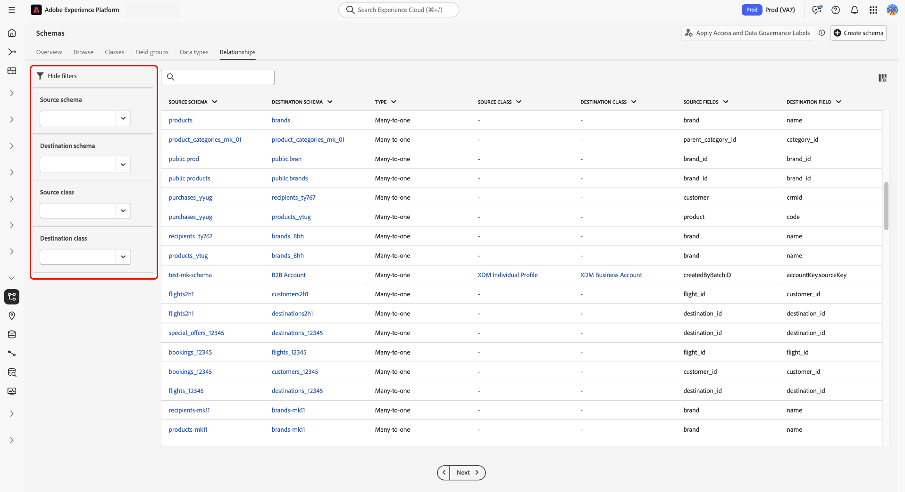
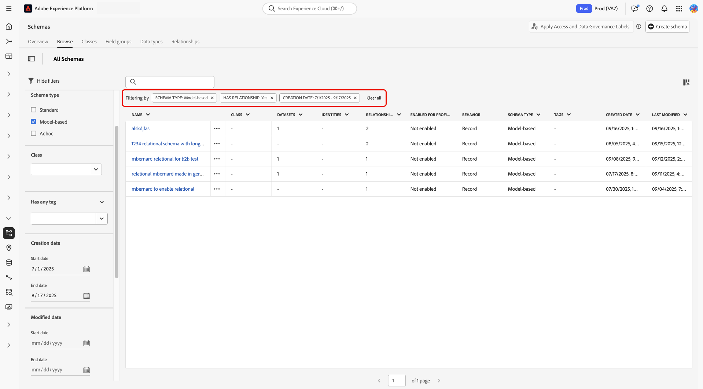
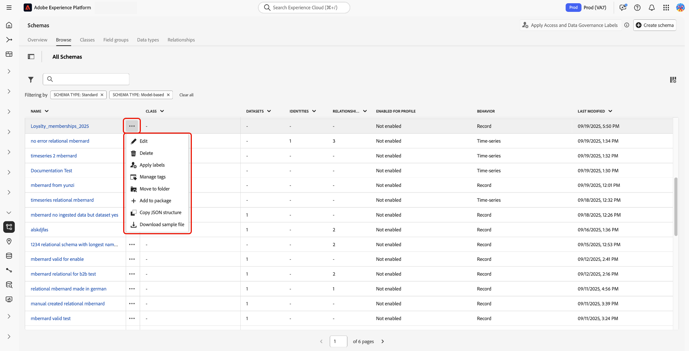
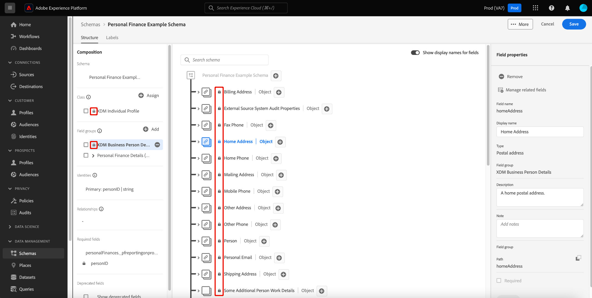
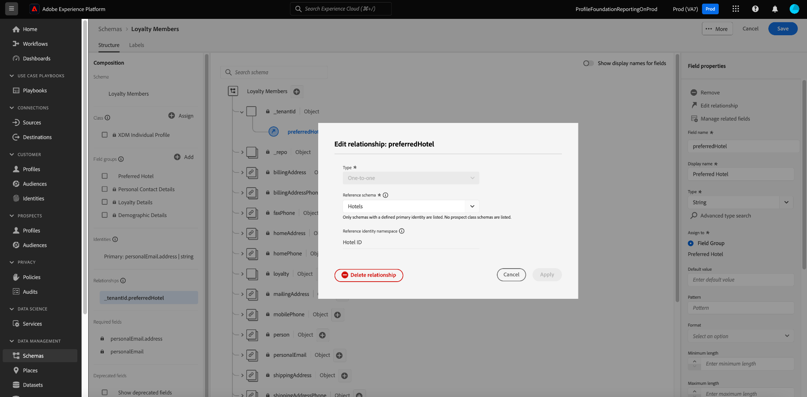

# Explore schema resources in the UI 

In Adobe Experience Platform, all Experience Data Model (XDM) schema resources are stored in the [!DNL Schema Library], including standard resources provided by Adobe and custom resources defined by your organization. In the Experience Platform UI, you can view the structure and fields of any existing schema, class, field group, or data type in the [!DNL Schema Library]. This is especially useful when planning and preparing for data ingestion, as the UI provides information on the expected data types and use cases of each field provided by these XDM resources.

This tutorial covers the steps for exploring existing schemas, classes, field groups, and data types in the Experience Platform UI.

## Look up a schema resource {#lookup}

In the Experience Platform UI, select **[!UICONTROL Schemas]** in the left navigation. The [!UICONTROL Schemas] workspace provides a **[!UICONTROL Browse]** tab to explore all schemas in your organization, along with additional dedicated tabs for exploring **[!UICONTROL Classes]**, **[!UICONTROL Field groups]**, **[!UICONTROL Data types]**, and **[!UICONTROL Relationships]** respectively.

Select the filter icon () to open filtering options in the left rail. Resource filters are available for schemas and relationships on the **[!UICONTROL Browse]** and **[!UICONTROL Relationships]** tabs respectively.

On the [!UICONTROL Browse] tab of the [!UICONTROL Schemas] workspace, you can filter your schema inventory. Use the **[!UICONTROL Included in Profile]** toggle to only show schemas that have been enabled for use in [Real-Time Customer Profile](../../profile/home.md). Use the **[!UICONTROL Show adhoc schemas]** toggle to filter the list of schemas created with fields namespaced for use only by a single dataset.

![The [!UICONTROL Schemas] workspace [!UICONTROL Browse] tab with the filters panel highlighted.](../images/ui/explore/filters.png)

On the [!UICONTROL Relationship] tab of the [!UICONTROL Schemas] workspace, you can filter the list of relationships based on four criteria. The filters include [!UICONTROL Source schema], [!UICONTROL Destination schema], [!UICONTROL Source class], and the [!UICONTROL Destination class]. The table below provides a description of the filters.

| Filter                            |Description |
|-----------------------------------|------------|
| [!UICONTROL Source schema]        | To see all relationships where the selected schema is the starting point or "source", select a schema from the [!UICONTROL Source schema] dropdown menu. |
| [!UICONTROL Destination schema]   | To view all relationships where the selected schema is the target or "destination", select a schema from the [!UICONTROL Destination schema] dropdown menu. |
| [!UICONTROL Source class]         | To filter relationships based on the class of the initiating schema, select a class from the [!UICONTROL Source class] dropdown menu. |
| [!UICONTROL Destination class]    | To display relationships that end with schemas of a specific class, select a class from the [!UICONTROL Destination class] dropdown menu. |

{style="table-layout:auto"}

Use the search bar to narrow down results further.

The resources displayed in search results are ordered first by title matches, then by description matches. In turn, the more word matches in either of these categories, the higher the resource appears in the list.

When you have found the resource you want to explore, select its name from the list to view its structure in the canvas.

## Enhanced schema browsing and organization

Use the [!UICONTROL Schemas] workspace filtering capabilities and organizational tools to find, organize, and act on schemas more efficiently. The inline actions improve discoverability, reduce navigation steps, and accelerate schema operations.

### Browse and filter metadata

The browse table displays additional columns that provide immediate visibility into schema characteristics and usage. View tags, schema type, Profile enablement status, and other metadata directly in the table view without opening individual schemas.

 The enhanced filter panel supports multiple filter types simultaneously, allowing you to narrow results by tag presence, schema type, relationship configuration, and custom metadata attributes.

Use filters to find Profile-enabled schemas with specific tags. Locate schemas of a particular type or those that contain relationship fields.

### Take inline actions on schemas

Each schema row provides access to contextual actions through an ellipsis menu, eliminating the need to navigate into individual schema details for common tasks.

 Edit schema properties, apply data governance labels, create datasets, and manage organizational metadata directly from the browse view. Additional actions include moving schemas to folders, adding them to deployment packages, copying JSON structures for development workflows, and downloading sample files for testing.

>[!NOTE]
>
>Sample files are for testing schema structure and should not contain production data.

These inline actions accelerate schema-related workflows by reducing navigation steps and enabling batch operations on multiple schemas when needed.

### Organize schemas using tags and folders

The workspace supports both tag-based and folder-based organization systems to accommodate different organizational preferences and use cases. Apply user-defined tags to categorize schemas by project, team, data domain, or any custom taxonomy that suits your organization. Alternatively, organize schemas into folder hierarchies for more structured browsing and access control.

Both organizational approaches integrate with the filtering system, allowing you to quickly locate schemas based on their assigned tags or folder placement. For detailed guidance on creating and managing tags across Experience Platform, see the [managing unified tags guide](../../../administrative-tags/ui/managing-tags.md).

## Explore an XDM resource in the canvas {#explore}

Once you select a resource, its structure opens in the canvas.

All object-type fields containing sub-properties are collapsed by default when they first appear in the canvas. To show the sub-properties of any field, select the icon next to its name.

### Standard class and field group indicator {#standard-class-and-field-group-indicator}

Within the Schema Editor, standard (Adobe-generated) classes and field groups are indicated with the padlock icon (. The padlock appears in the left rail next to the class or field group name, as well as next to any field in the schema diagram that is a part of a system-generated resource.

See the [Add custom fields to standard field groups](./resources/schemas.md) documentation for guidance. You cannot edit a standard class.

### System-generated fields {#system-fields}

Some field names are prepended with an underscore, such as `_repo` and `_id`. These represent placeholders for fields that the system will automatically generate and assign as data is ingested.

As such, most of these fields should be excluded from the structure of your data when ingesting into Experience Platform. The main exception to this rule is the [`_{TENANT_ID}` field](../api/getting-started.md#know-your-tenant_id), which all XDM fields created under your organization must be namespaced under.

### Data types {#data-types}

For each field shown in the canvas, its corresponding data type is shown next to its name, indicating at a glance the type of data that field expects for ingestion.

Any data type that is appended with square brackets (`[]`) represents an array of that particular data type. For example, a data type of **[!UICONTROL String]\[]** indicates that the field expects an array of string values. A data type of **[!UICONTROL Payment Item]\[]** indicates an array of objects that conform to the [!UICONTROL Payment Item] data type.

If an array field is based on an object type, you can select its icon in the canvas to show the expected attributes for each array item.

### [!UICONTROL Field properties] {#field-properties}

When you select the name of any field in the canvas, the right rail updates to show details about that field under **[!UICONTROL Field properties]**. This can include a description of the field's intended use case, default values, patterns, formats, whether or not the field is required, and more.

If the field you are inspecting is an enum field, the right rail will also display the acceptable values the field expects to receive.

### Identity fields {#identity}

When inspecting schemas that contain identity fields, these fields are listed in the left rail under the class or field group that provides them to the schema. Select the identity field name in the left rail to reveal the field in the canvas, regardless of how deeply it is nested.

Identity fields are highlighted in the canvas with a fingerprint icon (). If you select the identity field's name, you can view additional information such as the [identity namespace](../../identity-service/features/namespaces.md) and whether or not the field is the primary identity for the schema.

>[!NOTE]
>
>See the guide on [defining identity fields](./fields/identity.md) for more information on identity fields and their relationship with downstream Experience Platform services.

### Relationship fields {#relationship}

If you are inspecting a schema that contains a relationship field, the field will be listed in the left rail under **[!UICONTROL Relationships]**. Select the relationship field name in the left rail to reveal the field in the canvas, regardless of how deeply it is nested. Relationship fields are also uniquely highlighted in the canvas, showing the name of the reference schema that the field links to. For organizations with B2B capabilities, custom relationship names can be written and will be displayed on the canvas in these cases.

To view the identity namespace of the reference schema's primary identity, select the relationship field, then **[!UICONTROL Edit relationship]** in the [!UICONTROL Field properties] sidebar. The parameters for the relationship are displayed in the [!UICONTROL Edit relationship] dialog that appears.

See the tutorial on [creating a relationship in the UI](../tutorials/relationship-ui.md) for more information on the use of relationships in XDM schemas.

## Related documentation

The schema exploration capabilities detailed in this guide work seamlessly with other Experience Platform organizational and governance features. For comprehensive information on organizing your business objects with user-defined tags and categories, see the [managing unified tags guide](../../../administrative-tags/ui/managing-tags.md). To understand consistent UI patterns for advanced search, filtering, and inline actions that are applied across Experience Platform workspaces, refer to the [datasets user guide](../../../catalog/datasets/user-guide.md). When working with data governance labels and policies on your schemas, consult the [data usage labels user guide](../../../data-governance/labels/user-guide.md) for instructions on applying and managing labels to support compliance requirements.

## Next steps

This document covered how to explore existing XDM resources in the Experience Platform UI. For more information on the different features of the [!UICONTROL Schemas] workspace and [!DNL Schema Editor], see the [[!UICONTROL Schemas] workspace overview](./overview.md).
