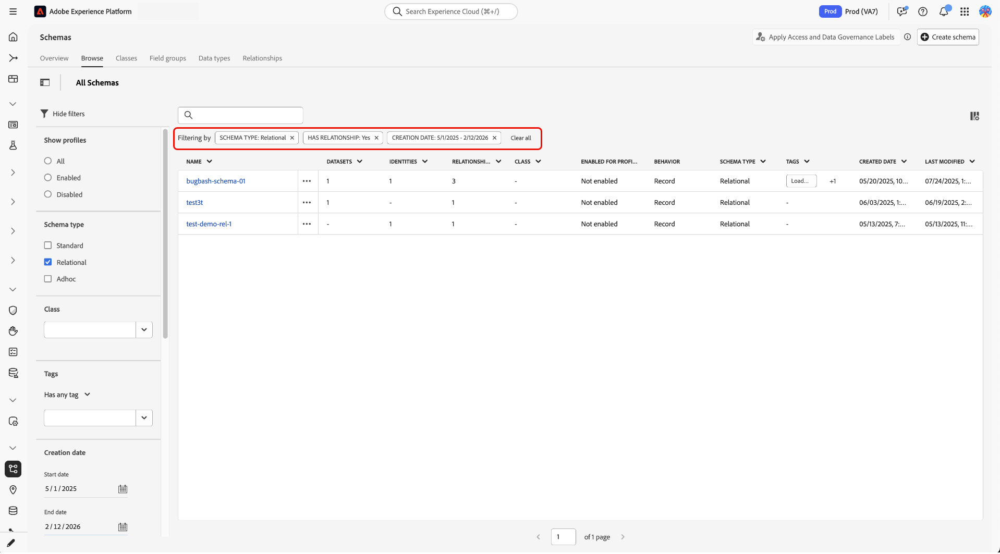
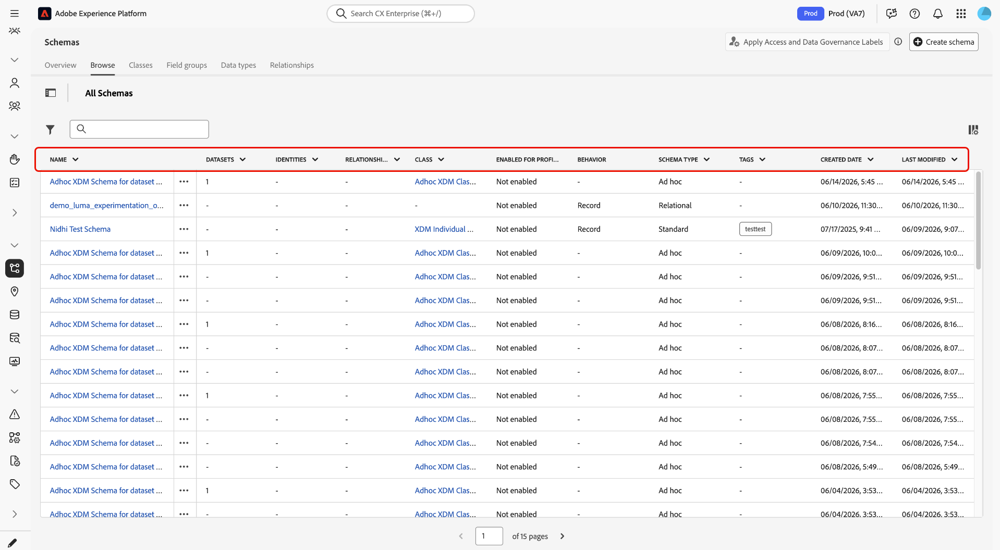
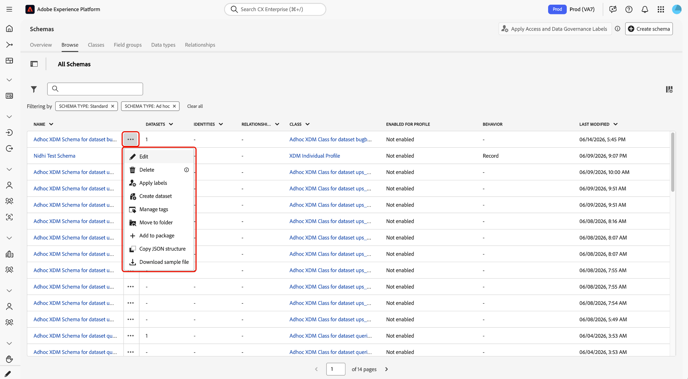
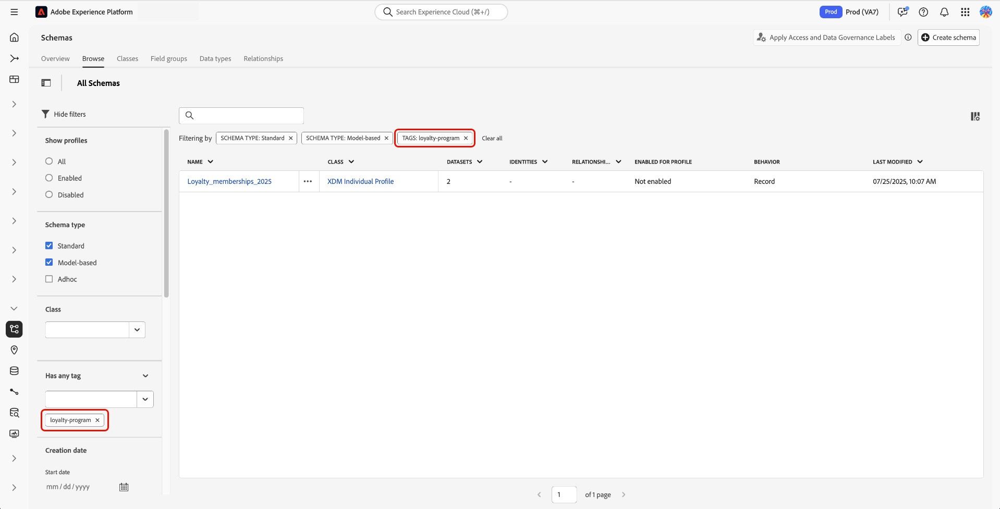
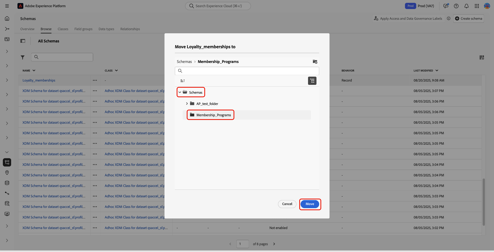

# Explore schema resources in the UI

In Adobe Experience Platform, all Experience Data Model (XDM) schema resources are stored in the [!DNL Schema Library], including standard resources provided by Adobe and custom resources defined by your organization. In the Experience Platform UI, you can view the structure and fields of any existing schema, class, field group, or data type in the [!DNL Schema Library]. This is especially useful when planning and preparing for data ingestion, as the UI provides information on the expected data types and use cases of each field provided by these XDM resources.

This guide explains how to explore existing schemas, classes, field groups, data types, and relationships in the Experience Platform UI.

## Look up a schema resource {#lookup}

In the Experience Platform UI, select **[!UICONTROL Schemas]** in the left rail. The [!UICONTROL Schemas] workspace provides a **[!UICONTROL Browse]** tab where you can view all schemas in your organization. You can also use the **[!UICONTROL Classes]**, **[!UICONTROL Field groups]**, **[!UICONTROL Data types]**, and **[!UICONTROL Relationships]** tabs to view those resources.

## Filter and search schemas {#filter-search}

Use the filtering and search tools in the **[!UICONTROL Schemas]** workspace to narrow the list of schemas and locate specific resources more quickly. The filter icon () opens the filter panel, where you can filter schemas using metadata, identity, relationship, date, and ownership criteria. Resource filters are available on the **[!UICONTROL Browse]** and **[!UICONTROL Relationships]** tabs.

![The [!UICONTROL Schemas] workspace [!UICONTROL Browse] tab with the comprehensive filters panel highlighted.](../images/ui/explore/schemas-filter-sidebar.png)

### Schema metadata filters

Filter schemas by their fundamental characteristics and organizational attributes.

| Filter | Control Type | Description |
|--------|-------------|-------------|
| [!UICONTROL Show profiles] | Radio buttons | Display [!UICONTROL All], [!UICONTROL Enabled] only, or [!UICONTROL Disabled] only. Profile-enabled schemas participate in [Real-Time Customer Profile](../../profile/home.md) and support unified customer views across your organization. |
| [!UICONTROL Schema type] | Checkboxes | Filter by schema origin: [!UICONTROL Standard] schemas (provided by Adobe), [!UICONTROL Relational] schemas (structured, relational data modeling capabilities), or [!UICONTROL Ad hoc] schemas (fields namespaced for use by a single dataset). |
| [!UICONTROL Class] | Dropdown | Show only schemas built on specific class foundations such as XDM Individual Profile, XDM ExperienceEvent, or custom classes defined by your organization. |
| [!UICONTROL Tags] | Dropdown | Filter schemas by user-applied, user-defined tags. Options include [!UICONTROL Has any tag] and [!UICONTROL Has all tags]. Use tags to locate schemas organized by project, team, business domain, or custom taxonomies that support your organizational schema management practices. |

{style="table-layout:auto"}

### Schema attribute filters

Narrow results based on schema structure and identity configuration.

| Filter | Control Type | Description |
|--------|-------------|-------------|
| [!UICONTROL Has relationship] | Yes/No checkboxes | Show only schemas that contain relationship fields connecting to other schemas. Relationship fields enable data connections across different schemas and support complex data modeling scenarios. |
| [!UICONTROL Has primary identity] | Yes/No checkboxes | Filter for schemas with designated primary identity fields. Primary identity fields are required for Profile enablement and serve as the foundation for customer data unification. |
| [!UICONTROL Primary identity namespace] | Dropdown | Find schemas using particular identity types such as Email, ECID, Phone, or custom namespaces as their primary identifier. |

{style="table-layout:auto"}

### Temporal and creator filters

Filter schemas based on creation patterns and ownership.

| Filter | Control Type | Description |
|--------|-------------|-------------|
| [!UICONTROL Creation date] | Start and end date pickers | Filter schemas by creation date ranges. Locate recently created schemas or find schemas built during specific project phases or time periods. |
| [!UICONTROL Modified date] | Start and end date pickers | Filter schemas by modification date ranges. Identify schemas with recent updates or changes to support maintenance and governance workflows. |
| [!UICONTROL Created by] | Dropdown | Filter schemas by their original creator. Locate schemas built by specific team members, systems, or service accounts to support ownership tracking and collaboration. |

{style="table-layout:auto"}

### Relationship tab filters

When viewing schema relationships on the [!UICONTROL Relationships] tab, use additional filters to explore schema connections:

| Filter | Control Type | Description |
|--------|-------------|-------------|
| [!UICONTROL Source schema] | Dropdown | Display relationships where the selected schema is the starting point or "source". |
| [!UICONTROL Destination schema] | Dropdown | Show relationships where the selected schema is the target or "destination". |
| [!UICONTROL Source class] | Dropdown | Filter relationships based on the class of the initiating schema. |
| [!UICONTROL Destination class] | Dropdown | Display relationships that end with schemas of a specific class. |

{style="table-layout:auto"}

### Combine multiple filters

Combine filters to narrow the list of schemas and find specific resources more quickly. For example, you can find [!UICONTROL Profile-enabled] standard schemas with custom tags that were created within the last month, or locate ad hoc schemas that use an email primary identity and contain relationship fields.

Applied filters appear as removable chips in the inventory header row. To remove a filter, select the **×** on its chip. To remove all active filters at once, select **[!UICONTROL Clear all]**.

Use the search bar to narrow down results further.

Search results are ranked based on matches in resource titles and descriptions. Title matches are prioritized over description matches, and resources with more matching terms appear higher in the results list.

When you have found the resource you want to explore, select its name from the list to view its structure in the canvas.

## Browse, organize, and manage schemas {#browse-organize-manage-schemas}

Use the [!UICONTROL Schemas] workspace to find, organize, and manage schemas. You can filter the schema inventory, sort metadata columns, and perform common schema actions directly from the inventory view.

### Browse and filter metadata

The schema inventory displays key schema metadata in a single table view. You can view tags, schema type, Profile enablement status, created date, last modified date, class, identities, relationships, behavior, and other metadata without opening individual schemas.

To sort the inventory, select a column header. Select the same column header again to reverse the sort order.

If the inventory contains more results than fit on a single page, use the page controls at the bottom of the list to navigate between pages.

 

### Take inline actions on schemas

Use the ellipsis menu for a schema row to perform common schema actions directly from the inventory view.

Actions are available from both the inventory view and resource detail views. Some actions are available only for custom (tenant-defined) resources. Standard Adobe-provided resources may have limited action options.

Depending on the resource type and permissions, you can edit schema properties, apply data governance labels, delete schemas, and manage tags without opening the schema. Additional actions include moving schemas to folders, adding schemas to deployment packages, copying schema JSON, and downloading sample files for testing.

>[!NOTE]
>
>Use sample files only to test schema structure. Do not include production data.

For detailed instructions on each action, see the [schema actions guide](./resources/schemas.md#manage-from-browse).

### Navigate schemas using tags and folders

Use tags and folders to organize and locate schemas in the inventory. Tags help you group schemas by project, team, data domain, or other categories defined by your organization. Folders provide a hierarchical structure for organizing related schemas.

To filter schemas by tag, select the filter icon () to open the filter panel. Then select one or more tags from the **[!UICONTROL Has any tag]** dropdown.

To browse schemas by folder, select the show folders icon (). The folder hierarchy appears in the left rail. Select a folder to view its associated schemas.

Tags and folders work with the inventory filtering system, allowing you to narrow the list of schemas based on their assigned tags and folder locations.

For information on creating and managing tags across Experience Platform, see the [managing unified tags guide](../../administrative-tags/ui/managing-tags.md).

## Explore an XDM resource in the canvas {#explore}

Once you select a resource, its structure opens in the canvas.

All object-type fields containing sub-properties are collapsed by default when they first appear in the canvas. To show the sub-properties of any field, select the icon next to its name.

### Standard class and field group indicator {#standard-class-and-field-group-indicator}

In the Schema Editor, standard classes and field groups display a padlock icon (). The icon identifies Adobe-generated resources that have editing restrictions. It appears in the left rail next to class and field group names, and next to fields that belong to Adobe-generated resources in the schema diagram.

You cannot edit a standard class. To extend a standard field group, see the [Add custom fields to standard field groups](./resources/schemas.md#custom-fields-for-standard-groups) documentation.

### System-generated fields {#system-fields}

Some field names are prepended with an underscore, such as `_repo` and `_id`. These represent placeholders for fields that the system will automatically generate and assign as data is ingested.

As such, most of these fields should be excluded from the structure of your data when ingesting into Experience Platform. The main exception to this rule is the [`_{TENANT_ID}` field](../api/getting-started.md#know-your-tenant_id), which all XDM fields created under your organization must be namespaced under.

### Data types {#data-types}

For each field shown in the canvas, its corresponding data type is shown next to its name, indicating at a glance the type of data that field expects for ingestion.

Any data type that is appended with square brackets (`[]`) represents an array of that particular data type. For example, a data type of **[!UICONTROL String]\[]** indicates that the field expects an array of string values. A data type of **[!UICONTROL Payment Item]\[]** indicates an array of objects that conform to the [!UICONTROL Payment Item] data type.

If an array field is based on an object type, you can select its icon in the canvas to show the expected attributes for each array item.

### [!UICONTROL Field properties] {#field-properties}

When you select the name of any field in the canvas, the right rail updates to show details about that field under **[!UICONTROL Field properties]**. This can include a description of the field's intended use case, **[!UICONTROL Default value]** (informational schema metadata that is not applied during ingestion), patterns, formats, whether the field is required, and more. See [type-specific field properties](./fields/overview.md#type-specific-properties) for how **[!UICONTROL Default value]** differs from ingestion validation settings. When you are exploring a field group, label-related details for the selected field can also appear here; see [Labels in the structure view](#field-group-labels-in-structure).

If the field you are inspecting is an enum field, the right rail will also display the acceptable values the field expects to receive.

### Identity fields {#identity}

When inspecting schemas that contain identity fields, these fields are listed in the left rail under the class or field group that provides them to the schema. Select the identity field name in the left rail to reveal the field in the canvas, regardless of how deeply it is nested.

Identity fields are highlighted in the canvas with a fingerprint icon (). If you select the identity field's name, you can view additional information such as the [identity namespace](../../identity-service/features/namespaces.md) and whether or not the field is the primary identity for the schema.

>[!NOTE]
>
>See the guide on [defining identity fields](./fields/identity.md) for more information on identity fields and their relationship with downstream Experience Platform services.

### Relationship fields {#relationship}

If you are inspecting a schema that contains a relationship field, the field will be listed in the left rail under **[!UICONTROL Relationships]**. Select the relationship field name in the left rail to reveal the field in the canvas, regardless of how deeply it is nested. Relationship fields are also uniquely highlighted in the canvas, showing the name of the reference schema that the field links to. For organizations with B2B capabilities, custom relationship names can be written and will be displayed on the canvas in these cases.

To view the identity namespace of the reference schema's primary identity, select the relationship field, then **[!UICONTROL Edit relationship]** in the [!UICONTROL Field properties] sidebar. The parameters for the relationship are displayed in the [!UICONTROL Edit relationship] dialog that appears.

See the tutorial on [creating a relationship in the UI](../tutorials/relationship-ui.md) for more information on the use of relationships in XDM schemas.

## Explore field groups: usage and metadata {#explore-field-groups}

Navigate to **[!UICONTROL Schemas]** > **[!UICONTROL Field groups]** to explore field groups. In the **[!UICONTROL Field groups]** tab, additional capabilities help you understand where a field group is used across schemas and what it includes, such as compatibility, required fields (which enforce ingestion requirements), and governance signals.

These features help you evaluate impact before making changes and identify relevant field groups more efficiently during schema design.

### View schema usage for field groups {#view-schema-usage-for-field-groups}

From the **[!UICONTROL Field groups]** table, select a field group to open its detail view. The canvas updates to display the field group structure, and the properties rail shows additional information about the selected resource.

#### Schemas using this field group

In the right-hand properties rail, the **[!UICONTROL Schemas using this field group]** section lists schemas that currently include the field group.

- If the field group is used by three or fewer schemas, all schema names are displayed.
- If it is used by more than three schemas, only some names are displayed, along with an option to view the complete list.

Select a schema name to open its detail view in a new tab and inspect how the field group is implemented within that schema.

#### View more and full schema list

If more schemas exist than can be shown inline, select **[!UICONTROL View more]** to open the full dialog.

The **[!UICONTROL Schemas using this field group]** dialog appears, showing the full list of schemas that use the field group.

In the **[!UICONTROL Schemas using this field group]** dialog, you can:

- Browse all schemas that use the field group
- Page through large result sets
- Select a schema to open its detail view in a new tab

You can view schema details such as schema name, class, and other attributes.

This workflow is intended for **impact analysis and exploration only**. It does not modify schemas or field groups. To change schema structure, see [Create and edit schemas in the UI](./resources/schemas.md).

### Field group metadata and filtering {#field-group-metadata-and-filtering}

The **[!UICONTROL Field groups]** tab provides metadata and filtering tools to help you locate and evaluate field groups before selecting them.

#### Browse table and filters

The field group inventory table includes additional columns that expose metadata directly in the list view, such as **[!UICONTROL Compatible classes]**, which indicates which classes a field group can be applied to. Field groups can only be added to schemas that use one of the listed compatible classes, based on the behavior of the data they represent (for example, record-based or time-series data). The table may display **[!UICONTROL All]** when the field group is compatible with all classes. **[!UICONTROL Industry tags]** help categorize field groups for discovery.

To refine the list, select the filter icon () to open the filter panel in the left rail. The following image shows the filter panel open in the left rail.

In the filter panel, you can:

- **[!UICONTROL Compatible classes]** — Use the dropdown to filter field groups by class compatibility  
- **[!UICONTROL Industry tags]** — Use checkboxes to filter by one or more industry categories  

While browsing, select a row in the table to trigger the info rail. The info rail displays metadata such as compatible classes and industry tags so you can review key details without opening the field group.

#### Field group detail metadata

When you open a field group, the properties rail displays additional metadata associated with the resource.

The properties rail can display the following metadata:

- **[!UICONTROL Compatible classes]** — Classes that the field group can extend  
- **[!UICONTROL Required attributes]** — Attributes that must have valid values when required by the field group during data ingestion. Requirements depend on the data structure, and records with missing or invalid required values fail validation
- **[!UICONTROL Labels]** — Labels are not shown at the field group level. Select a field to view label details in the **[!UICONTROL Field properties]** rail

This information helps you understand constraints and requirements before using or modifying the field group.

#### Labels in the structure view

When a field group is open in the canvas, you can view label information directly in the structure. Select the settings icon () in the canvas toolbar and enable **[!UICONTROL Show labels on tree]** to display label indicators on fields in the canvas.

Select a field in the canvas to view label details in the **[!UICONTROL Field properties]** rail, including labels applied to that field.

Labels are grouped by category (for example, identity and sensitive labels) and provide visibility into governance or access-related constraints applied to the data.

These indicators are for visibility only and do not change schema structure. For more information, see [Manage data usage labels for a schema](../tutorials/labels.md).

## Next steps

Use the following resources to continue working with XDM schemas and related Experience Platform features:

- To learn more about the **[!UICONTROL Schemas]** workspace and **[!DNL Schema Editor]**, see the [[!UICONTROL Schemas] workspace overview](./overview.md).
- For information on creating and managing tags, see the [managing unified tags guide](../../administrative-tags/ui/managing-tags.md).
- For guidance on inventory views, filtering, search, and workspace navigation patterns, see the [datasets user guide](../../catalog/datasets/user-guide.md).
- For information on applying and managing data governance labels, see the [data usage labels user guide](../../data-governance/labels/user-guide.md).
