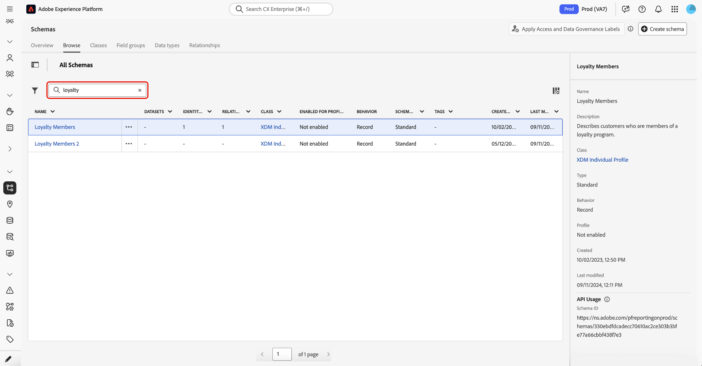
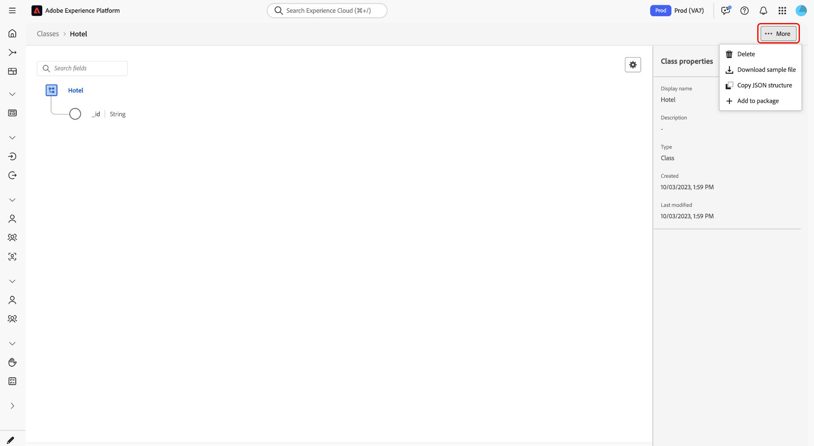
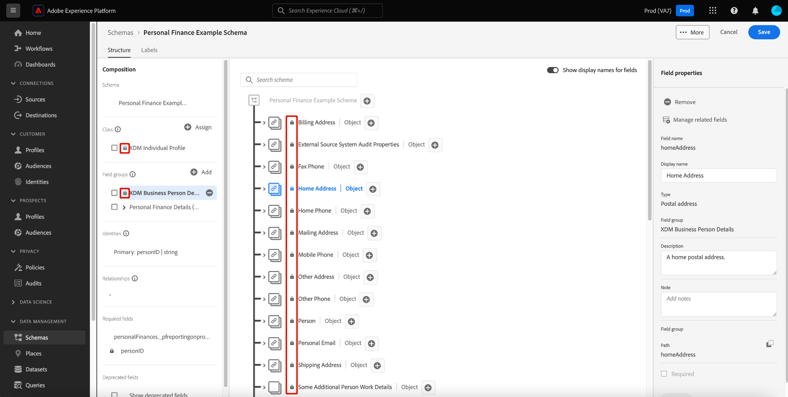
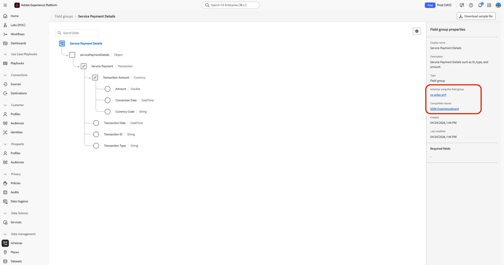
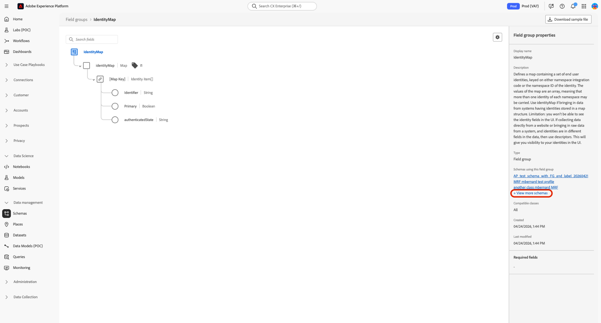
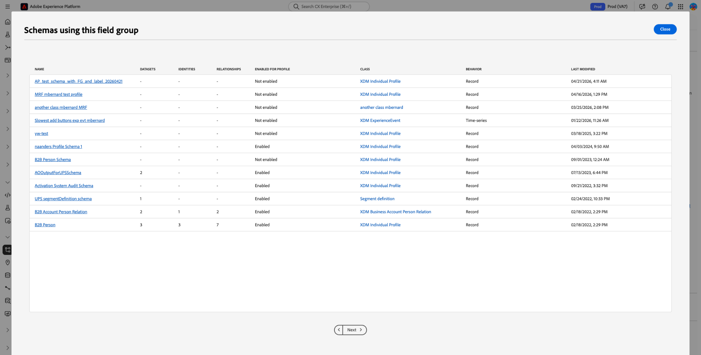
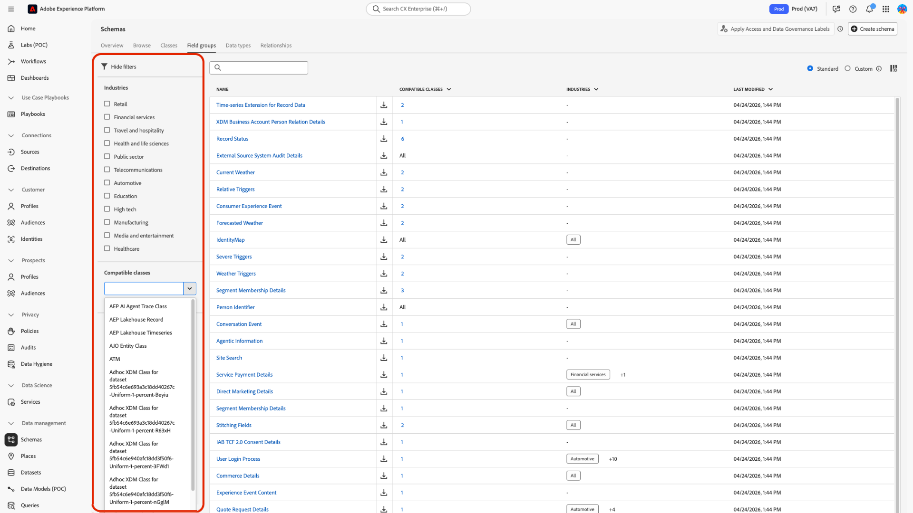
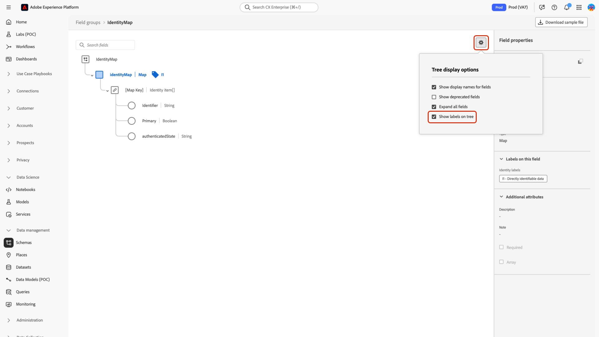
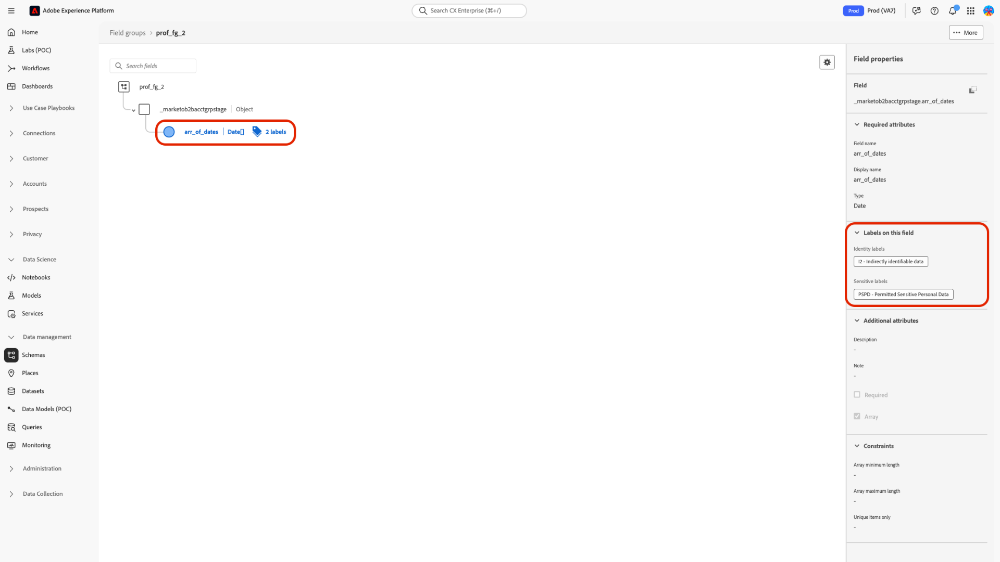

# Explore schema resources in the UI

In Adobe Experience Platform, all Experience Data Model (XDM) schema resources are stored in the [!DNL Schema Library], including standard resources provided by Adobe and custom resources defined by your organization. In the Experience Platform UI, you can view the structure and fields of any existing schema, class, field group, or data type in the [!DNL Schema Library]. This is especially useful when planning and preparing for data ingestion, as the UI provides information on the expected data types and use cases of each field provided by these XDM resources.

This tutorial covers the steps for exploring existing schemas, classes, field groups, and data types in the Experience Platform UI.

## Look up a schema resource {#lookup}

In the Experience Platform UI, select **[!UICONTROL Schemas]** in the left navigation. The [!UICONTROL Schemas] workspace provides a **[!UICONTROL Browse]** tab to explore all schemas in your organization, along with additional dedicated tabs for exploring **[!UICONTROL Classes]**, **[!UICONTROL Field groups]**, **[!UICONTROL Data types]**, and **[!UICONTROL Relationships]** respectively.

The filter icon () reveals controls in the left rail to narrow down listed results. Resource filters are available for schemas and relationships on the **[!UICONTROL Browse]** and **[!UICONTROL Relationships]** tabs respectively. On the **[!UICONTROL Field groups]** tab, use the filters described in [Field group metadata and filtering](#field-group-metadata-and-filtering) to narrow the list by compatible class and industry tags.

On the [!UICONTROL Browse] tab of the [!UICONTROL Schemas] workspace, you can filter your schema inventory. Use the **[!UICONTROL Included in Profile]** toggle to only show schemas that have been enabled for use in [Real-Time Customer Profile](../../profile/home.md). Use the **[!UICONTROL Show adhoc schemas]** toggle to filter the list of schemas created with fields namespaced for use only by a single dataset.

![The [!UICONTROL Schemas] workspace [!UICONTROL Browse] tab with the filters panel highlighted.](../images/ui/explore/filters.png)

On the [!UICONTROL Relationship] tab of the [!UICONTROL Schemas] workspace, you can filter the list of relationships based on four criteria. The filters include [!UICONTROL Source schema], [!UICONTROL Destination schema], [!UICONTROL Source class], and the [!UICONTROL Destination class]. The table below provides a description of the filters.

| Filter                            |Description |
|-----------------------------------|------------|
| [!UICONTROL Source schema]        | To see all relationships where the selected schema is the starting point or "source", select a schema from the [!UICONTROL Source schema] dropdown menu. |
| [!UICONTROL Destination schema]   | To view all relationships where the selected schema is the target or "destination", select a schema from the [!UICONTROL Destination schema] dropdown menu. |
| [!UICONTROL Source class]         | To filter relationships based on the class of the initiating schema, select a class from the [!UICONTROL Source class] dropdown menu. |
| [!UICONTROL Destination class]    | To display relationships that end with schemas of a specific class, select a class from the [!UICONTROL Destination class] dropdown menu. |

{style="table-layout:auto"}

You can also use the search bar to narrow down results further.

The resources displayed in search results are ordered first by title matches, then by description matches. In turn, the more word matches in either of these categories, the higher the resource appears in the list.

When you have found the resource you want to explore, select its name from the list to view its structure in the canvas.

## Manage schemas, classes, field groups, and data types: actions and deletion {#xdm-resource-actions}

Use this section when you need to manage or delete XDM resources, or when an action (such as delete) is unavailable and you need to understand why.

### Where to find actions (inline vs detail page) {#where-to-find-actions}

To perform actions such as deleting, exporting, or copying a resource, use one of the following entry points:

On the **[!UICONTROL Browse]**, **[!UICONTROL Classes]**, **[!UICONTROL Field groups]**, and **[!UICONTROL Data types]** tabs, management actions are available in two locations:

- **Inline in the table**: Each resource row includes an actions menu (for example, **[!UICONTROL …]**) that provides direct access to available actions.

- **Resource detail view**: To access full actions in the detail view, you must select a **custom (tenant-defined)** resource. Standard (Adobe-provided) resources have limited actions and do not show options such as Delete, Copy JSON structure, or Add to package. Select a custom resource from the inventory to open its detail view, then use the **[!UICONTROL More]** menu in the page header to access the same available actions.

These actions are consistent across both entry points for supported resource types (schemas, classes, field groups, and data types).

### Available actions {#available-actions}

Depending on the resource type and your permissions, the following actions may be available:

- **[!UICONTROL Delete]** — Permanently remove a custom resource from your organization (when constraints allow). If delete is blocked, see [Constraints](#delete-constraints).
- **[!UICONTROL Download sample file]** — Generate a sample data file based on the resource structure. Step-by-step: [Generate sample XDM data](./sample.md).
- **[!UICONTROL Copy JSON structure]** — Copy the resource definition in JSON format for reuse, export, or inspection. Step-by-step: [Export XDM schemas](./export.md).
- **[!UICONTROL Add to package]** — Include the resource in a sandbox package for export or import across sandboxes. Step-by-step: [Export objects into a package](../../sandboxes/ui/sandbox-tooling.md#export-objects).

The following applies to different resource types:

- For **custom (tenant-defined)** schemas, classes, field groups, and data types, all actions above may be available.
- For **standard (Adobe-defined)** classes, field groups, and data types:
  - Only **[!UICONTROL Download sample file]** is available.
  - **Delete**, **Copy JSON structure**, and **Add to package** are not available.

### Delete behavior {#delete-behavior}

Use the **[!UICONTROL Delete]** action when you want to remove a custom resource that is no longer needed.

>[!IMPORTANT]
>
> Deleting a resource permanently removes it from your organization and cannot be undone. Some resources cannot be deleted due to usage, permissions, or system constraints.

To delete a resource:

1. Locate the resource in the table or open its detail view.
2. Select the actions menu (**[!UICONTROL …]** or **[!UICONTROL More]**).
3. Select **[!UICONTROL Delete]**.
4. Confirm the action in the dialog by selecting **[!UICONTROL Delete]** again.

The resource is permanently removed from your organization after confirmation.

If deletion is not available for a resource, the option appears disabled with a tooltip explaining why the action cannot be performed.

### Constraints (dataset, Profile, RBAC, tenant vs global) {#delete-constraints}

If an action such as **[!UICONTROL Delete]** is unavailable or disabled, it is typically due to one of the following conditions:

- **Permissions (RBAC)**: You must have the required permissions (such as **[!UICONTROL Manage Schemas]**) to perform management actions. If permissions are missing, actions appear disabled with tooltips. To learn how permissions are configured, see the [access control UI overview](../../access-control/ui/overview.md).

- **Dataset association**: Resources that are used by one or more datasets (such as schemas associated with datasets) cannot be deleted. To identify and remove dataset dependencies, see [Delete a dataset](../../catalog/datasets/user-guide.md#delete).

- **Profile enablement**: Schemas enabled for Real-Time Customer Profile cannot be deleted. For guidance on how Profile enablement affects your schema, see [Planning for Real-Time Customer Profile enablement](../schema/profile-enablement-planning.md).

- **Tenant vs global resources**: Tenant-defined (custom) resources can be deleted (subject to constraints), while standard (Adobe-provided) classes, field groups, and data types cannot be deleted.

These constraints are reflected directly in the UI. When an action is unavailable, it appears disabled and includes a tooltip explaining the specific limitation.

If you cannot delete a resource, review the conditions above to determine whether you need to update permissions, remove dependencies, or adjust your data model.

For additional schema editing workflows in the canvas, see [Create and edit schemas in the UI](./resources/schemas.md).

## Explore an XDM resource in the canvas {#explore}

Once you select a resource, its structure opens in the canvas.

All object-type fields containing sub-properties are collapsed by default when they first appear in the canvas. To show the sub-properties of any field, select the icon next to its name.

### Standard class and field group indicator {#standard-class-and-field-group-indicator}

Within the Schema Editor, standard (Adobe-generated) classes and field groups are indicated with the padlock icon (. The padlock appears in the left rail next to the class or field group name, as well as next to any field in the schema diagram that is a part of a system-generated resource.

See the [Add custom fields to standard field groups](./resources/schemas.md) documentation for guidance. You cannot edit a standard class.

### System-generated fields {#system-fields}

Some field names are prepended with an underscore, such as `_repo` and `_id`. These represent placeholders for fields that the system will automatically generate and assign as data is ingested.

As such, most of these fields should be excluded from the structure of your data when ingesting into Experience Platform. The main exception to this rule is the [`_{TENANT_ID}` field](../api/getting-started.md#know-your-tenant_id), which all XDM fields created under your organization must be namespaced under.

### Data types {#data-types}

For each field shown in the canvas, its corresponding data type is shown next to its name, indicating at a glance the type of data that field expects for ingestion.

Any data type that is appended with square brackets (`[]`) represents an array of that particular data type. For example, a data type of **[!UICONTROL String]\[]** indicates that the field expects an array of string values. A data type of **[!UICONTROL Payment Item]\[]** indicates an array of objects that conform to the [!UICONTROL Payment Item] data type.

If an array field is based on an object type, you can select its icon in the canvas to show the expected attributes for each array item.

### [!UICONTROL Field properties] {#field-properties}

When you select the name of any field in the canvas, the right rail updates to show details about that field under **[!UICONTROL Field properties]**. This can include a description of the field's intended use case, default values, patterns, formats, whether the field is required, and more. When you are exploring a field group, label-related details for the selected field can also appear here; see [Labels in the structure view](#field-group-labels-in-structure).

If the field you are inspecting is an enum field, the right rail will also display the acceptable values the field expects to receive.

### Identity fields {#identity}

When inspecting schemas that contain identity fields, these fields are listed in the left rail under the class or field group that provides them to the schema. Select the identity field name in the left rail to reveal the field in the canvas, regardless of how deeply it is nested.

Identity fields are highlighted in the canvas with a fingerprint icon (). If you select the identity field's name, you can view additional information such as the [identity namespace](../../identity-service/features/namespaces.md) and whether or not the field is the primary identity for the schema.

>[!NOTE]
>
>See the guide on [defining identity fields](./fields/identity.md) for more information on identity fields and their relationship with downstream Experience Platform services.

### Relationship fields {#relationship}

If you are inspecting a schema that contains a relationship field, the field will be listed in the left rail under **[!UICONTROL Relationships]**. Select the relationship field name in the left rail to reveal the field in the canvas, regardless of how deeply it is nested. Relationship fields are also uniquely highlighted in the canvas, showing the name of the reference schema that the field links to. For organizations with B2B capabilities, custom relationship names can be written and will be displayed on the canvas in these cases.

To view the identity namespace of the reference schema's primary identity, select the relationship field, then **[!UICONTROL Edit relationship]** in the [!UICONTROL Field properties] sidebar. The parameters for the relationship are displayed in the [!UICONTROL Edit relationship] dialog that appears.

See the tutorial on [creating a relationship in the UI](../tutorials/relationship-ui.md) for more information on the use of relationships in XDM schemas.

## Explore field groups: usage and metadata {#explore-field-groups}

Navigate to **[!UICONTROL Schemas]** > **[!UICONTROL Field groups]** to explore field groups. In the **[!UICONTROL Field groups]** tab, additional capabilities help you understand where a field group is used across schemas and what it includes, such as compatibility, required fields (which enforce ingestion requirements), and governance signals.

These features help you evaluate impact before making changes and identify relevant field groups more efficiently during schema design.

### View schema usage for field groups {#view-schema-usage-for-field-groups}

From the **[!UICONTROL Field groups]** table, select a field group to open its detail view. The canvas updates to display the field group structure, and the properties rail shows additional information about the selected resource.

#### Schemas using this field group

In the right-hand properties rail, the **[!UICONTROL Schemas using this field group]** section lists schemas that currently include the field group.

- If the field group is used by three or fewer schemas, all schema names are displayed.
- If it is used by more than three schemas, only some names are displayed, along with an option to view the complete list.

Select a schema name to open its detail view in a new tab and inspect how the field group is implemented within that schema.

#### View more and full schema list

If more schemas exist than can be shown inline, select **[!UICONTROL View more]** to open the full dialog.

The **[!UICONTROL Schemas using this field group]** dialog appears, showing the full list of schemas that use the field group.

In the **[!UICONTROL Schemas using this field group]** dialog, you can:

- Browse all schemas that use the field group
- Page through large result sets
- Select a schema to open its detail view in a new tab

You can view schema details such as schema name, class, and other attributes.

This workflow is intended for **impact analysis and exploration only**. It does not modify schemas or field groups. To change schema structure, see [Create and edit schemas in the UI](./resources/schemas.md).

### Field group metadata and filtering {#field-group-metadata-and-filtering}

The **[!UICONTROL Field groups]** tab provides metadata and filtering tools to help you locate and evaluate field groups before selecting them.

#### Browse table and filters

The field group inventory table includes additional columns that expose metadata directly in the list view, such as **[!UICONTROL Compatible classes]**, which indicates which classes a field group can be applied to. Field groups can only be added to schemas that use one of the listed compatible classes, based on the behavior of the data they represent (for example, record-based or time-series data). The table may display **[!UICONTROL All]** when the field group is compatible with all classes. **[!UICONTROL Industry tags]** help categorize field groups for discovery.

To refine the list, select the filter icon () to open the filter panel in the left rail. The following image shows the filter panel open in the left rail.

In the filter panel, you can:

- **[!UICONTROL Compatible classes]** — Use the dropdown to filter field groups by class compatibility  
- **[!UICONTROL Industry tags]** — Use checkboxes to filter by one or more industry categories  

While browsing, select a row in the table to update the info rail. The info rail displays metadata such as compatible classes and industry tags so you can review key details without opening the field group.

#### Field group detail metadata

When you open a field group, the properties rail displays additional metadata associated with the resource.

The properties rail can display the following metadata:

- **[!UICONTROL Compatible classes]** — Classes that the field group can extend  
- **[!UICONTROL Required attributes]** — Attributes that must have valid values when required by the field group during data ingestion. Requirements depend on the data structure, and records with missing or invalid required values fail validation
- **[!UICONTROL Labels]** — Labels are not shown at the field group level. Select a field to view label details in the **[!UICONTROL Field properties]** rail

This information helps you understand constraints and requirements before using or modifying the field group.

#### Labels in the structure view

When a field group is open in the canvas, you can view label information directly in the structure. Select the settings icon () in the canvas toolbar and enable **[!UICONTROL Show labels on tree]** to display label indicators on fields in the canvas.

Select a field in the canvas to view label details in the **[!UICONTROL Field properties]** rail, including labels applied to that field.

Labels are grouped by category (for example, identity and sensitive labels) and provide visibility into governance or access-related constraints applied to the data.

These indicators are for visibility only and do not change schema structure. For more information, see [Manage data usage labels for a schema](../tutorials/labels.md).

## Next steps

This document covered how to explore existing XDM resources in the Experience Platform UI. For more information on the different features of the [!UICONTROL Schemas] workspace and [!DNL Schema Editor], see the [[!UICONTROL Schemas] workspace overview](./overview.md).
