# Field-based workflows in the Schema Editor (Beta)

>[!IMPORTANT]
>
>The workflows described in this beta document are now generally available in Adobe Experience Platform. For the latest guidance on field-based workflows in the Schema Editor, refer to the [schemas UI guide](./resources/schemas.md) instead. This guide will soon be removed.

Adobe Experience Platform provides a robust set of standardized [field groups](../schema/composition.md#field-group) for use in Experience Data Model (XDM) schemas. The structure and semantics behind these field groups are carefully tailored to meet a wide variety of segmentation use cases and other downstream applications in Platform. You can also define your own custom field groups to address unique business needs.

When you add a field group to a schema, that schema inherits all the fields contained in that group. However, you can now add individual fields to your schema without needing to include other fields from the associated field group that you may not necessarily use.

This guide covers the different methods for adding individual fields to a schema in the Platform UI.

## Prerequisites

This tutorial assumes that you are familiar with the [composition of XDM schemas](../schema/composition.md) and how to use the Schema Editor in the Platform UI. To follow along, you should start the process of [creating a new schema](./resources/schemas.md) and assigning it to a standard class before continuing with this guide.

## Remove fields added from standard field groups {#remove-field-group}

After you have added a standard field group to a schema, you can remove any standard fields that you do not need. 

>[!NOTE]
>
>Removing fields from a standard field group only affects the schema being worked on and does not affect the field group itself. If you remove standard fields in one schema, those fields are still available in all other schemas that employ the same field group.

In the following example, the standard field group **[!UICONTROL Demographic Details]** has been added to a schema. To remove a single field such as `taxId`, select the field in the canvas and then select **[!UICONTROL Remove]** in the right rail.

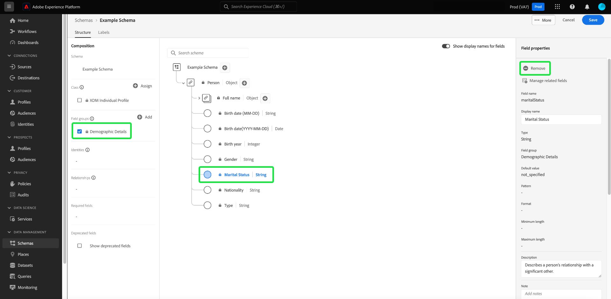

If there are multiple fields you wish to remove, you can manage the field group as a whole. Select a field belonging to the group in the canvas, then select **[!UICONTROL Manage related fields]** in the right rail.

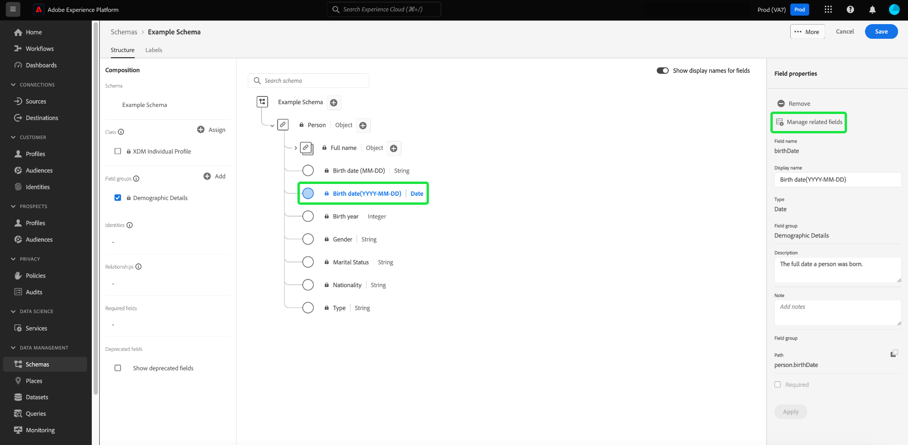

A dialog appears showing the structure of the field group in question. From here you can use the provided checkboxes to select or deselect the fields that you require. When you are satisfied, select **[!UICONTROL Confirm]**.

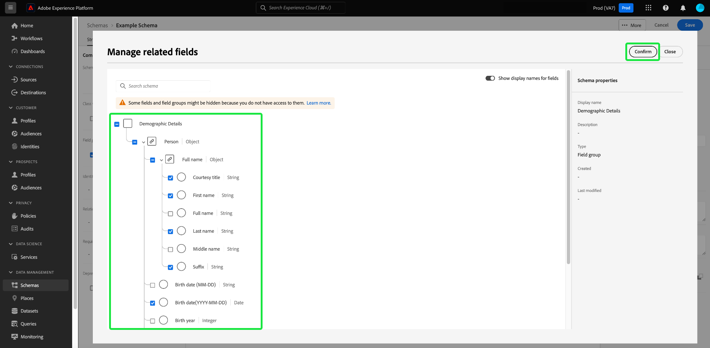

The canvas reappears with only the selected fields present in the schema structure.

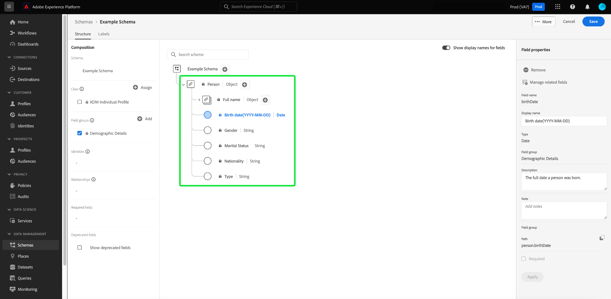

## Add standard fields directly to a schema

You can add fields from standard field groups directly to a schema without needing to know their corresponding field group beforehand. To add a standard field to a schema, select the plus (**+**) icon next to the schema's name in the canvas. An **[!UICONTROL Untitled Field]** placeholder appears in the schema structure and the right rail updates to reveal controls to configure the field.

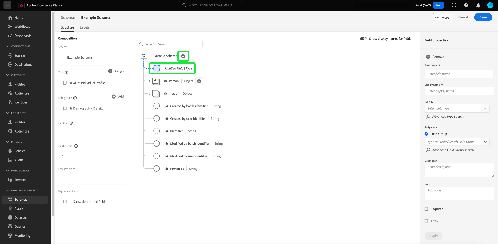

Under **[!UICONTROL Field name]**, start typing the name of the field you wish to add. The system automatically searches for standard fields that match the query and lists them under **[!UICONTROL Recommended Standard Fields]**, including the field groups that they belong to.

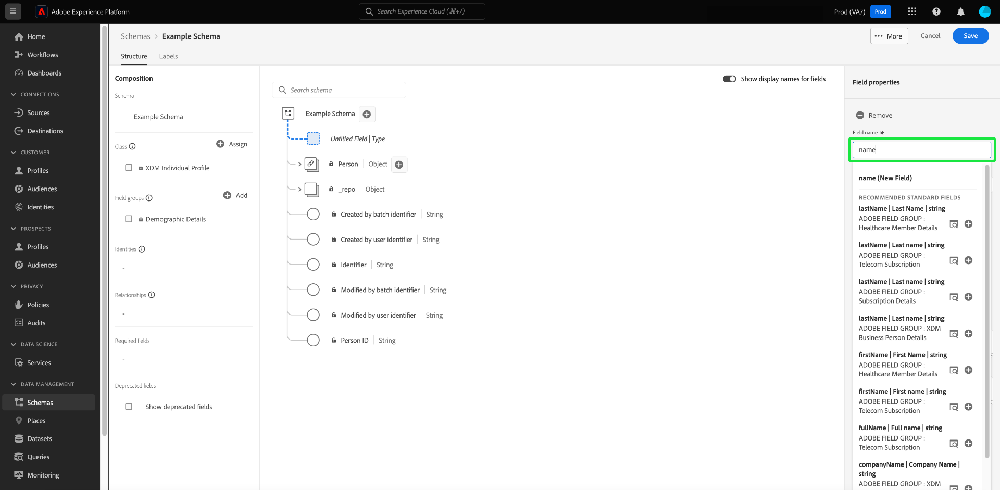

While some standard fields share the same name, their structure may vary depending on the field group they come from. If a standard field is nested within a parent object in the field group structure, the parent field will also be included in the schema if the child field is added.

Select the preview icon () next to a standard field to view the structure of its field group and better understand how it might be nested. To add the standard field to the schema, select the plus icon ().

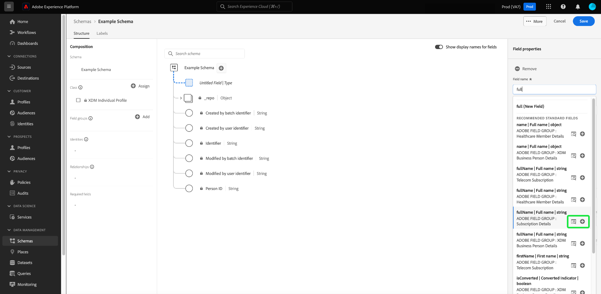

The canvas updates to show the standard field added to the schema, including any parent fields that it is nested under within the field group structure. The name of the field group is also listed under **[!UICONTROL Field groups]** in the left rail. If you want to add more fields from the same field group, select **[!UICONTROL Manage related fields]** in the right rail.

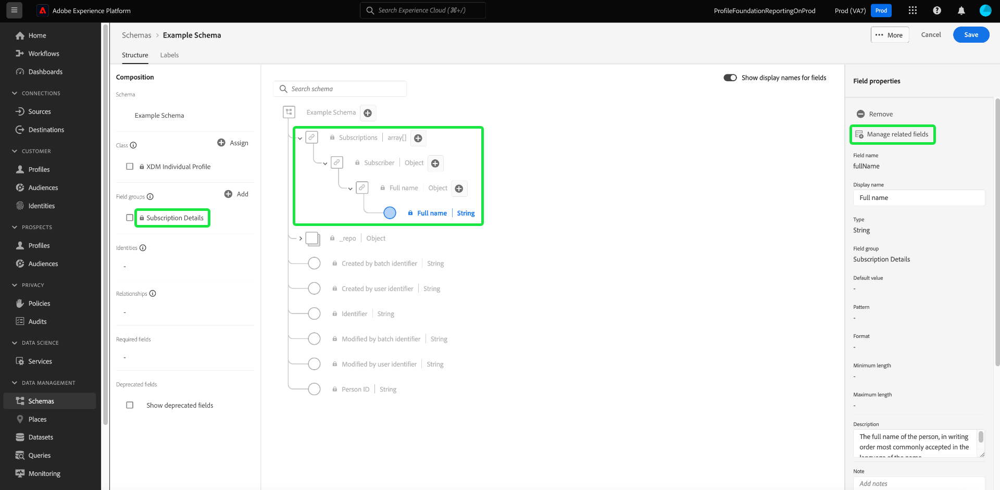

## Add custom fields directly to a schema

Similar to the workflow for standard fields, you can also add your own custom fields directly to a schema. 

To add fields to the root level of a schema, select the plus (**+**) icon next to the schema's name in the canvas. An **[!UICONTROL Untitled Field]** placeholder appears in the schema structure and the right rail updates to reveal controls to configure the field.

Start typing in the name of the field you wish to add, and the system automatically starts searching for matching standard fields. To create a new custom field instead, select the top option appended with **([!UICONTROL New Field])**.

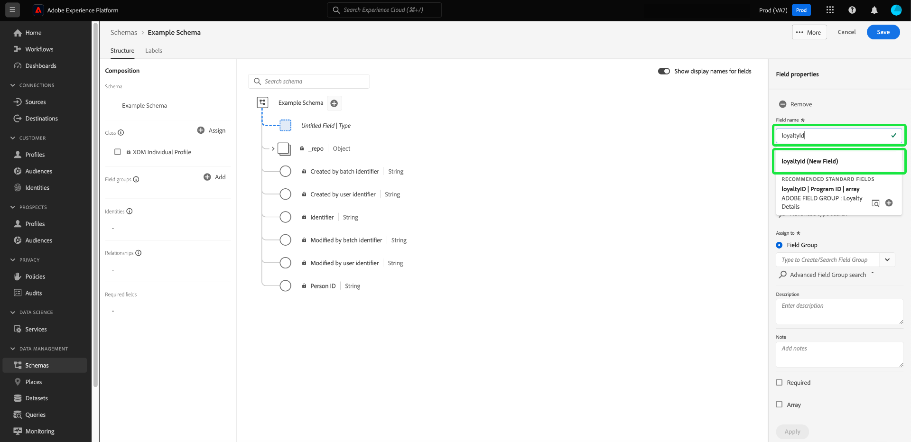

From here, provide a display name and data type for the field. Under **[!UICONTROL Assign field group]**, you must select a field group for the new field to be associated with. Start typing in the name of the field group, and if you have previously [created custom field groups](./resources/field-groups.md#create) they will appear in the dropdown list. Alternatively, you can type a unique name into the field to create a new field group instead.

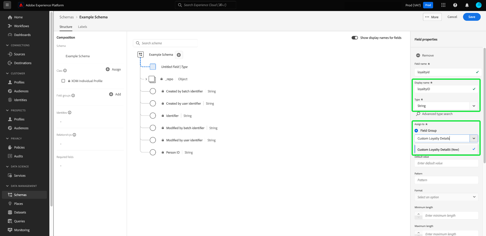

>[!WARNING]
>
>If you select an existing custom field group, any other schemas that employ that field group will also inherit the newly added field after you save your changes. For this reason, only select an existing field group if you want this type of propagation. Otherwise, you should opt to create a new custom field group instead.

When finished, select **[!UICONTROL Apply]**.

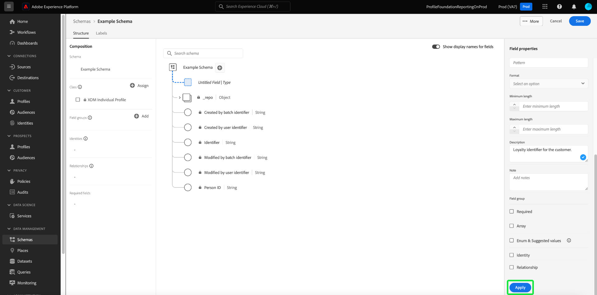

The new field is added to the canvas, and is namespaced under your [tenant ID](../api/getting-started.md#know-your-tenant_id) to avoid conflicts with standard XDM fields. The field group that you associated the new field with also appears under **[!UICONTROL Field groups]** in the left rail. 

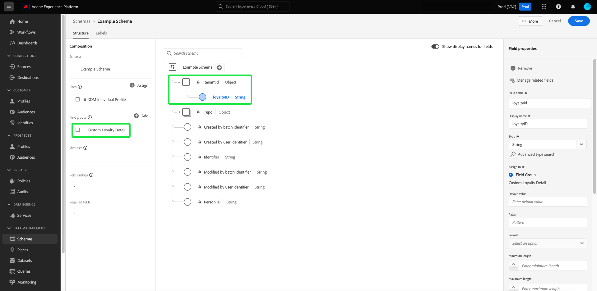

>[!NOTE]
>
>The rest of the fields provided by the selected custom field group are removed from the schema by default. If you want to add some of these fields to the schema, select a field belonging to the group and then select **[!UICONTROL Manage related fields]** in the right rail.

### Add custom fields to the structure of standard field groups

If the schema you are working on has an object-type field provided by a standard field group, you can add your own custom fields to that standard object. Select the plus (**+**) icon next to the root of the object and provide the details of the custom field in the right rail.

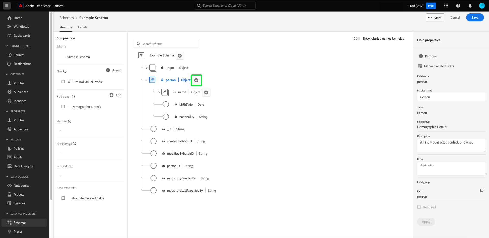

After applying your changes, the new field appears under your tenant ID namespace within the standard object. This nested namespace prevents field-name conflicts within the field group itself in order to avoid breaking changes in other schemas that use the same field group.

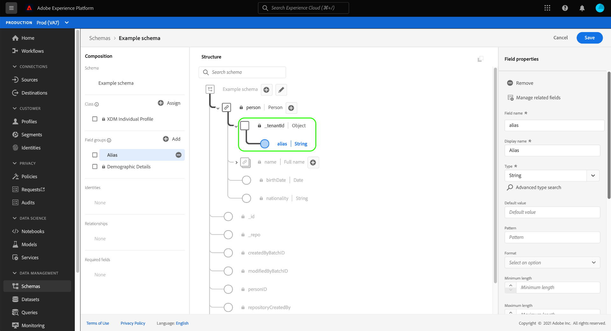

## Next steps

This guide covered the new field-based workflows for the Schema Editor in the Platform UI. For more information about managing schemas in the UI, see the [UI overview](./overview.md).
