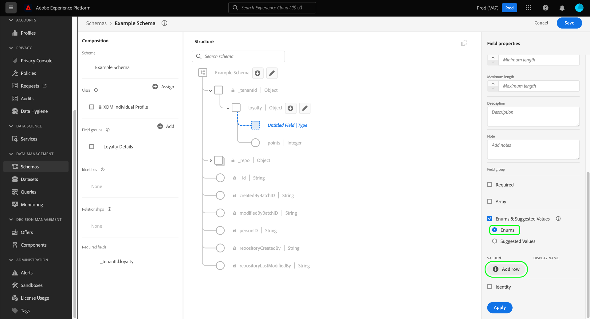
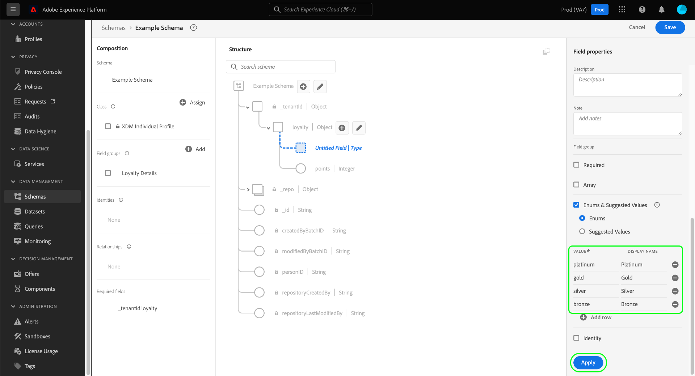
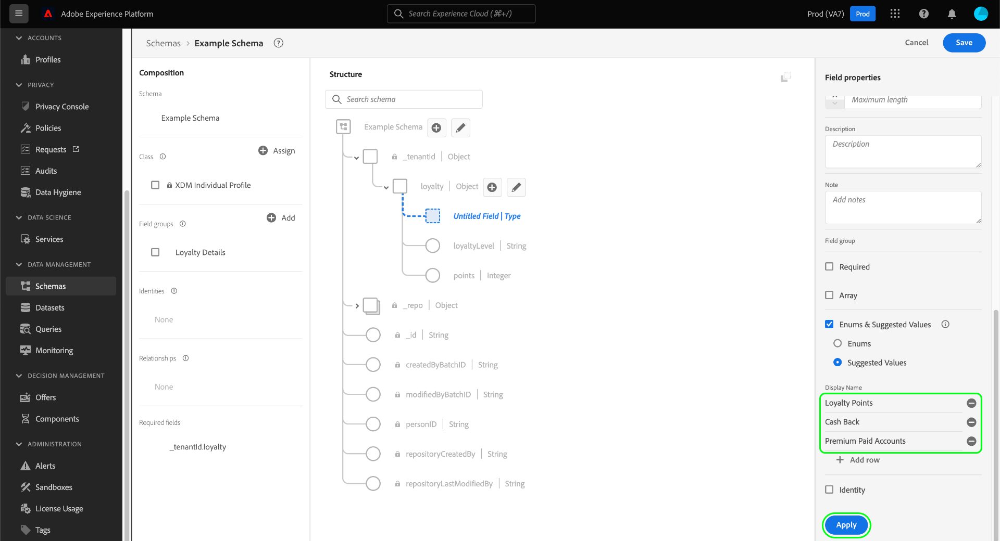
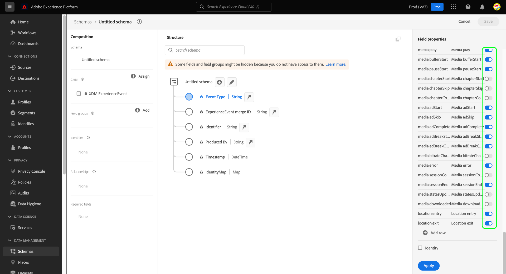
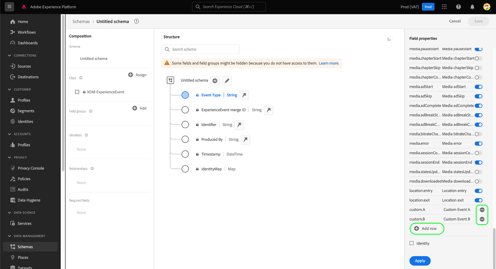
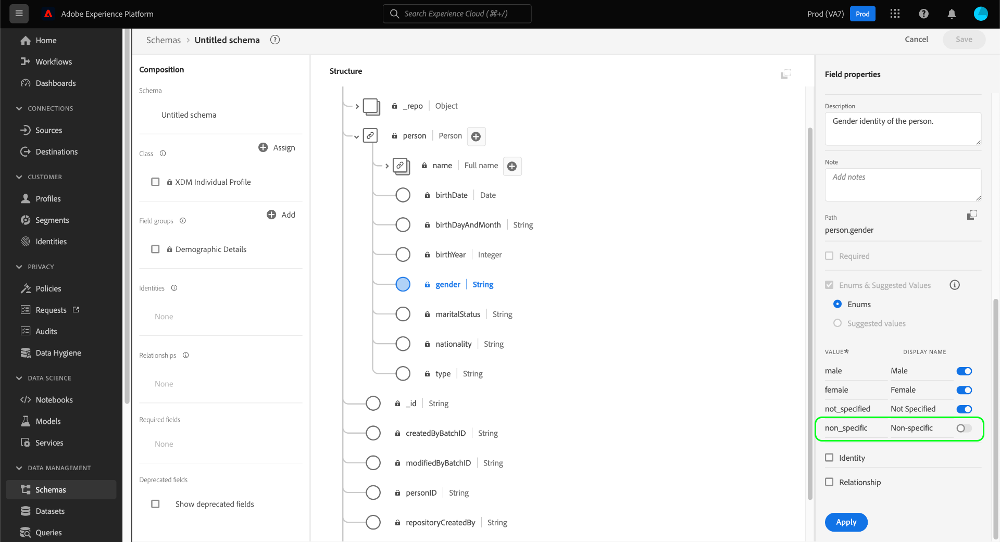

# Define enums and suggested values in the UI {#enums-and-suggested-values}

>[!CONTEXTUALHELP]
>id="platform_xdm_enum_suggestedvalue"
>title="Enums & Suggested Values"
>abstract="An **Enum** constrains a string field to only allow data that matches a predefined set of values to be ingested. Each enum constraint can be assigned a **Display name** that populates attribute dropdowns in the Segmentation UI. **Suggested values** for a field do not restrict ingestion and only determine the display names shown in Segmentation. If you have multiple schemas that share a field belonging to a common class or field group, and you define different enums or suggested values for that field between each schema, those values are merged and appended in the union schema."

In Experience Data Model (XDM), a string field can be given a predefined set of accepted or suggested values to better control what values are ingested into that field or how it will behave in segmentation.

**[!UICONTROL Enums]** constrain the values that can be ingested for a string field to a predefined set. If you attempt to ingest data to an enum field and the value does not match any of those defined in its configuration, ingestion will be denied.

In contrast to enums, the **[!UICONTROL Suggested values]** option allows to to denote a set of recommended values for a string field that do not constrain the values that it can ingest. Instead, suggested values affect what predefined values are available in the [Segmentation UI](../../../segmentation/ui/overview.md) when including the string field as an attribute.

When [defining a new field](./overview.md#define) in the Adobe Experience Platform user interface and setting the type to [!UICONTROL String], you are given the option to define an [enum](#enum) or [suggested values](#suggested-values) for that field.

This document covers how to define enums and suggested values in the [!UICONTROL Schemas] UI workspace. For a quick overview on enums and suggested values, including how to configure them in the UI and their downstream effects, watch the following video:

>[!VIDEO](https://video.tv.adobe.com/v/3409501/?quality=12&learn=on)

## Define an enum {#enum}

Select **[!UICONTROL Enums and Suggested Values]**, then select **[!UICONTROL Enums]**. Additional controls appear, allowing you to specify the value constraints for the enum. To add a constraint, select **[!UICONTROL Add row]**.

Under the **[!UICONTROL Value]** column, you must provide the exact value you want to constrain the field to. You can optionally provide a human-friendly **[!UICONTROL Display Name]** for the constraint as well, which affects how the value will be represented in segmentation.

Continue to use **[!UICONTROL Add row]** to add the desired constraints and optional labels to the enum, or select the delete icon () next to a previously added row to remove it. When finished, select **[!UICONTROL Apply]** to apply the changes to the schema.

The canvas updates to reflect the changes. When you explore this schema in the future, you can view and edit the constraints for the enum field within the right rail.

## Define suggested values {#suggested-values}

Select **[!UICONTROL Enums and Suggested Values]**, then select **[!UICONTROL Suggested Values]** to make additional controls appear. From here, select **[!UICONTROL Add row]** to start adding suggested values.

Under the **[!UICONTROL Display Name]** column, provide a human-friendly name for the value as you want it to appear in the Segmentation UI. To add more suggested values, select **[!UICONTROL Add row]** again and repeat the process as needed. To remove a previously added row, select  next to the row in question.

When finished, select **[!UICONTROL Apply]** to apply the changes to the schema.

>[!NOTE]
>
>There is an approximate five-minute delay for a field's updated suggested values to be reflected in the Segmentation UI.

### Manage suggested values for standard fields

Some fields from standard XDM components contain their own suggested values, such as `eventType` from the [[!UICONTROL XDM ExperienceEvent] class](../../classes/experienceevent.md). While you can create additional suggested values for a standard field, you cannot modify or remove any suggested values that are not defined by your organization. When viewing a standard field in the UI, its suggested values are displayed but are read-only.

To add new suggested values for a standard field, select **[!UICONTROL Add row]**. To remove a suggested value that was previously added by your organization, select  next to the row in question.

<!-- ### Removing suggested values for standard fields

Only suggested values that you define can be removed from a standard field. Existing suggested values can be disabled so that they no longer appear in the segmentation dropdown, but they cannot be removed outright.

For example, consider a profile schema where the a suggested value for the standard `person.gender` field is disabled:

In this example, the display name "[!UICONTROL Non-specific]" is now disabled from being shown in the segmentation dropdown list. However, the value `non_specific` is still part of the list of enumerated fields and is therefore still allowed on ingestion. In other words, you cannot disable the actual enum value for the standard field as it would go against the principle of only allowing changes that make a field less restrictive.

See the [section below](#evolution) for more information on the rules for updating enums and suggested values for existing schema fields. -->

## Evolution rules for enums and suggested values {#evolution}

After a schema with an enum field has been used to ingest data into Platform, any further changes made to the schema definition must comply with the data already in the system. In general, changes made to an existing field can only make that field **less** restrictive. An field cannot be made more restrictive than it already is.

When it comes to enums and suggested values, the following rules apply post-ingestion:

* You **CAN** add suggested values for standard and custom fields with existing suggested values.
* You **CAN** remove suggested values from custom fields with existing suggested values.
* You **CAN** add new enum values for an existing custom enum field.
* You **CAN** switch a custom field's enum values to suggested values only, or convert it to a string with no enum or suggested values. **This switch cannot be undone once applied.**
* You **CANNOT** remove enums or suggested values from standard fields.
* You **CANNOT** add enum values to a field with no existing enum.
* You **CANNOT** remove fewer than all existing enum values for a custom field.
* You **CANNOT** switch from suggested values to an enum.

## Merging rules for enums and suggested values {#merging}

If multiple schemas use the same enum field with different configurations, and those schemas are included in a union, certain rules apply when it comes to how enum differences are reconciled. The exact rules depend on whether the schemas referencing the same standard field (like `eventType`) or if they're referencing the same custom field path in different field groups.

If referencing the same standard field:

* Any additional suggested values are **APPENDED** in the union.
* Updates made to the suggested values for the same enum key are **UPDATED** in the union.

If referencing the same custom field path in different field groups:

* Any additional suggested values are **APPENDED** in the union.
* If the same additional suggested value is defined in more than one schema, those values are **MERGED** in the union. In other words, the same suggested value will not appear twice after merging.

## Validation limitations

Due to current system limitations, there are two cases where an enum is not validated by the system during ingestion:

1. The enum is defined on an [array field](./array.md).
1. The enum is defined more than one level deep in the schema hierarchy.

## Next steps

This guide covered how to define enums and suggested values for string fields in the the UI. For information on how to manage enums and suggested values using the Schema Registry API, refer to the following [tutorial](../../tutorials/suggested-values.md).

To learn how to define other XDM field types in the [!DNL Schema Editor], see the overview on [defining fields in the UI](./overview.md#special).
