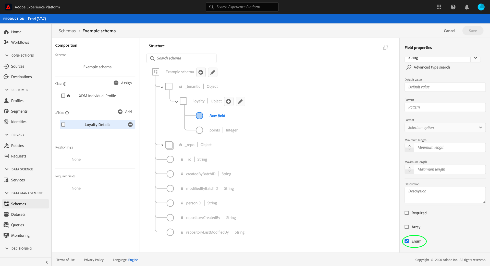
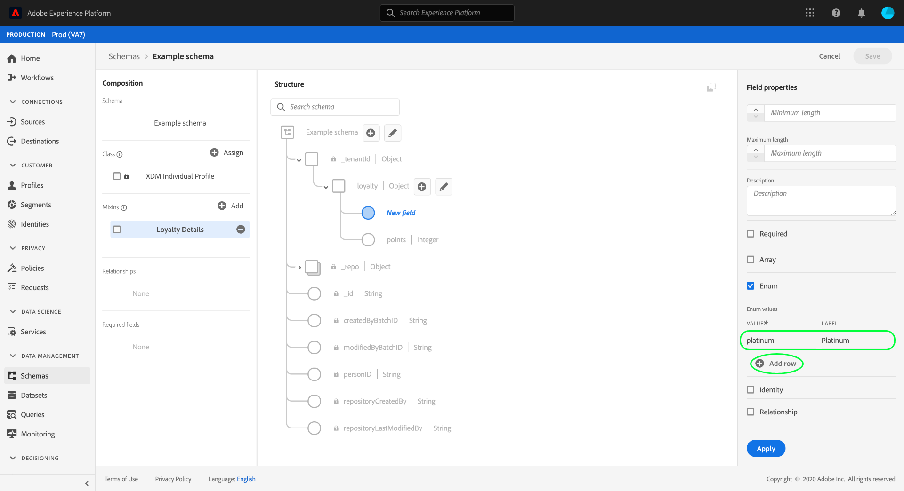
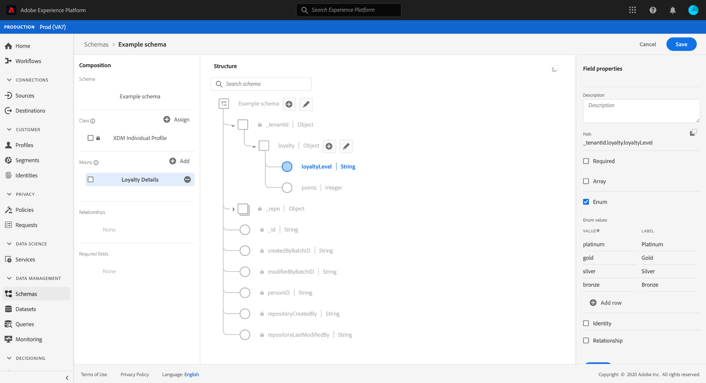

# Define an enum field in the UI

In Experience Data Model (XDM), an enum field represents a field that is constrained to a pre-defined list of acceptable values.

When [defining a new field](./overview.md#define) in the Adobe Experience Platform user interface, you can set it as an enum field by selecting the **[!UICONTROL Enum]** checkbox in the right rail. 

Additional controls appear after selecting the checkbox, allowing you to specify the value constraints for the enum. Under the **[!UICONTROL Value]** column, you must provide the exact value you want to constrain the field to. This value must comply to the [!UICONTROL Type] you selected for the enum field. You can optionally provide a human-friendly **[!UICONTROL Label]** for the constraint as well.

To add additional constraints to the enum, select **[!UICONTROL Add row]**.

Continue to add the desired constraints and optional labels to the enum. When finished, select **[!UICONTROL Apply]** to apply the change to the schema.

The canvas updates to reflect the changes. When you explore this schema in the future, you can view and edit the constraints for the enum field within the right rail.

## Next steps

This guide covered how to define a required field in the the UI. To learn how to define other field types, see the [field definition overview](./overview.md#special).