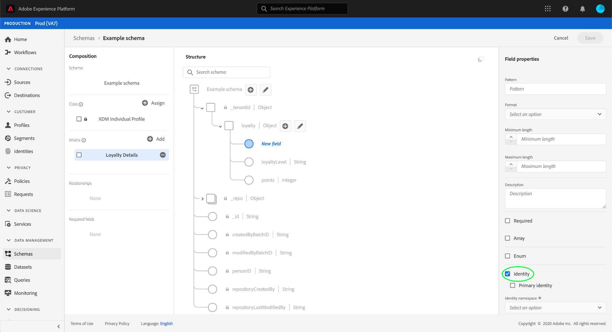
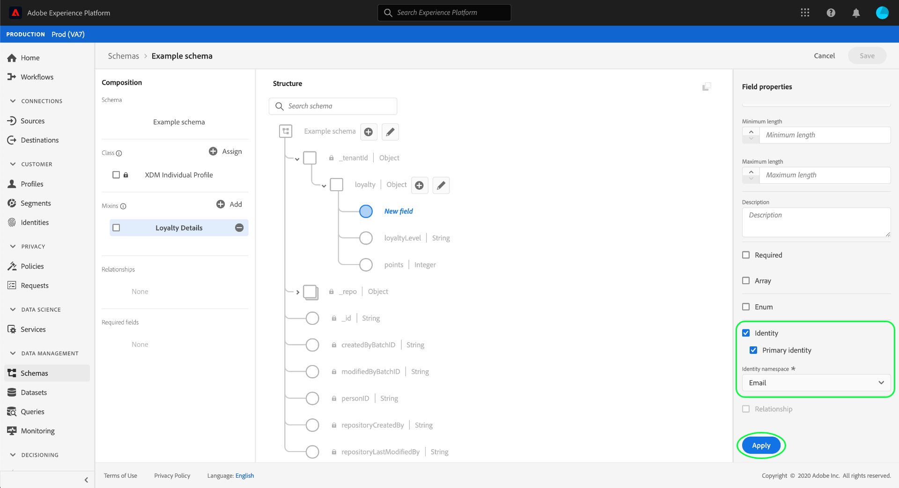
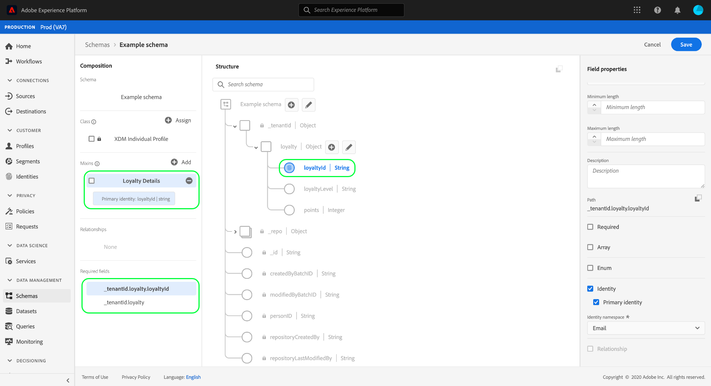

# Define identity fields in the UI

In Experience Data Model (XDM), an identity field represents a field that that can be used to identify an individual person related to a record or time-series event. This document covers how to define an identity field in the Adobe Experience Platform UI.

## Prerequisites

Identity fields are a crucial component in how customer identity graphs are constructed in Platform, which ultimately affects how Real-Time Customer Profile merges disparate data fragments together to gain a complete view of the customer. Before defining identity fields in your schemas, please refer to the following documentation to learn about the key services and concepts related to identity fields:

* [Adobe Experience Platform Identity Service](../../../identity-service/home.md): Bridges identities across devices and systems, linking datasets together based on the identity fields defined by the XDM schemas they conform to.
  * [Identity namespaces](../../../identity-service/namespaces.md): Identity namespaces define the different types of identity information that can relate to a single person, and are a required component for each identity field.
* [Real-Time Customer Profile](../../../profile/home.md): Leverages customer identity graphs to provide a unified consumer profile based on aggregated data from multiple sources, updated in near-real-time.

## Define an identity field

When [defining a new field](./overview.md#define) in the UI, you can set it as an identity field by selecting the **[!UICONTROL Identity]** checkbox in the right rail. 

Additional controls appear after selecting the checkbox. If you want this field to be the primary identity for the schema, select the **[!UICONTROL Primary identity]** checkbox.

>[!NOTE]
>
>A single schema may have many identity fields defined, but can only have one primary identity. All identity fields (primary or otherwise) contribute to the identity graph for an individual customer, but Real-Time Customer Profile uses only the primary identity as the source of truth when merging data fragments together. If you want to enable a schema for use in Profile, the schema must have a primary identity defined.

Under **[!UICONTROL Identity namespace]**, use the dropdown menu to select the appropriate namespace for the identity field. Standard namespaces provided by Adobe are listed, along with any custom namespaces defined by your organization.

When finished, select **[!UICONTROL Apply]** to apply the change to the schema.

The canvas updates to reflect the changes, with the selected field gaining a fingerprint symbol () to designate it as an identity. In the left rail, the identity field is now listed under the name of the class or schema field group that provides the field to the schema.

Since all identity fields are required by default, the field is now listed under **[!UICONTROL Required fields]** in the left rail. If the identity field is nested within the schema structure, all parent fields will also be listed as required.

If you defined a primary identity for the schema, you can now proceed to [enable the schema for use in Real-Time Customer Profile](../resources/schemas.md#profile).

## Next steps

This guide covered how to define an identity field in the the UI. As data is ingested using this schema, your customer identity graphs will update to reflect the schema's identity fields. See the guide on the [identity graph viewer](../../../identity-service/ui/identity-graph-viewer.md) to learn how to explore your organization's private graph in the UI.

See the overview on [defining fields in the UI](./overview.md#special) to learn how to define other XDM field types in the [!DNL Schema Editor].
