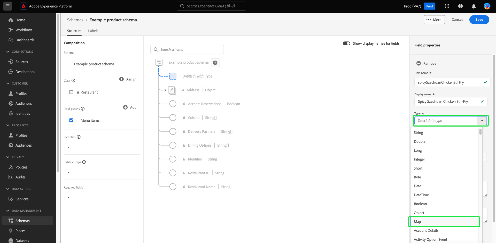
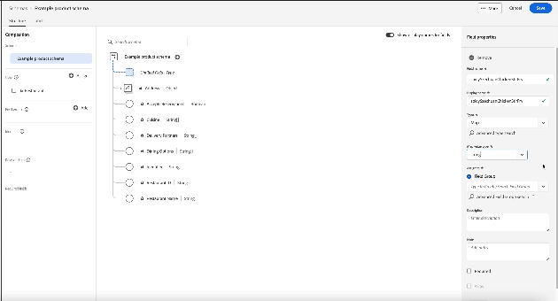

# Define map fields in the UI

Adobe Experience Platform allows you to fully customize the structure of your custom Experience Data Model (XDM) classes, schema field groups, and data types. 

You can also define map fields in the Schema Editor to model flexible and dynamic data structures or store a collection of key-value pairs. The map data structure allows for efficient and fast lookups, inserts, and deletes where information is organized and accessed based on unique identifiers.

When defining a new field in the Platform user interface (UI), use the **[!UICONTROL Type]** dropdown and select "**[!UICONTROL Map]**" from the list.

A [!UICONTROL Map value type] property appears. This value is required for [!UICONTROL Map] data types. Available values for the map are [!UICONTROL String] and [!UICONTROL Integer]. Select a value from the drop-down list of available options.

![The Schemas Editor with the [!UICONTROL Map value type] dropdown highlighted.](../../images/ui/fields/special/map-value-type.png)

Once you have configured the subfield, you must assign it to a field group. Use the **[!UICONTROL Field Group]** drop down menu, or search field, and select **[!UICONTROL Apply]**. You can continue to add fields to the object using the same process, or select **[!UICONTROL Save]** to confirm your settings. 

## Usage restrictions {#restrictions}

XDM places the following restrictions on the use of this data type:

* Map types MUST be of type `object`.
* Map types MUST NOT have properties defined (in other words, they define "empty" objects).
* Map types MUST include an `additionalProperties.type` field that describes the values that may be placed within the map, either `string` or `integer`.

Ensure that you are only using map-type fields when absolutely necessary, as they carry the following performance drawbacks:

* Response time from [Adobe Experience Platform Query Service](../../../query-service/home.md) degrades from three seconds to ten seconds for 100 million records.
* Maps must have fewer than 16 keys or else risk further degradation.

>[!NOTE]
>
>The Platform UI has limitations in how it can extract the keys of map-type fields. Whereas object-type fields can be expanded, maps are displayed as a single field instead. Map fields created through the Schema Registry API that are not string or integer data types are displayed as "[!UICONTROL Complex]" data types.

## Next steps

After reading this document, you are now able to define map fields in the Platform UI. Remember that you can only use classes and field groups to add fields to schemas. To learn more about how to manage these resources in the UI, see the guides on creating and editing [classes](../resources/classes.md) and [field groups](../resources/field-groups.md).

For more information on the capabilities of the [!UICONTROL Schemas] workspace, see the [[!UICONTROL Schemas] workspace overview](../overview.md).
