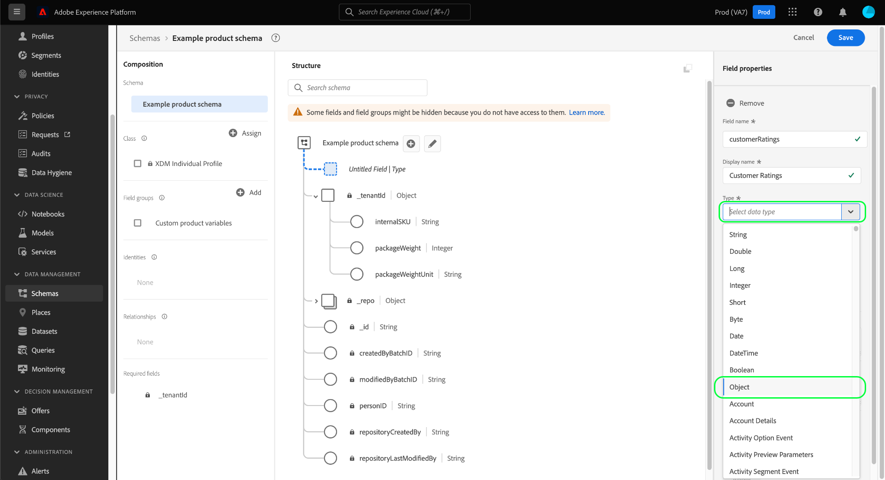

# Define object fields in the UI

Adobe Experience Platform allows you to fully customize the structure of your custom Experience Data Model (XDM) classes, schema field groups, and data types. In order to organize and nest related fields in custom XDM resources, you can define object-type fields which can contain additional sub-fields.

When [defining a new field](./overview.md#define) in the Adobe Experience Platform user interface, use the **[!UICONTROL Type]** dropdown and select "[!UICONTROL Object]" from the list.

Select **[!UICONTROL Apply]** to add the object to the schema. The canvas updates to show the new field with the [!UICONTROL Object] data type applied, including controls to edit and add sub-fields to the object.

To add a sub-field, select the **plus (+)** icon next to the object field in the canvas. A new field appears beneath the object, with controls to configure the sub-field in the right rail.

Once you have configured the sub-field and selected **[!UICONTROL Apply]**, you can continue to add fields to the object using the same process. You can also add sub-fields that are objects themselves, allowing you to nest fields as deeply as you like.

Once you have finished constructing the object, you may find that you want to reuse its structure in different classes and field groups. In this case, you can choose to convert the object to a data type. See the section on [converting objects to data types](../resources/data-types.md#convert) in the data types UI guide for more information.

## Next steps

This guide covered how to define an object field in the the UI. See the overview on [defining fields in the UI](./overview.md#special) to learn how to define other XDM field types in the [!DNL Schema Editor].
