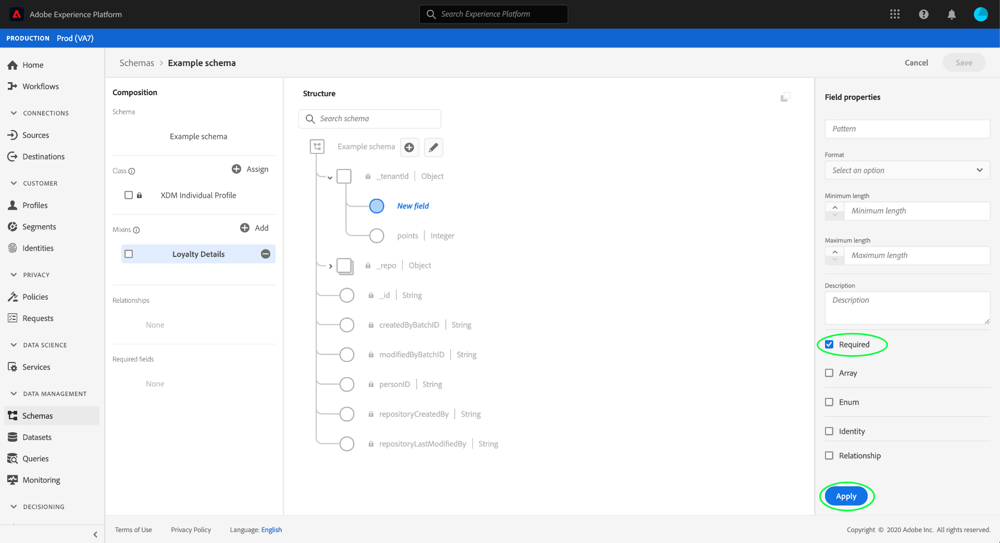
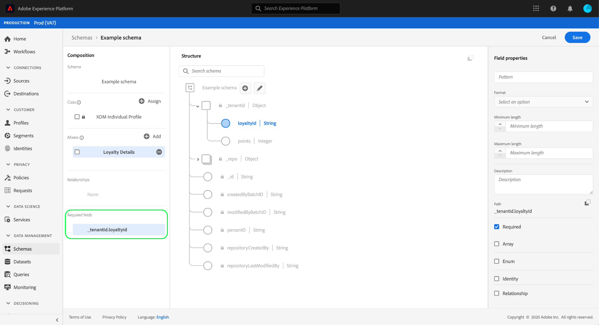

# Define a required field in the UI

In Experience Data Model (XDM), a required field indicates that it must be supplied a valid value in order for a particular record or time-series event to be accepted during data ingestion. Common use cases for required fields include user identity information and timestamps.

When [defining a new field](./overview.md#define) in the Adobe Experience Platform user interface, you can set it as a required field by selecting the **[!UICONTROL Required]** checkbox in the right rail. Select **[!UICONTROL Apply]** to apply the change to the schema.

Once the field is applied, its path appears under **[!UICONTROL Required fields]** in the left rail.

## Next steps

This guide covered how to define a required field in the the UI. To learn how to define other field types, see the [field definition overview](./overview.md#special).