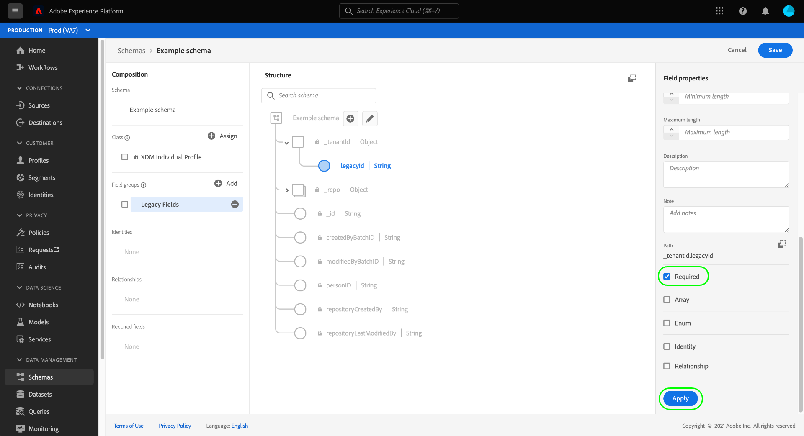
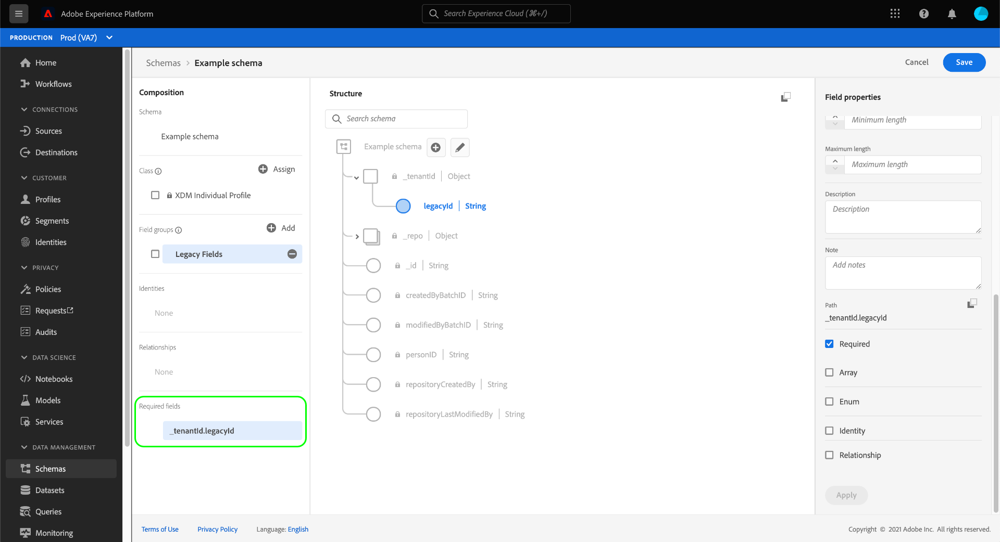
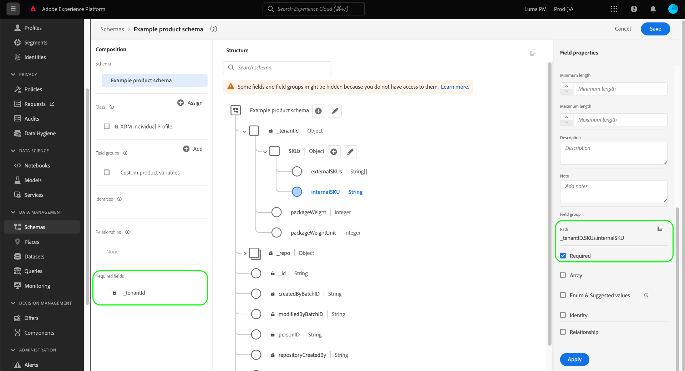

# Define required fields in the UI

In Experience Data Model (XDM), a required field indicates that it must be supplied a valid value in order for a particular record or time-series event to be accepted during data ingestion. Common use cases for required fields include user identity information and timestamps.

>[!IMPORTANT]
>
>Regardless of whether a schema field is required or not, Platform does not accept `null` or empty values for any ingested field. If there is no value for particular field in a record or event, the key for that field should be excluded from the ingestion payload.

When [defining a new field](./overview.md#define) in the Adobe Experience Platform user interface, you can set it as a required field by selecting the **[!UICONTROL Required]** checkbox in the right rail. Select **[!UICONTROL Apply]** to apply the change to the schema.

If the field is a root-level attribute under the tenant ID object, its path immediately appears under **[!UICONTROL Required fields]** in the left rail.

If a required field is nested within an object that is not marked as required itself, however, then the nested field does not appear under **[!UICONTROL Required fields]** in the left rail.

In the example below, the `loyaltyId` field is set as required, but its parent object `loyalty` is not. In this case, no validation errors would occur if `loyalty` was excluded when ingesting data, even though the child field `loyaltyId` is marked as required. In other words, while `loyalty` is optional it must contain a `loyaltyId` field in the event that it is included.

If you want a nested field to always be required in a schema, you must also set all parent fields as required (with the exception of the tenant ID object).

## Next steps

This guide covered how to define a required field in the the UI. See the overview on [defining fields in the UI](./overview.md#special) to learn how to define other XDM field types in the [!DNL Schema Editor].
