# Machine learning-assisted schema creation

>[!AVAILABILITY]
>
>* Machine learning-assisted schema creation is currently in beta. The documentation and the functionality are subject to change.

Use ML algorithms to generate a schema from sample data. This process saves time and increases accuracy when defining the structure, fields, and data types for large complex datasets.

With ML schema generation, you can quickly integrate new data sources and reduce the mistakes from manual creation. Non-technical users can use it to generate schemas or manage large and complex datasets without any extra effort. This assistance speeds up the process from getting data to gaining insights, as makes it easier to combine new data sources and perform data analysis.

## Getting started

This tutorial requires a working understanding of the requirements for schema creation. Before continuing with this guide, you should read the [UI guide to creating and editing schemas](./resources/schemas.md). 

This guide explains how to create schemas using machine learning (ML) algorithms to generate a schema from sample data. See the [manual schema creation workflow guide](https://experienceleague.adobe.com/en/docs/experience-platform/xdm/ui/resources/schemas#add-field-groups) for information on creating schemas or the document on [field-based workflows in the Schema Editor](https://experienceleague.adobe.com/en/docs/experience-platform/xdm/ui/field-based-workflows) to enhance your understanding of the schema creation process.

>[!NOTE]
>
>You can also compose a schema using the [!DNL Schema Registry] API. To create a schema manually using the API, first read the [[!DNL Schema Registry] developer guide](../api/getting-started.md) before attempting the tutorial on [creating a schema using the API](../tutorials/create-schema-api.md).

## Navigate to the Create schema workflow {#navigate-to-schema-creation-workflow}

From the left navigation of the Experience Platform UI, select the **[!UICONTROL Schemas]** workspace. The **[!UICONTROL Schemas]** workspace appears. Select **[!UICONTROL Create schema]** to add a new schema to start a schema creation workflow.

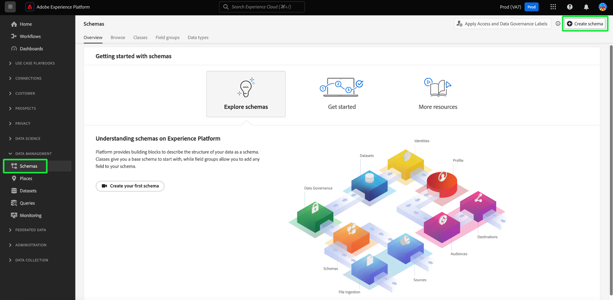

## Create a schema {#create-a-schema}

The [!UICONTROL Create a schema] dialog appears. Select the **[ML-Assisted]** schema creation option, followed by **[!UICONTROL Select]** to confirm your choice.

![The [!UICONTROL Create a schema] dialog with [!UICONTROL ML- Assisted] highlighted.](../images/ui/ml-schema-creation/use-sample-csv.png)

### Select a base class {#select-base-class}

The [!UICONTROL Create schema] workflow appears. Select a base class for your schema followed by **[!UICONTROL Next]**.

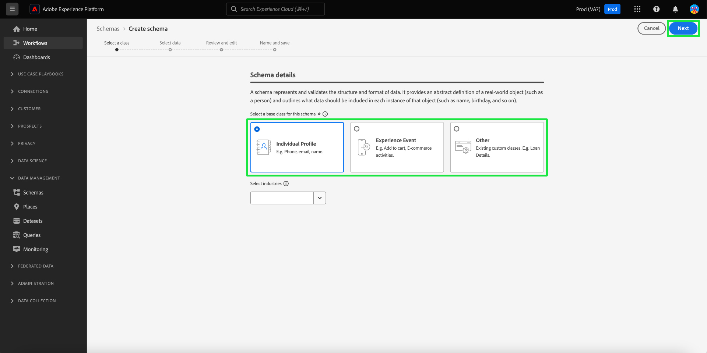

### Upload a CSV file {#upload-csv}

The **[!UICONTROL Select data]** stage of the creation workflow appears. From the **[!UICONTROL Upload files]** section, select **[!UICONTROL Choose files]** or the **[!UICONTROL Drag and Drop files]** section. Select a .csv file from your computer to generate a schema.

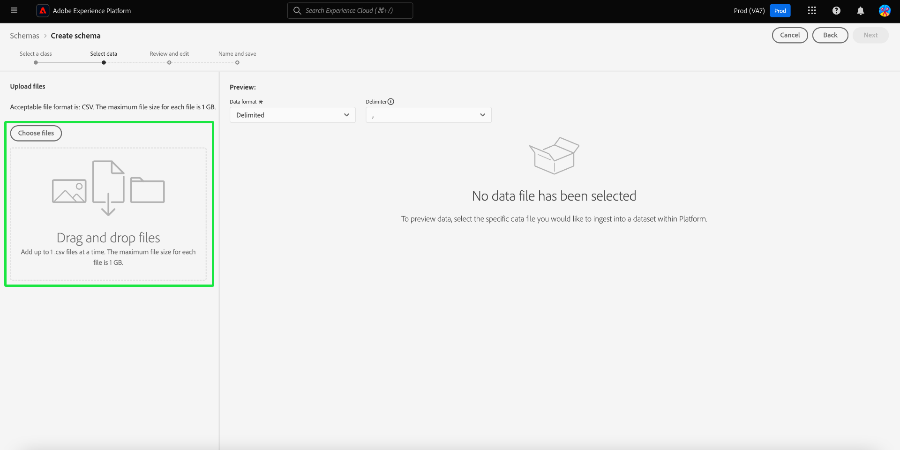

### Preview data {#preview-data}

The [!UICONTROL Upload file] section displays the name of the CSV file that you imported and the **[!UICONTROL Preview]** section displays rows of sample data from the file you uploaded. Select **[!UICONTROL Next]** to continue the workflow.

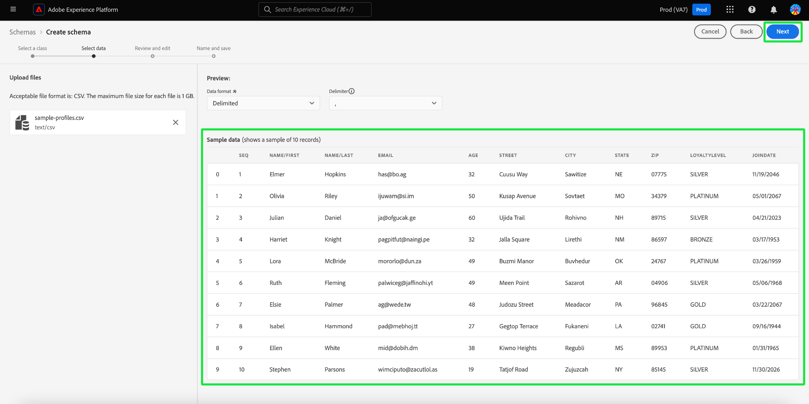

### Review and edit schema {#review-schema}

The **[!UICONTROL Review and edit]** stage of the creation workflow now appears, displaying the machine learning-assisted **[!UICONTROL Schema recommendation]** in a tabularized view. At this stage, you can edit, add, or remove fields from the recommended schema generated by the machine learning model. The table contains the following fields:

| Field Name       | Description  |
|------------------|---------------------------------------------------------|
| [!UICONTROL Data table]       | The dataset or database where the field originates. |
| [!UICONTROL Source Field]     | The original field name from the source system.      |
| [!UICONTROL Target Field]     | The field name in the target system where the data will be mapped.   |
| [!UICONTROL Display Name]     | The name used to display the field in the user interface. This name should be more user-friendly or descriptive.  |
| [!UICONTROL Data Type]        | The type of data stored in the field (for example, `String`, `Date`). |
| [!UICONTROL Field Group]      | A categorization of the field based on its use or context (for example, [!UICONTROL Demographic Details], [!UICONTROL Commerce Details]).  |

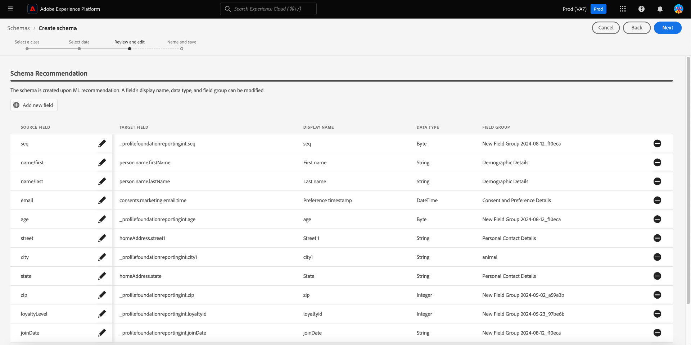

#### Add a field {#add-field}

To add a field to the schema, select **[!UICONTROL Add new field]**. 

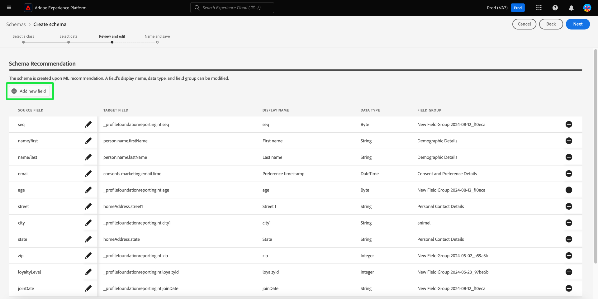

The [!UICONTROL Select field] dialog appears. The dialog contains a diagram of the schema as it currently exists. Select the desired field and select **[Select]** to add a new field to the schema. Select **[Cancel]** to close the dialog if needed.

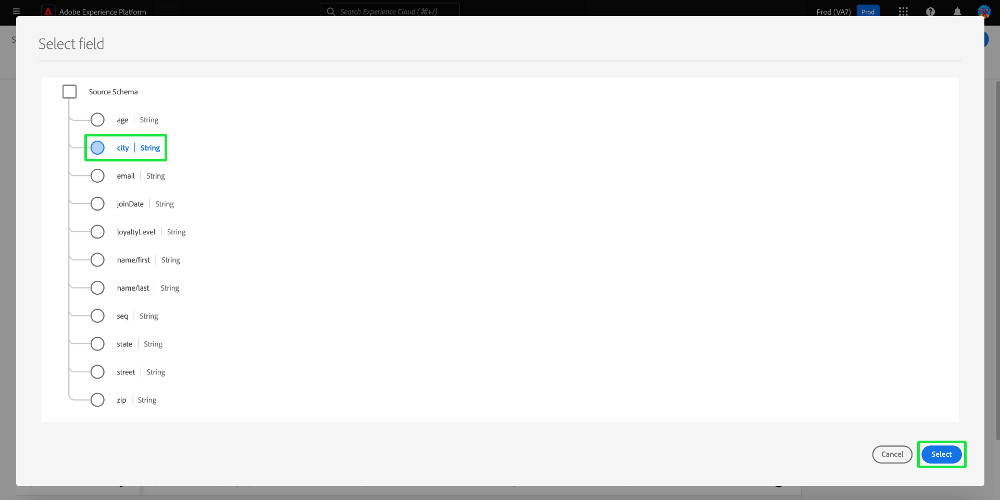

A new row appears on your recommended schema. You can now edit the field.

#### Edit a Field {#edit-field}
   
To edit a field, select the pencil icon of the row you wish to edit. A details panel appears to the right where you can edit the custom field mapping. The details panel contains the [!UICONTROL Target field], [!UICONTROL Display Name], [!UICONTROL Data Type], and [!UICONTROL Field Group]. Make any necessary changes and select **[!UICONTROL Apply]** to confirm. Select the pencil icon again to close the details panel.

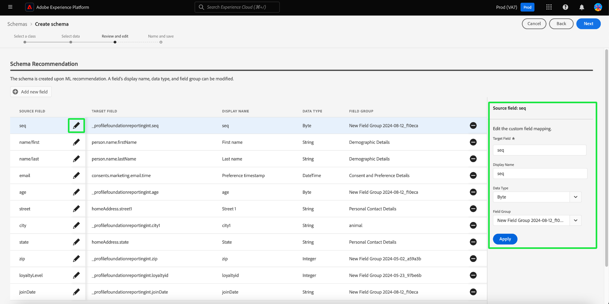

#### Remove a field {#remove-field}

To remove a field, select the minus icon on a row you want to delete. 

>[!CAUTION]
>
>No confirmation dialog appears when removing this item.

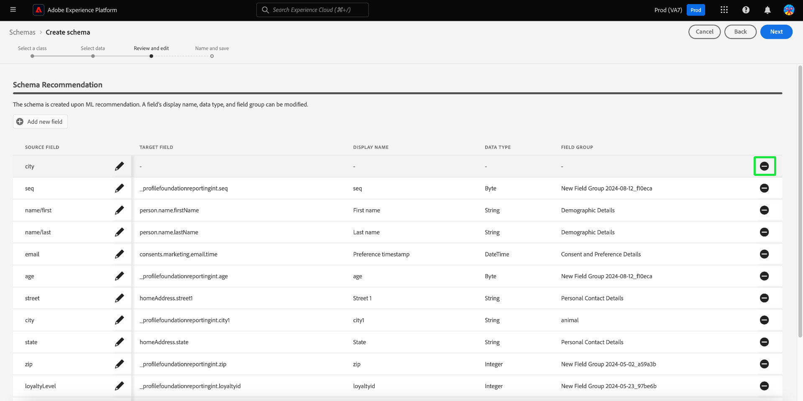

#### Approve your recommended schema {#approve}

To approve your recommended schema and continue the **[!UICONTROL Create schema]** workflow, select **[Next]**.

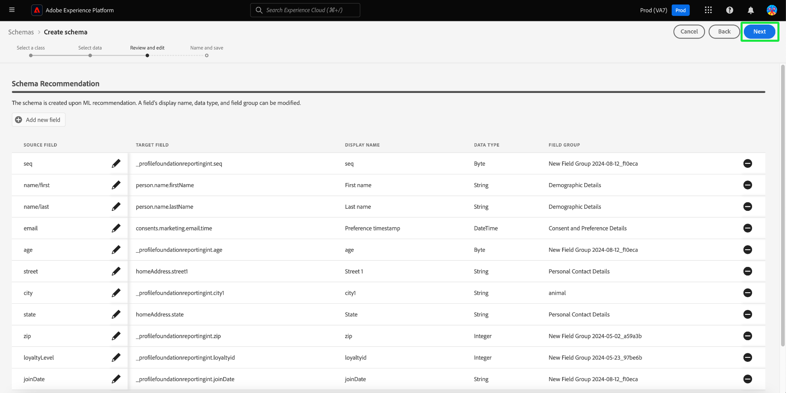

### Name and save schema {#name-and-save}

The **[!UICONTROL Name and save]** stage of the creation workflow appears. Enter a **[Schema display name]** and an optional description. The **[Schema generated]** section provides a diagram of the ML-generated schema. Select **[Finish]** to complete the schema creation workflow.

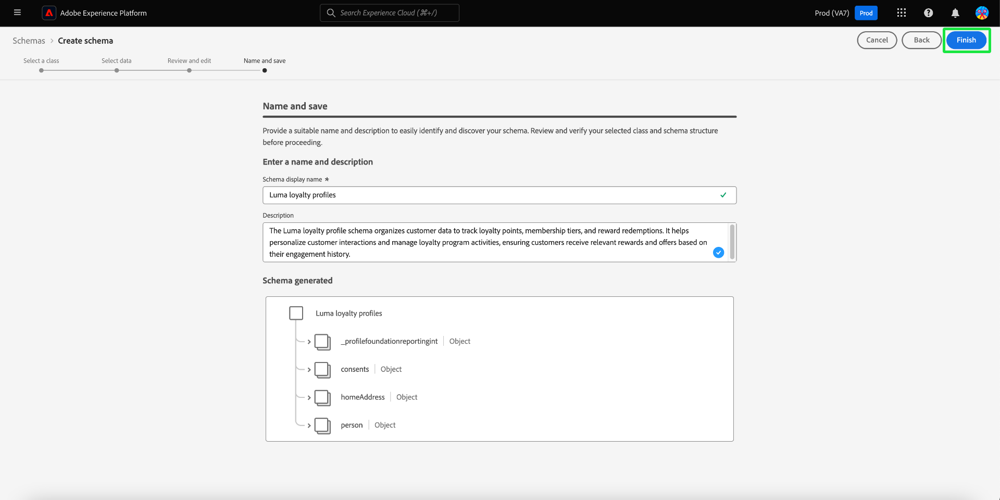

### View in the Schema Editor {#view-in-editor}

The Schema Editor appears with your newly created schema displayed in the canvas. Select **[!UICONTROL Save]** to return to the [!UICONTROL Schemas] workspace.

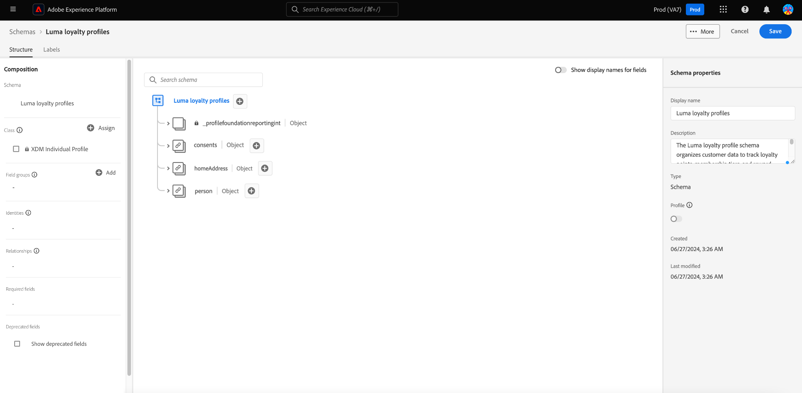

## Next Steps

After creating your schema, you can use the Schema Editor to make further modifications, if necessary. Your new schema is now ready to be integrated with your data sources and used for data analysis.

See the [Edit an existing schema guide](https://experienceleague.adobe.com/en/docs/experience-platform/xdm/ui/resources/schemas#edit) for more information on using the Schema Editor.
