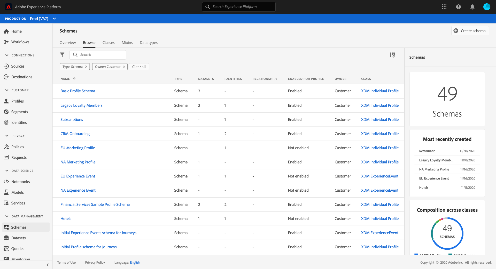

# [!UICONTROL Schemas] UI overview

The [!UICONTROL Schemas] workspace in the Adobe Experience Platform user interface allows you to manage Experience Data Model (XDM) resources, including schemas, classes, schema field groups, and data types. You can view and explore core resources provided by Adobe, and create custom resources and schemas for your organization.

To access to the workspace in the Platform UI, select **[!UICONTROL Schemas]** in the left rail.

## Getting started

If you are using the workspace for the first time, start with the guide on [exploring existing resources in the UI](./explore.md) to familiarize yourself with the different tabs and the schema canvas.

It is also recommended that you follow the [schema creation tutorial](../tutorials/create-schema-ui.md) to create an example schema and get a full tour of the [!DNL Schema Editor]'s capabilities in the process.

## Creating and managing XDM resources

The [!UICONTROL Schemas] workspace provides powerful tools for creating and customizing your organization's XDM resources. Refer to the following documentation to learn how to create and edit each resource type in the UI:

* [Schemas](./resources/schemas.md)
* [Classes](./resources/classes.md)
* [Field groups](./resources/field-groups.md)
* [Data types](./resources/data-types.md)

## Defining XDM fields

Classes, field groups, and data types all contribute fields to a schema. You can choose from a list of standard field types when adding fields to these resources, and can also define specialized fields for certain use cases. Refer to the guide on [defining XDM fields in the UI](./fields/overview.md) for more information.

## Next steps

This document provided an introduction to the [!UICONTROL Schemas] workspace in the Platform UI. Please refer to the documentation linked throughout this overview to learn more about how to manage your schemas and other XDM resources.
