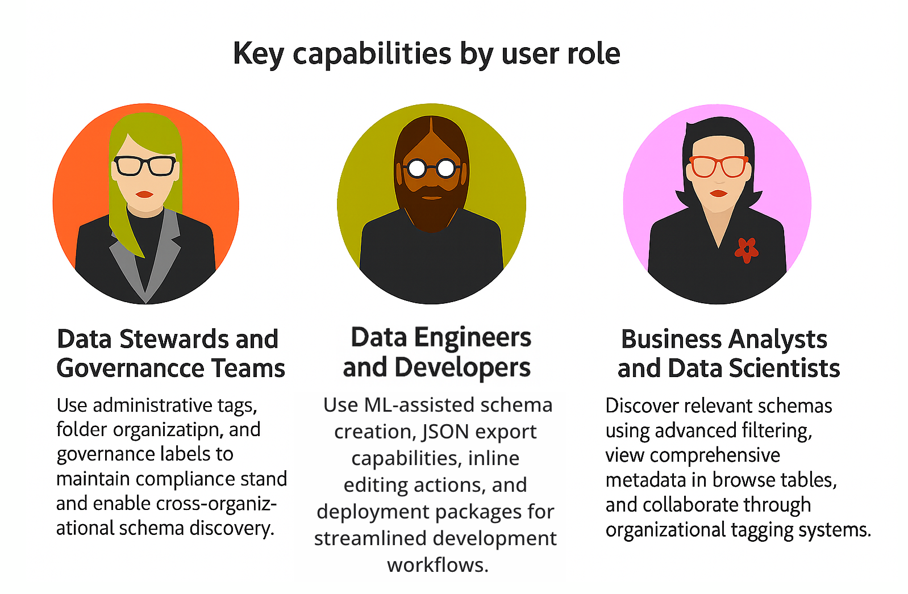

# [!UICONTROL Schemas] UI overview 

The [!UICONTROL Schemas] workspace in the Adobe Experience Platform user interface allows you to manage Experience Data Model (XDM) resources, including schemas, classes, schema field groups, and data types. You can view and explore core resources provided by Adobe, and create custom resources and schemas for your organization.

To access to the workspace in the Experience Platform UI, select **[!UICONTROL Schemas]** in the left rail.

## Enterprise schema management at scale

The [!UICONTROL Schemas] workspace enables enterprise-grade data modeling with advanced discovery tools, automated schema generation, and integrated governance workflows. Organizations can reduce time-to-insight by efficiently organizing schemas across teams, ensuring compliance through built-in labeling, and accelerating development with machine learning-assisted creation. The workspace supports large schema inventories while maintaining performance and governance standards required for enterprise environments.

## Key capabilities by user role

Different teams interact with the Schemas workspace in unique ways based on their responsibilities and goals.

**Data Stewards and Governance Teams**: Use administrative tags, folder organization, and governance labels to maintain compliance standards and enable cross-organizational schema discovery.

**Data Engineers and Developers**: Leverage ML-assisted schema creation, JSON export capabilities, inline editing actions, and deployment packages for streamlined development workflows.

**Business Analysts and Data Scientists**: Discover relevant schemas using advanced filtering, view comprehensive metadata in browse tables, and collaborate through organizational tagging systems.

## Getting started

If you are using the workspace for the first time, start with the guide on [exploring existing resources in the UI](./explore.md) to familiarize yourself with the different tabs, enhanced filtering capabilities, and the schema canvas.

It is also recommended that you follow the [schema creation tutorial](../tutorials/create-schema-ui.md) to create an example schema and get a full tour of the [!DNL Schema Editor]'s capabilities in the process.

## Discovering and organizing schemas

Locate and organize schemas efficiently using advanced discovery tools. Filter schemas by type, Profile enablement, tags, identity configuration, relationships, creation dates, and creators. The enhanced browse table displays comprehensive metadata including tags, schema type, class, identities, relationships, behavior, and creation details directly in the table view.

Organize schemas using user-defined tags for project-based categorization or folder hierarchies for structured browsing and access control. Both organizational approaches integrate with the filtering system to support team-based workflows and governance requirements.

For detailed guidance on schema discovery and filtering capabilities, see the [exploring schemas guide](./explore.md).

## Schema governance and compliance

Maintain data governance standards and regulatory compliance through integrated labeling and organizational tools. Apply data governance labels at the schema level to automatically propagate compliance classifications to all associated datasets. Use administrative tags and folder structures to support organizational governance policies and audit requirements.

Learn more about [data governance labels](../../../data-governance/labels/user-guide.md) and [administrative tags](../../../administrative-tags/ui/managing-tags.md) for comprehensive governance workflows.

## Streamlined schema operations

Accelerate schema management through inline actions and automated workflows. Edit properties, manage tags, move schemas between folders, or export JSON structures directly from the browse table without navigating to individual schema details. Use ML-assisted schema creation to generate schemas from sample data, reducing manual effort and improving accuracy.

These operational enhancements reduce development time and minimize context switching for teams managing large schema inventories.

## Creating and managing XDM resources

The [!UICONTROL Schemas] workspace provides powerful tools for creating and customizing your organization's XDM resources. Refer to the following documentation to learn how to create and edit each resource type in the UI:

* [Schemas](./resources/schemas.md)
* [Schema actions and workflows](./resources/schemas.md#more)
* [ML-assisted schema creation](./ml-assisted-schema-creation.md) - Generate schemas from sample data using machine learning algorithms
* [Industry data models](../../schema/industries/overview.md) - Pre-built schemas for common industry use cases
* [Classes](./resources/classes.md)
* [Field groups](./resources/field-groups.md)
* [Data types](./resources/data-types.md)

## Integration with Experience Platform ecosystem

Schemas integrate seamlessly with Real-Time Customer Profile for customer data unification, Query Service for data analysis workflows, and destination platforms for activation. The workspace supports enterprise-scale deployments with folder-based access control, bulk operations capabilities, and automated governance label propagation to maintain performance and compliance across large schema inventories.

## Defining XDM fields

Classes, field groups, and data types all contribute fields to a schema. You can choose from a list of standard field types when adding fields to these resources, and can also define specialized fields for certain use cases. Refer to the guide on [defining XDM fields in the UI](./fields/overview.md) for more information.

## Next steps

This document provided an introduction to the [!UICONTROL Schemas] workspace in the Experience Platform UI. Please refer to the documentation linked throughout this overview to learn more about how to manage your schemas and other XDM resources.
