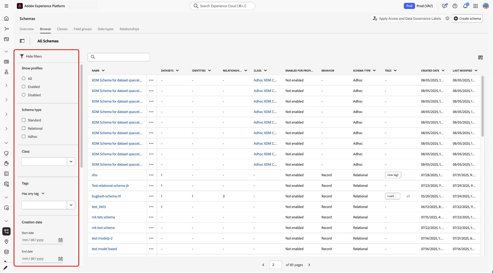

# [!UICONTROL Schemas] UI overview

Use the **[!UICONTROL Schemas]** workspace in Adobe Experience Platform to create, manage, and organize Experience Data Model (XDM) resources. From this workspace, you can work with schemas, classes, schema field groups, data types, and relationships. You can also view Adobe-provided resources and create custom resources for your organization.

To access the workspace in the Experience Platform UI, select **[!UICONTROL Schemas]** in the left rail.

## Getting started {#getting-started}

If you are using the workspace for the first time, start with the guide on [exploring schema resources in the UI](./explore.md) to learn how to browse resources, filter inventory views, use tags and folders, and manage schemas from the inventory.

To create your first schema, follow the [schema creation tutorial](../tutorials/create-schema-ui.md). The tutorial walks through the schema creation process and introduces the core features of the **[!DNL Schema Editor]**.

## Discover and organize schemas {#discover-and-organize-schemas}

Use the **[!UICONTROL Browse]** workspace to locate and organize schemas. You can search and filter schemas, sort inventory columns, view schema metadata, and organize resources using tags and folders.

For detailed information on filtering, inventory management, tags, folders, and inline actions, see the [explore schema resources guide](./explore.md).

## Manage schema governance {#manage-schema-governance}

Apply governance controls directly to schemas to help maintain data management and compliance requirements across your organization. You can apply data governance labels to schemas, organize resources with tags and folders, and manage schema metadata from inventory views.

For more information, see the following documentation:

- [Data usage labels](../../data-governance/labels/user-guide.md)
- [Managing unified tags](../../administrative-tags/ui/managing-tags.md)

## Manage schemas from inventory views {#manage-schemas-from-inventory-views}

Use inline actions to perform common schema management tasks without opening individual schemas. Depending on the resource type, you can edit schema properties, apply labels, manage tags, move resources to folders, add resources to deployment packages, and perform other inventory-level actions.

For more information, see the [explore schema resources guide](./explore.md#browse-organize-manage-schemas).

## Create and manage XDM resources {#create-and-manage-xdm-resources}

The **[!UICONTROL Schemas]** workspace provides tools for creating and managing XDM resources. Use the following documentation to learn more about each resource type:

- [Schemas](./resources/schemas.md)
- [Schema actions and workflows](./resources/schemas.md#manage-schemas)
- [ML-assisted schema creation](./ml-assisted-schema-creation.md)
- [Industry data models](../schema/industries/overview.md)
- [Classes](./resources/classes.md)
- [Field groups](./resources/field-groups.md)
- [Data types](./resources/data-types.md)
- [Relationships](../tutorials/relationship-ui.md)

## Integration with Experience Platform services {#integration-with-experience-platform-services}

Schemas support several Experience Platform workflows and services. Depending on your use case, schemas can be used with the following services:

- [Real-Time Customer Profile](../../../profile/home.md)
- [Query Service](../../../query-service/home.md)
- [Destinations](../../../destinations/home.md)

Refer to the documentation for each service to learn how schemas are used within those workflows.

## Define XDM fields {#define-xdm-fields}

Schemas, classes, field groups, and data types all contribute fields to your XDM data model. When creating custom resources, you can define standard field types and specialized fields for specific use cases.

For more information, see the guide on [defining XDM fields in the UI](./fields/overview.md).

## Next steps {#next-steps}

Use the following resources to continue learning about XDM schemas and related capabilities:

- [Explore schema resources in the UI](./explore.md)
- [Create and edit schemas](./resources/schemas.md)
- [Experience Data Model (XDM) overview](../home.md)
  