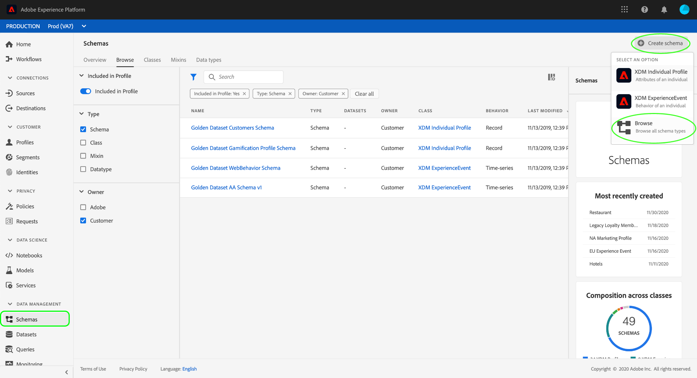
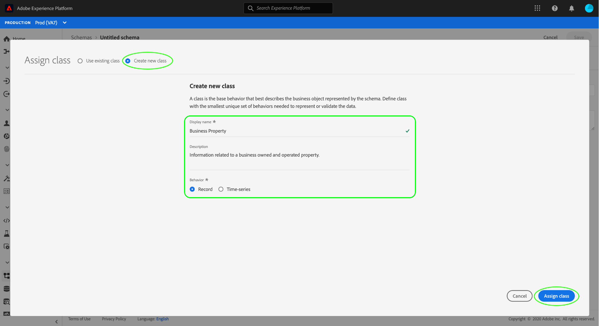
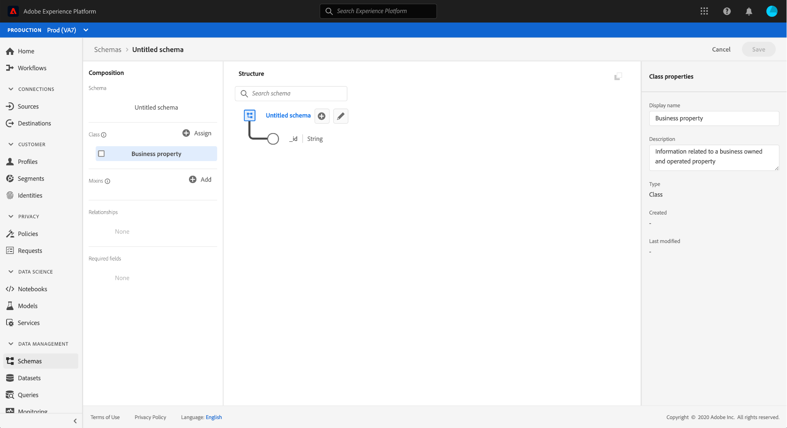
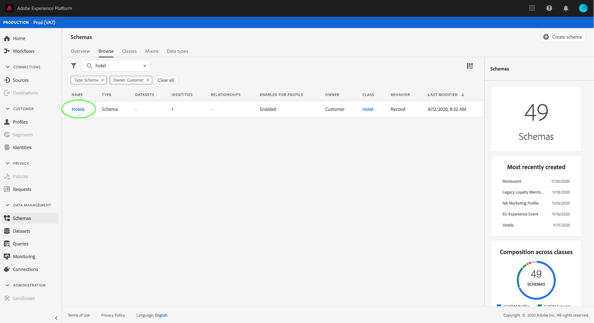
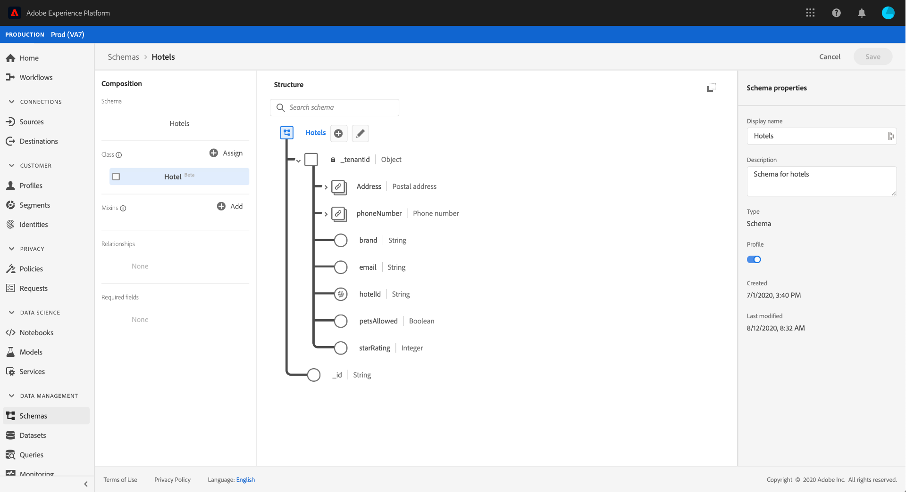
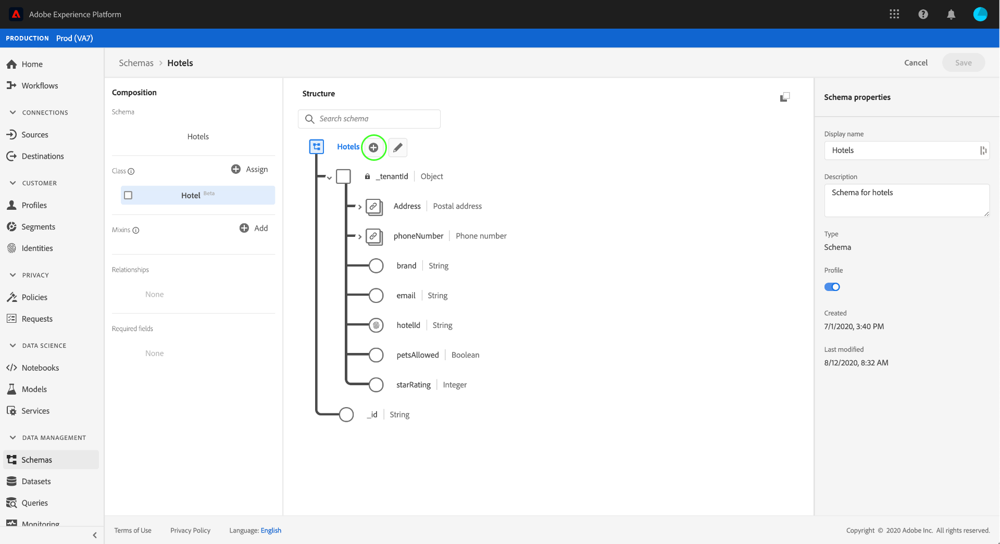
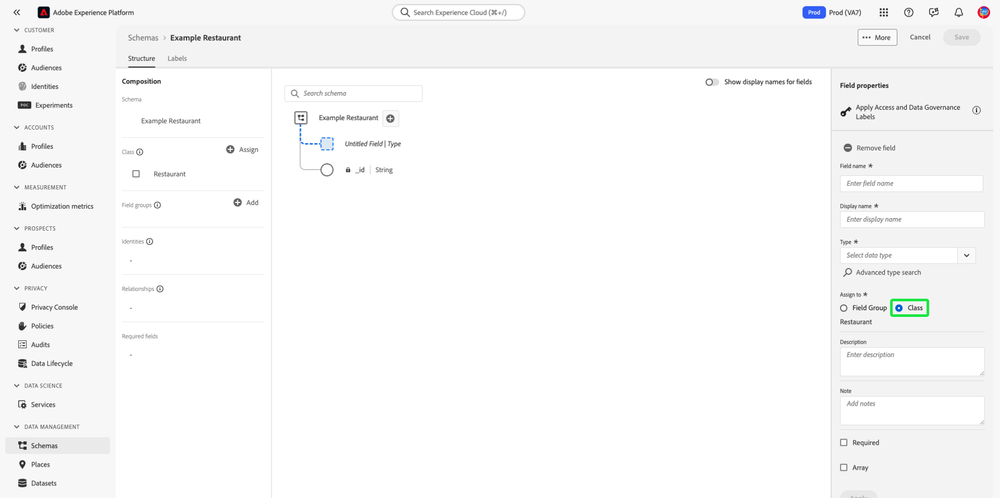
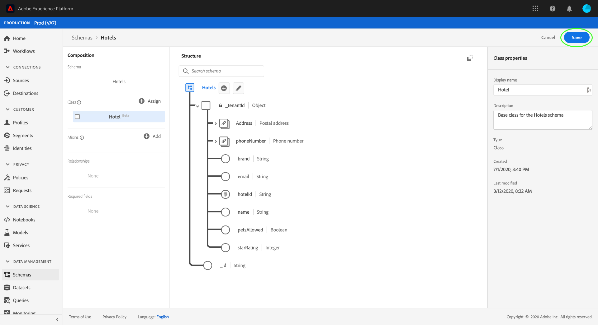

# Create and edit classes in the UI

In Adobe Experience Platform, a schema's class defines the behavioral aspects of the data that the schema will contain (record or time-series). In addition to this, classes describe the smallest number of common properties that all schemas based on that class would need to include and provide a way for multiple compatible datasets to be merged.

Adobe provides several standard ("core") XDM classes, including [!DNL XDM Individual Profile] and [!DNL XDM ExperienceEvent]. In addition to these core classes, you can also create your own custom classes to describe more specific use cases for your organization.

This document provides an overview of how to create, edit, and manage custom classes in the Experience Platform UI.

## Prerequisites

This guide requires a working understanding of XDM System. Refer to the [XDM overview](../../home.md) for an introduction to the role of XDM within the Experience Platform ecosystem, and the [basics of schema composition](../../schema/composition.md) to learn how classes contribute to XDM schemas.

While not required for this guide, it is recommended that you also follow the tutorial on [composing a schema in the UI](../../tutorials/create-schema-ui.md) to familiarize yourself with the various capabilities of the [!DNL Schema Editor].

## Create a new class {#create}

In the **[!UICONTROL Schemas]** workspace, select **[!UICONTROL Create schema]**, then select **[!UICONTROL Browse]** from the dropdown.

A dialog appears that allows you select from a list of available classes. At the top of the dialog, select **[!UICONTROL Create new class]**. You can then give your new class a display name (a short, descriptive, unique, and user-friendly name for the class), a description, and a behavior for the data that the schema will define (**[!UICONTROL Record]** or **[!UICONTROL Time-series]**).

When finished, select **[!UICONTROL Assign class]**.

The [!DNL Schema Editor] appears, showing a new schema in the canvas that is based on the custom class you just created. Since no fields have been added to the class yet, the schema only contains an `_id` field, which represents the system-generated unique identifier that is automatically applied to all resources in the [!DNL Schema Registry].

>[!IMPORTANT]
>
>When building a schema that implements a class defined by your organization, remember that schema field groups are available for use only with compatible classes. Since the class you defined is new, there are no compatible field groups listed in the **[!UICONTROL Add field group]** dialog. Instead, you will need to [create new field groups](./field-groups.md#create) for use with that class. The next time you compose a schema that implements the new class, the field groups that you defined will be listed and available for use.

You can now start [adding fields to the class](#add-fields), which will be shared by all schemas that employ the class.

## Edit an existing class {#edit}

>[!NOTE]
>
>Only custom classes defined by your organization can be fully edited and customized. For core classes defined by Adobe, only the display names for their fields can be edited within the context of individual schemas. See the section on [editing display names for schema fields](./schemas.md#display-names) for details.
>
>Once a custom class has been saved and used in data ingestion, only additive changes can be made to it thereafter. See the [rules of schema evolution](../../schema/composition.md#evolution) for more information.

To edit an existing class, select the **[!UICONTROL Browse]** tab, and then select the name of a schema that employs the class you want to edit.

>[!TIP]
>
>You can use the workspace's search and filtering capabilities to help find the schema easier. See the guide on [exploring XDM resources](../explore.md) for more information.

The [!DNL Schema Editor] appears, with the schema's structure shown in the canvas. You can now start [adding fields to the class](#add-fields).

## Add fields to a class {#add-fields}

Once you have a schema that employs a custom class open in the [!UICONTROL Schema Editor], you can start adding fields to the class. To add a new field, select the **plus (+)** icon next to the schema's name.

>[!IMPORTANT]
>
>Keep in mind that any fields you add to a class will be used in all schemas that employ that class. You should therefore carefully consider which fields will be useful in all schema use cases. If you are thinking of adding a field that may only see use in some schemas under this class, you may want to consider adding it to those schemas by [creating a field group](./field-groups.md#create) instead.

An **[!UICONTROL Untitled Field]** placeholder appears in in the canvas, and the right rail updates to show controls to configure the field's properties. Under **[!UICONTROL Assign to]**, select **[!UICONTROL Class]**.

See the guide on [defining fields in the UI](../fields/overview.md#define) for specific steps on how to configure and add the field to the class. Continue to add as many fields as required to the class. When finished, select **[!UICONTROL Save]** to save both the schema and the class.

If you have previously created schemas that employ this class, the newly added fields will automatically appear in those schemas.

## Change the class of a schema {#schema}

You can change the class of the schema at any point during the initial creation process before it has been saved. See the guide on [creating and editing schemas](./schemas.md#change-class) for more information.

## Next steps

This document covered how to create and edit classes using the Platform UI. For more information on the capabilities of the [!UICONTROL Schemas] workspace, see the [[!UICONTROL Schemas] workspace overview](../overview.md).

To learn how to manage classes using the [!DNL Schema Registry] API, see the [classes endpoint guide](../../api/classes.md).
