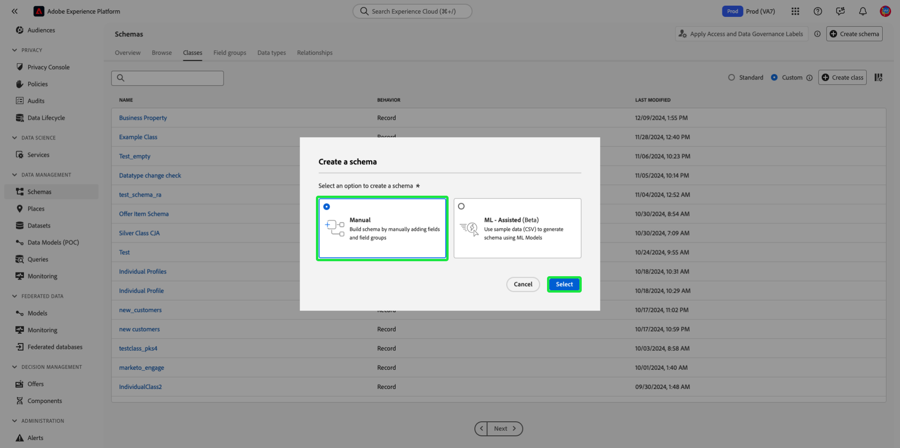

# Create and edit classes in the UI {#ui-create-and-edit}

>[!CONTEXTUALHELP]
>id="platform_schemas_class_filter"
>title="Standard or custom class filter"
>abstract="The list of available classes is pre-filtered based on how they were created. Select the radio button to choose between the Standard and Custom options. The Standard option shows entities created by Adobe and includes both XDM Individual Profile and XDM Experience Event classes. The Custom option displays entities created within your organization. See the documentation to learn more about creating and editing classes."

In Adobe Experience Platform, a schema's class defines the behavioral aspects of the data that the schema will contain (record or time-series). In addition to this, classes describe the smallest number of common properties that all schemas based on that class would need to include and provide a way for multiple compatible datasets to be merged.

Adobe provides several standard ("core") Experience Data Model (XDM) classes, including [XDM Individual Profile](../../classes/individual-profile.md) and [XDM ExperienceEvent](../../classes/experienceevent.md). In addition to these core classes, you can also create your own custom classes to describe more specific use cases for your organization.

This document provides an overview of how to create, edit, and manage custom classes in the Experience Platform UI.

## Prerequisites {#prerequisites}

This guide requires a working understanding of XDM System. Refer to the [XDM overview](../../home.md) for an introduction to the role of XDM within the Experience Platform ecosystem, and the [basics of schema composition](../../schema/composition.md) to learn how classes contribute to XDM schemas.

While not required for this guide, it is recommended that you also follow the tutorial on [composing a schema in the UI](../../tutorials/create-schema-ui.md) to familiarize yourself with the various capabilities of the Schema Editor.

## Getting started {#getting-started}

In the Experience Platform UI, select **[!UICONTROL Schemas]** in the left navigation to open the [!UICONTROL Schemas] workspace, then select the **[!UICONTROL Classes]** tab. A list of available classes are displayed. 

![The of classes inside the [!UICONTROL Classes] tab of the [!UICONTROL Schemas] workspace [!UICONTROL Classes] and [!UICONTROL Schemas] highlighted.](../../images/ui/resources/classes/available-classes.png)

## Filter classes {#filter}

The list of classes are automatically filtered based on how they were created. The default setting displays the classes defined by Adobe. You can also filter the list to show those created by your organization. Select the radio button to choose between the [!UICONTROL Standard] and [!UICONTROL Custom] options. The [!UICONTROL Standard] option shows entities created by Adobe and the [!UICONTROL Custom] option displays entities created within your organization.

![The [!UICONTROL Classes] tab of the [!UICONTROL Schemas] workspace with [!UICONTROL Standard] and [!UICONTROL Custom] highlighted.](../../images/ui/resources/classes/standard-and-custom-classes.png)

>[!TIP]
>
>Use the search capabilities to filter or find a class based on its name. See the guide on [exploring XDM resources](../explore.md) for more information.

## Create a new class {#create}

There are two methods to create a class in the Experience Platform UI, through **[!UICONTROL Create class]** or **[!UICONTROL Create schema]**.

### Create class

Select **[!UICONTROL Create class]** from the [!UICONTROL Classes] tab in the [!UICONTROL Schemas] workspace.

![The [!UICONTROL Classes] tab of the [!UICONTROL Schemas] workspace with [!UICONTROL Create class] highlighted](../../images/ui/resources/classes/create-class.png)

The [!UICONTROL Create class] dialog appears. Enter a [!UICONTROL Display name] and [!UICONTROL Description] for your class and choose the intended behavior of your class with the radio buttons. Classes can be of the type [!UICONTROL Record], or [!UICONTROL Time-series]. Select **[!UICONTROL Create]** to confirm your choices and return to the [!UICONTROL Classes] tab.

![The [!UICONTROL Create class] dialog with [!UICONTROL Create] highlighted.](../../images/ui/resources/classes/create-class-dialog.png)

The class you have created is available and listed in the [!UICONTROL Classes] view. 

![The [!UICONTROL Classes] tab of the [!UICONTROL Schemas] workspace with the recently created class highlighted.](../../images/ui/resources/classes/new-class-listing.png)

### Create schema

Alternatively, you can create a class by manually creating a schema. Select **[!UICONTROL Create schema]** from the [!UICONTROL Classes] tab in the [!UICONTROL Schemas] workspace.

![The [!UICONTROL Classes] tab of the [!UICONTROL Schemas] workspace with [!UICONTROL Create schema] highlighted](../../images/ui/resources/classes/create-schema.png)

Select **[!UICONTROL Manual]** in the [!UICONTROL Create a schema] dialog that appears.

>[!NOTE]
>
>If you use the ML-assisted schema creation workflow, you can upload a file and use ML algorithms to generate a recommended schema. In that schema creation workflow, you do not need to specify the base class for your schema. To learn how ML can recommend a schema structure based on a csv file, see the [machine learning-assisted schema creation guide](../ml-assisted-schema-creation.md).

The schema creation workflow appears. In the [!UICONTROL Schema details] section, select **[!UICONTROL Other]**. A list of available classes appears. Select **[!UICONTROL Create class]**.

![The [!UICONTROL Create schema] workflow with [!UICONTROL Other] highlighted in the [!UICONTROL Schema details] section.](../../images/ui/resources/classes/other-schema-details.png)

The [!UICONTROL Create class] dialog appears. Enter a [!UICONTROL Display name] and [!UICONTROL Description] for your class and choose the intended behavior of your class with the radio buttons. Classes can be of the type [!UICONTROL Record], or [!UICONTROL Time-series]. Select **[!UICONTROL Create]** to confirm your choices and return to the [!UICONTROL Classes] tab.

![The [!UICONTROL Create class] dialog with [!UICONTROL Create] highlighted.](../../images/ui/resources/classes/create-class-from-schema.png)

The class list refreshes in the [!UICONTROL Schema details] section, and your newly created class is automatically selected. Select **[!UICONTROL Next]** to continue creating your schema.

![The [!UICONTROL Schema details] section with the new class selected and [!UICONTROL Next] highlighted.](../../images/ui/resources/classes/select-new-class.png)

After you have selected a class, the [!UICONTROL Name and review] section appears. In this section, you provide a name and description to identify your schema. ​The schema's base structure (provided by the class) is shown in the canvas for you to review and verify your selected class and schema structure.

Enter a human-friendly [!UICONTROL Schema display name] in the text field. Next, enter a suitable description to help identify your schema. When you have reviewed your schema structure and are happy with your settings, select **[!UICONTROL Finish]** to create your schema. 

![The [!UICONTROL Name and review] section of the [!UICONTROL Create schema] workflow with the [!UICONTROL Schema display name], [!UICONTROL Description], and [!UICONTROL Finish] highlighted.](../../images/ui/resources/classes/schema-details.png)

## Add fields to a class {#add-fields}

Once you have a schema that employs a custom class open in the Schema Editor, you can start adding fields to the class. To add a new field, select the **plus (+)** icon next to the schema's name.

>[!IMPORTANT]
>
>When building a schema that implements a class defined by your organization, remember that schema field groups are available for use only with compatible classes. Since the class you defined is new, there are no compatible field groups listed in the **[!UICONTROL Add field group]** dialog. Instead, you will need to [create new field groups](./field-groups.md#create) for use with that class. The next time you compose a schema that implements the new class, the field groups that you defined will be listed and available for use.

>[!IMPORTANT]
>
>Keep in mind that any fields you add to a class will be used in all schemas that employ that class. You should therefore carefully consider which fields will be useful in all schema use cases. If you are thinking of adding a field that may only see use in some schemas under this class, you may want to consider adding it to those schemas by [creating a field group](./field-groups.md#create) instead.

An **[!UICONTROL Untitled Field]** placeholder appears in in the canvas, and the right rail updates to show controls to configure the field's properties. Under **[!UICONTROL Assign to]**, select **[!UICONTROL Class]**.

![An untitled field in the canvas of the Schema Editor with the Assign to [!UICONTROL Class] field property selected and highlighted.](../../images/ui/resources/classes/assign-to-class.png)

See the guide on [defining fields in the UI](../fields/overview.md#define) for specific steps on how to configure and add the field to the class. Continue to add as many fields as required to the class. When finished, select **[!UICONTROL Save]** to save both the schema and the class.

![The newly created schema on the canvas of the Schema Editor, with [!UICONTROL Save] highlighted.](../../images/ui/resources/classes/save.png)

If you have previously created schemas that employ this class, the newly added fields will automatically appear in those schemas.

## Edit a class (#edit-a-class)

>[!NOTE]
>
>Only custom classes defined by your organization can be fully edited and customized. For core classes defined by Adobe, only the display names for their fields can be edited within the context of individual schemas. See the section on [editing display names for schema fields](./schemas.md#display-names) for details.
>
>Once a custom class has been saved and used in data ingestion, only additive changes can be made to it thereafter. See the [rules of schema evolution](../../schema/composition.md#evolution) for more information.

You can edit a class through the schema workflow by editing an existing schema that extends the class, or by manually creating a schema. It is not possible to directly edit a class. From inside the [!UICONTROL Browse] tab in the [!UICONTROL Schemas] workspace, select an existing class or **[!UICONTROL Create a schema]**.

![The Schema Editor with an existing class and the [!UICONTROL Create a schema] highlighted.](../../images/ui/resources/classes/edit-class-options.png)

If you choose to create a new schema, see the section on [creating a schema](#create-schema) for details. Once you've finished creating the schema (or after selecting an existing schema) the Schema Editor will appear. To update an existing class field, select the field from the schema structure. The field's information will appear in the right rail. Ensure the [!UICONTROL Assign to]
option **[!UICONTROL Class]** is selected or your updates won't affect the class. 

![The Schema Editor with a field selected and highlighted, and the right rail exposed, highlighting [!UICONTROL Assign to].](../../images/ui/resources/classes/edit-existing-field.png)

Make any desired changes to the field, scrolling down in the right rail to select **[!UICONTROL Apply]** to save your changes. 

>[!IMPORTANT]
>
> Any updates you make to fields will be applied in all schemas that employ that class, following the [rules of schema evolution](../../schema/composition.md#evolution).

![The Schema Editor with a field selected and the right rail exposed, highlighting [!UICONTROL Apply].](../../images/ui/resources/classes/save-changes.png)

To add new fields, follow the [add fields to a class](#add-fields-to-a-class) guide. When finished, select **[!UICONTROL Save]** to save both the schema and the class. 

![The Schema Editor with [!UICONTROL Save] highlighted.](../../images/ui/resources/classes/save-schema.png)

## Change the class of a schema {#schema}

You can change the class of the schema at any point during the initial creation process before it has been saved. This should be done with caution however, as field groups are only compatible with certain classes. Changing the class resets the canvas and any fields you have added.
See the guide on [creating and editing schemas](./schemas.md#change-class) for more information.

## Next steps {#next-steps}

This document covered how to create and edit classes using the Experience Platform UI. For more information on the capabilities of the [!UICONTROL Schemas] workspace, see the [[!UICONTROL Schemas] workspace overview](../overview.md).

To learn how to manage classes using the Schema Registry API, see the [classes endpoint guide](../../api/classes.md).
