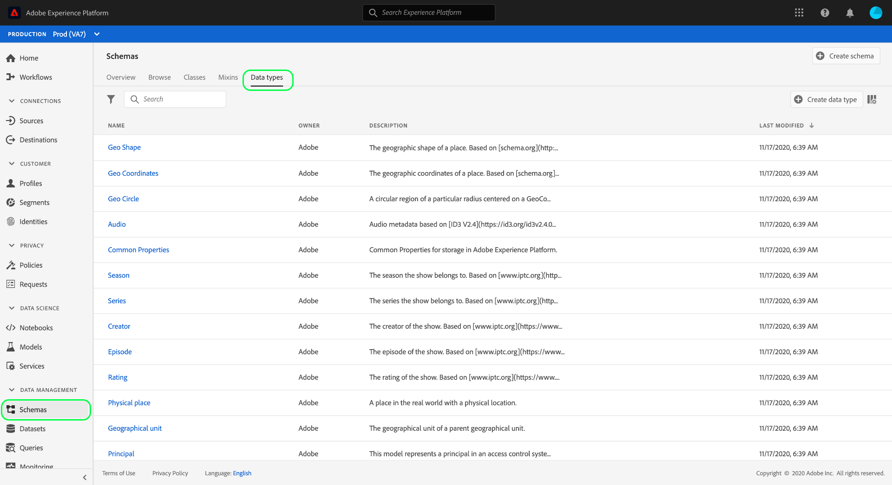
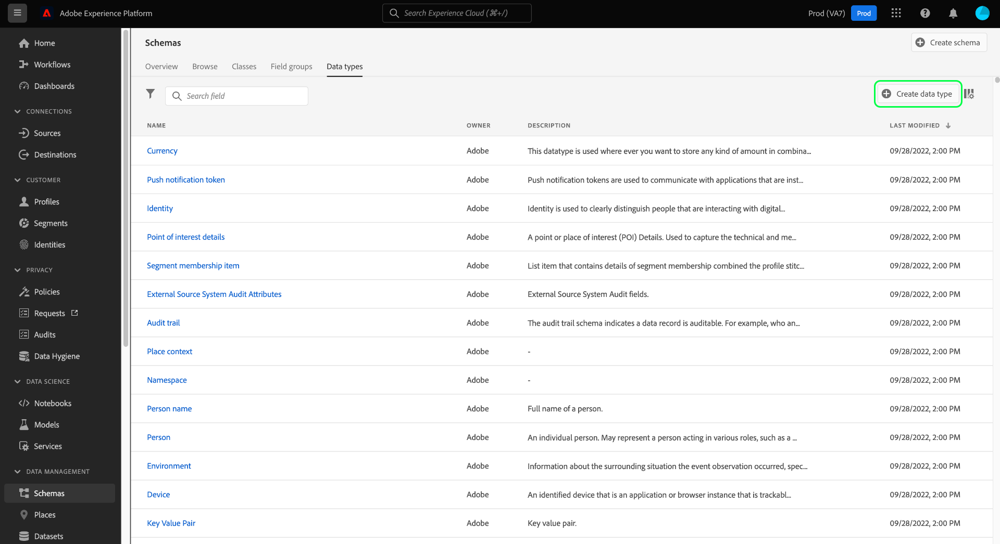
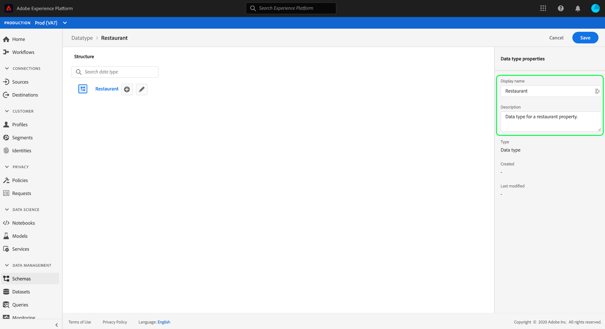
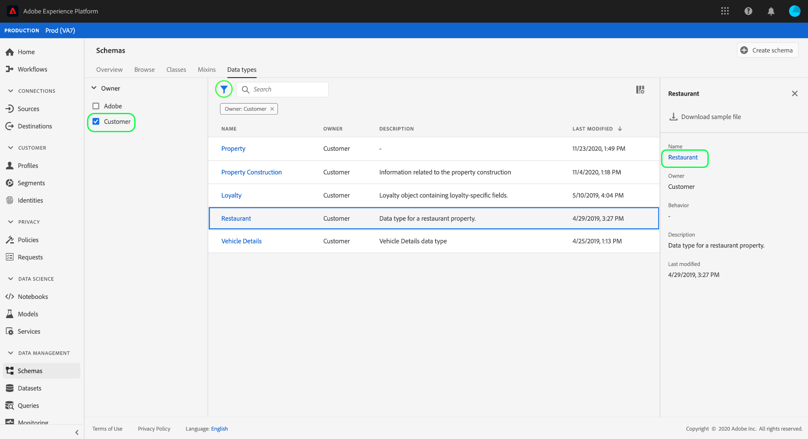
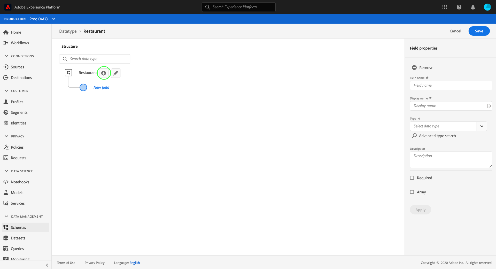
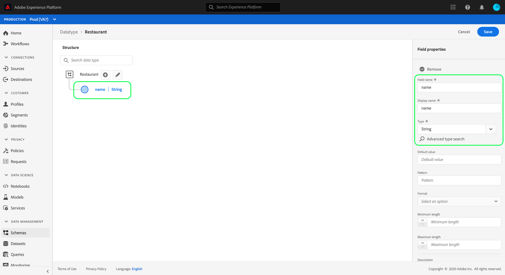
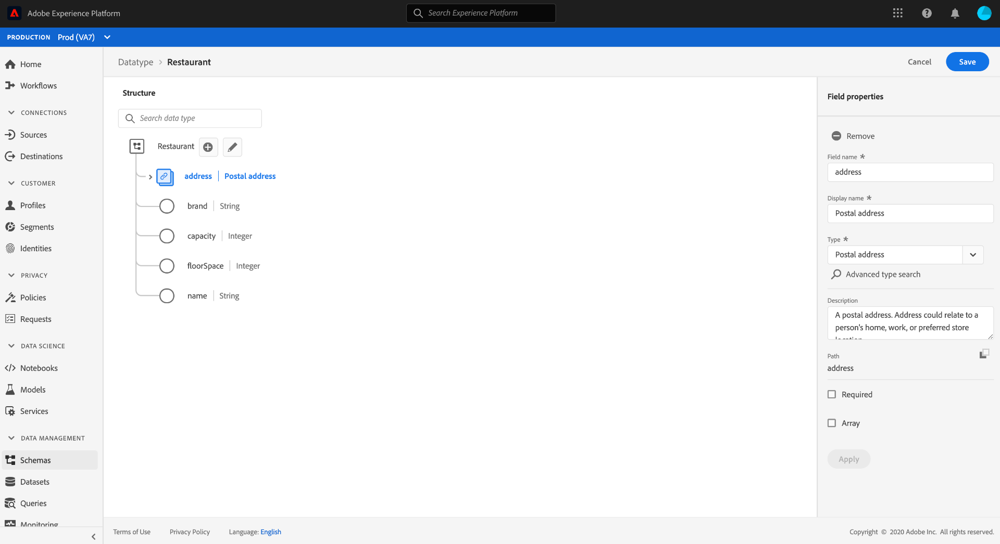
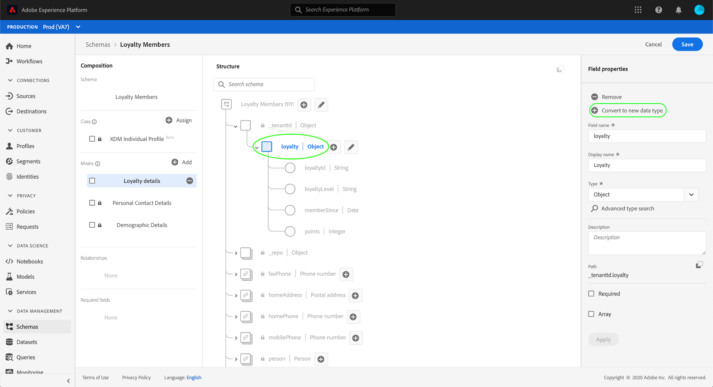
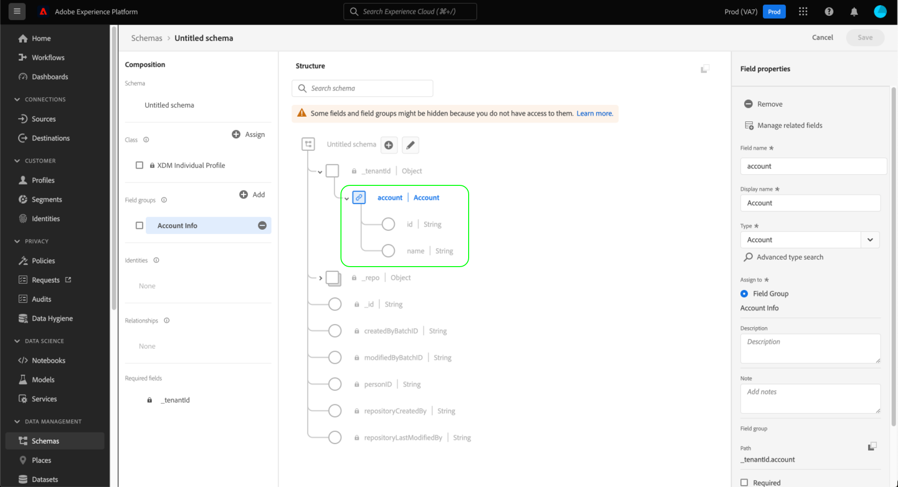

# Create and edit data types using the UI

In Experience Data Model (XDM), data types are reusable fields that contain multiple sub-fields. While similar to schema field groups in that they allow for the consistent use of a multi-field structure, data types are more flexible because they can be included anywhere in the schema structure whereas field groups can only be added at the root level.

Adobe Experience Platform provides many standard data types that can be used to cover a wide variety of common experience management use cases. However, you can also define your own custom data types in order to serve your unique business needs.

This tutorial covers the steps for creating and editing custom data types in the Platform user interface.

## Prerequisites

This guide requires a working understanding of XDM System. Refer to the [XDM overview](../../home.md) for an introduction to the role of XDM within the Experience Platform ecosystem, and the [basics of schema composition](../../schema/composition.md) for how data types contribute to XDM schemas.

While not required for this guide, it is recommended that you also follow the tutorial on [composing a schema in the UI](../../tutorials/create-schema-ui.md) to familiarize yourself with the various capabilities of the [!DNL Schema Editor].

## Open the [!DNL Schema Editor] for a data type

In the Platform UI, select **[!UICONTROL Schemas]** in the left navigation to open the [!UICONTROL Schemas] workspace, then select the **[!UICONTROL Data types]** tab. A list of available data types is displayed, including those defined by Adobe and those created by your organization.

From here, you have two options:

- [Create a new data type](#create)
- [Select an existing data type to edit](#edit)

### Create a new data type {#create}

From the **[!UICONTROL Data types]** tab, select **[!UICONTROL Create data type]**.

The [!DNL Schema Editor] appears, showing the current structure of the new data type in the canvas. On the right-hand side of the editor, you can provide a display name and optional description for the data type. Ensure that you provide a unique and concise name for your data type, as that is how it will be identified when adding it to a schema.

This tutorial creates a data type that describes a restaurant property, so the data type is given a display name of "Restaurant".

From here, you can skip ahead to the [next section](#add-fields) to start adding fields to the new data type.

### Edit an existing data type

>[!NOTE]
>
>Once an existing data type is used in a schema that has been enabled for use in Real-Time Customer Profile, only non-destructive changes can be made to that data type thereafter. See the [rules of schema evolution](../../schema/composition.md#evolution) for more information.

Only custom data types defined by your organization can be edited. To narrow down the displayed list, select the filter icon () to reveal controls for filtering based on [!UICONTROL Owner]. Select **[!UICONTROL Customer]** to show only custom data types owned by your organization.

Select the data type you want to edit from the list to open the right rail, showing the details of the data type. Select the name of the data type in the right rail to open its structure in the [!DNL Schema Editor].

## Add fields to the data type {#add-fields}

To start adding fields to the data type, select the **plus (+)** icon next to the root-level field in the canvas. A new field appears below, and the right rail updates to display controls for the new field.

Use the controls in the right rail to configure the details of the new field. See the guide on [defining fields in the UI](../fields/overview.md#define) for specific steps on how to configure and add the field to the data type.

The Restaurant data type requires a string field to represent the restaurant's name. As such, the [!UICONTROL Field name] is set as "name" and the [!UICONTROL Type] is set as "[!UICONTROL String]". Select **[!UICONTROL Apply]** to apply the changes to the field.

Continue adding more fields to the data type as needed. The example Restaurant data type now has additional fields for brand, seating capacity, and floor space.

In addition to basic fields, you can also nest additional data types within your custom data type. For example, the Restaurant data type requires a field that represents the property's physical address. In this scenario, you can add a new "address" field which is assigned the standard data type "[!UICONTROL Postal address]".

This demonstrates how flexible data types can be in terms of describing your data: data types can employ fields which are also data types, which themselves can contain further data types, and so on. This allows you to abstract and reuse common data patterns throughout your XDM schemas, making it easier to represent complex data structures.

Once you have finished adding fields to the data type, select **[!UICONTROL Save]** to save your changes and add the data type to the [!DNL Schema Library].

## Add the data type to a class or field group

Once you have created a data type, you can start using it in your schemas. Since XDM schemas are composed of a class and zero or more field groups, fields provided by a data type cannot be added to a schema directly. Instead, they must be included in a class or a field group.

Start by following the steps involved with [adding a field to a class](./classes.md#add-fields) or [adding a field to a field group](./field-groups.md#add-fields). When you choose the **[!UICONTROL Type]** for the new field, select the name of your data type from the dropdown menu.

## Convert a multi-field object into a data type {#convert}

When you create an object-type field with multiple sub-fields in the [!DNL Schema Editor], you can convert that field into a data type so you can use that same field structure in a different class or field group.

To convert an object-type field to a data type, select the field in the canvas. Before you convert the field, ensure that the **[!UICONTROL Display name]** is descriptive of the data that the object will contain, as this will become the name of the data type. When you are ready to convert the field, select **[!UICONTROL Convert to new data type]** in the right rail.

The canvas updates the data type of the field from "[!UICONTROL Object]" to the new data type. The sub-fields also have small lock icons beside them, indicating they are no longer individual fields but rather part of a multi-field data type. This structure can now be reused in other classes and field groups by selecting this data type from the **[!UICONTROL Type]** dropdown when defining a new field.

## Next steps

This guide covered how to create and edit data types using the Platform UI. For more information on the capabilities of the [!UICONTROL Schemas] workspace, see the [[!UICONTROL Schemas] workspace overview](../overview.md).

To learn how to manage data types using the [!DNL Schema Registry] API, see the [data types endpoint guide](../../api/data-types.md).
