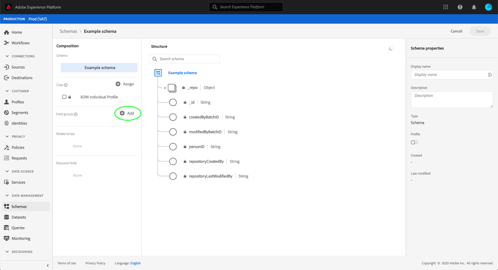
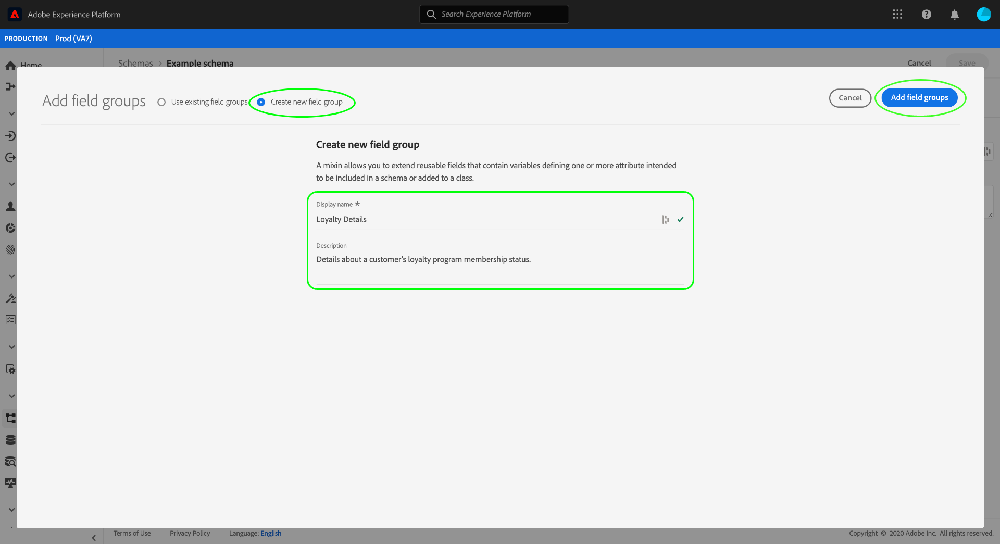
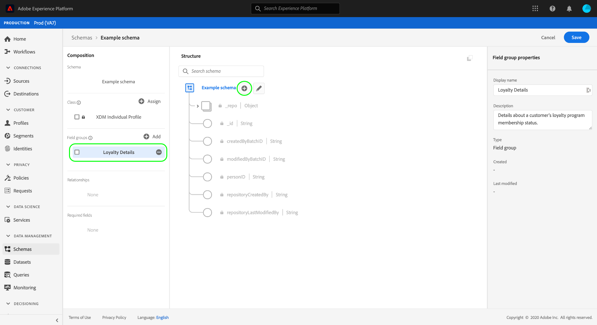
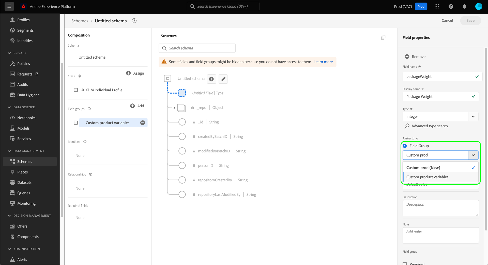
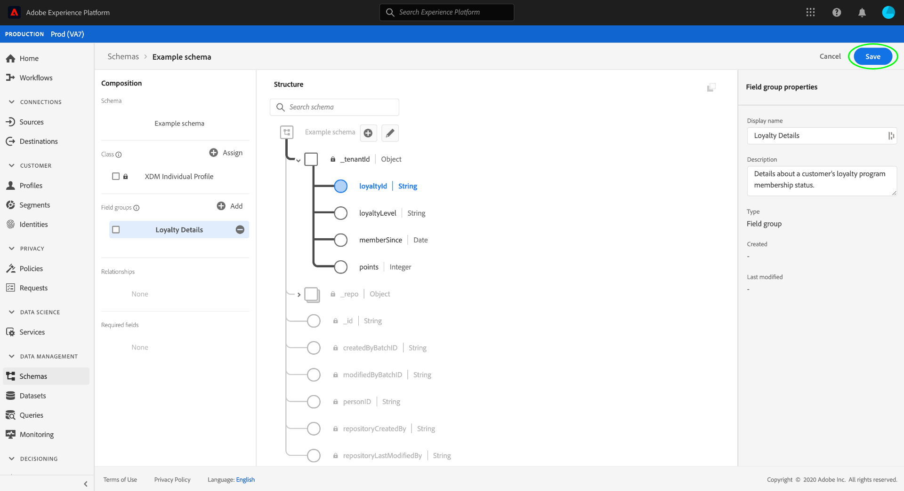

# Create and edit schema field groups in the UI

In Experience Data Model (XDM), schema field groups are reusable components that define one or more fields that implement certain functions such as personal details, hotel preferences, or address. Field groups are intended to be included as part of a schema that implements a compatible class. 

A field group defines which class(es) it is compatible with, based on the behavior of the data that the field group represents (record or time series). This means that not all field groups are available for use with all classes.

Adobe Experience Platform provides many standard field groups that cover a wide range of marketing use cases. However, you can also create and edit your own custom field groups to define additional concepts related to your business within your XDM schemas. This guide provides an overview of how to create, edit, and manage custom field groups for your organization in the Platform UI.

## Prerequisites

This guide requires a working understanding of XDM System. Refer to the [XDM overview](../../home.md) for an introduction to the role of XDM within the Experience Platform ecosystem, and the [basics of schema composition](../../schema/composition.md) for how field groups contribute to XDM schemas.

While not required for this guide, it is recommended that you also follow the tutorial on [composing a schema in the UI](../../tutorials/create-schema-ui.md) to familiarize yourself with the various capabilities of the [!DNL Schema Editor].

## Create a new field group {#create}

To create a new field group, you must first select a schema that the field group will be added to. You can choose to [create a new schema](./schemas.md#create) or [select an existing schema to edit](./schemas.md#edit).

Once you have the schema open in the [!DNL Schema Editor], select **[!UICONTROL Add]** next to the [!UICONTROL Field groups] section in the left rail.

A dialog appears, showing a list of existing field groups for your organization. Near the top of the dialog, select **[!UICONTROL Create new field group]**. Here you can provide a **[!UICONTROL Display name]** and **[!UICONTROL Description]** for the field group. When finished, select **[!UICONTROL Add field group]**.

The [!DNL Schema Editor] reappears, with the new field group listed in the left rail. Since this is a brand new field group, it currently does not provide any fields to the schema, and therefore the canvas remains unchanged. You can now start [adding fields to the field group](#add-fields).

## Edit an existing field group {#edit}

>[!NOTE]
>
>Only custom field groups defined by your organization can be fully edited and customized. For core field groups defined by Adobe, only the display names for their fields can be edited within the context of individual schemas. See the section on [editing display names for schema fields](./schemas.md#display-names) for details.
>
>Once a custom field group has been saved and used in a schema for data ingestion, only additive changes can be made to the field group thereafter. See the [rules of schema evolution](../../schema/composition.md#evolution) for more information.

To edit an existing field group, you must first open a schema that employs the field group within the [!DNL Schema Editor]. You can [select an existing schema to edit](./schemas.md#edit), or you can [create a new schema](./schemas.md#create) and add the field group in question.

Once you have the schema open in the editor, you can start [adding fields to the field group](#add-fields).

## Add fields to a field group {#add-fields}

>[!NOTE]
>
>This section focuses on adding fields to custom field groups. For information on how to add custom fields to standard field groups, refer to the [schemas UI guide](./schemas.md#custom-fields-for-standard-groups).

To add fields to a custom field group in the [!DNL Schema Editor], start by selecting the field group's name in the left rail, then select the **plus (+)** icon next to the schema's name in the canvas.

An **[!UICONTROL Untitled Field]** placeholder appears in in the canvas, and the right rail updates to show controls to configure the field's properties. See the guide on [defining fields in the UI](../fields/overview.md#define) for specific steps on how to configure different field types.

Under **[!UICONTROL Assign to]**, select the **[!UICONTROL Field Group]** option, then use the dropdown to select the desired field group from the list. You can start typing in the name of the field group to narrow down results.

Continue to add as many fields as required to the field group. When finished, select **[!UICONTROL Save]** to save both the schema and the field group.

If the same field group is already employed in other schemas, the newly added fields will automatically appear in those schemas.

## Next steps

This guide covered how to create and edit field groups using the Platform UI. For more information on the capabilities of the [!UICONTROL Schemas] workspace, see the [[!UICONTROL Schemas] workspace overview](../overview.md).

To learn how to manage field groups using the [!DNL Schema Registry] API, see the [field groups endpoint guide](../../api/field-groups.md).
