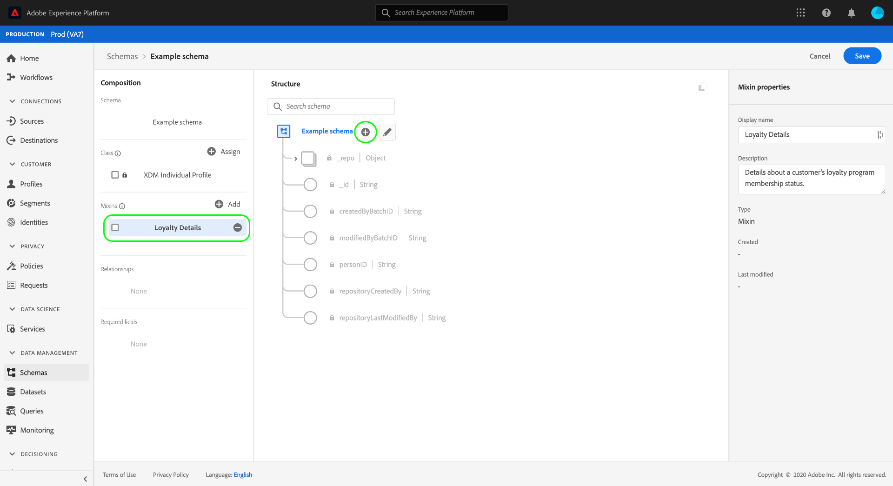
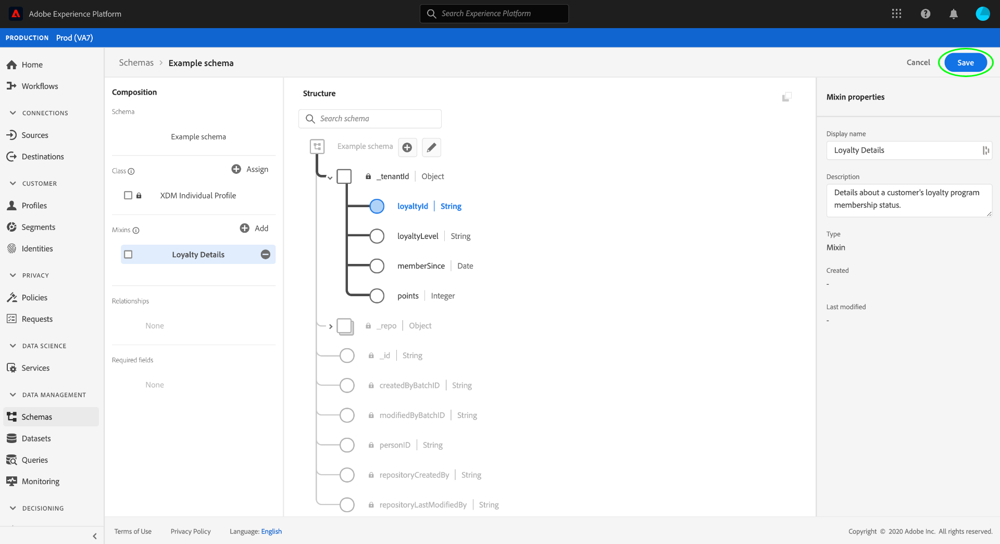

# Create and edit mixins in the UI

In Experience Data Model (XDM), mixins are reusable components that define one or more fields that implement certain functions such as personal details, hotel preferences, or address. Mixins are intended to be included as part of a schema that implements a compatible class. 

A mixin defines which class(es) it is compatible with, based on the behavior of the data that the mixin represents (record or time series). This means that not all mixins are available for use with all classes.

Adobe Experience Platform provides many standard mixins that cover a wide range of marketing use cases. However, you can also create and edit your own custom mixins to define additional concepts related to your business within your XDM schemas. This guide provides an overview of how to create, edit, and manage custom mixins for your organization in the Platform UI.

## Prerequisites

This guide requires a working understanding of XDM System. Refer to the [XDM overview](../../home.md) for an introduction to the role of XDM within the Experience Platform ecosystem, and the [basics of schema composition](../../schema/composition.md) for how mixins contribute to XDM schemas.

While not required for this guide, it is recommended that you also follow the tutorial on [composing a schema in the UI](../../tutorials/create-schema-ui.md) to familiarize yourself with the various capabilities of the [!DNL Schema Editor].

## Create a new mixin {#create}

To create a new mixin, you must first select a schema that the mixin will be added to. You can choose to [create a new schema](./schemas.md#create) or [select an existing schema to edit](./schemas.md#edit).

Once you have the schema open in the [!DNL Schema Editor], select **[!UICONTROL Add]** next to the [!UICONTROL Mixins] section in the left rail.

A dialog appears, showing a list of existing mixins for your organization. Near the top of the dialog, select **[!UICONTROL Create new mixin]**. Here you can provide a **[!UICONTROL Display name]** and **[!UICONTROL Description]** for the mixin. When finished, select **[!UICONTROL Add mixin]**.

The [!DNL Schema Editor] reappears, with the new mixin listed in the left rail. Since this is a brand new mixin, it currently does not provide any fields to the schema, and therefore the canvas remains unchanged. You can now start [adding fields to the mixin](#add-fields).

## Edit an existing mixin {#edit}

>[!NOTE]
>
>Only custom mixins defined by your organization can be fully edited and customized. For core mixins defined by Adobe, only the display names for their fields can be edited within the context of individual schemas. See the section on [editing display names for schema fields](./schemas.md#display-names) for details.
>
>Once a custom mixin has been saved and used in a schema for data ingestion, only additive changes can be made to the mixin thereafter. See the [rules of schema evolution](../../schema/composition.md#evolution) for more information.

To edit an existing mixin, you must first open a schema that employs the mixin within the [!DNL Schema Editor]. You can [select an existing schema to edit](./schemas.md#edit), or you can [create a new schema](./schemas.md#create) and add the mixin in question.

Once you have the schema open in the editor, you can start [adding fields to the mixin](#add-fields).

## Add fields to a mixin {#add-fields}

To add fields to a mixin in the [!DNL Schema Editor], start by selecting the mixin's name in the left rail, then select the **plus (+)** icon next to the schema's name in the canvas.

A **[!UICONTROL New field]** appears in in the canvas, and the right rail updates to show controls to configure the field's properties. See the guide on [defining fields in the UI](../fields/overview.md#define) for specific steps on how to configure and add the field to the mixin.

Continue to add as many fields as required to the mixin. When finished, select **[!UICONTROL Save]** to save both the schema and the mixin.

If the same mixin is already employed in other schemas, the newly added fields will automatically appear in those schemas.

## Next steps

This guide covered how to create and edit mixins using the Platform UI. For more information on the capabilities of the [!UICONTROL Schemas] workspace, see the [[!UICONTROL Schemas] workspace overview](../overview.md).

To learn how to manage mixins using the [!DNL Schema Registry] API, see the [mixins endpoint guide](../../api/mixins.md).