# Create and edit schemas in the UI

This guide provides an overview of how to create, edit, and manage Experience Data Model (XDM) schemas for your organization in the Adobe Experience Platform UI.

>[!IMPORTANT]
>
>XDM schemas are extremely customizable, and therefore the steps involved in creating a schema can vary depending on what kind of data you want the schema to capture. As a result, this document only covers the basic interactions you can make with schemas in the UI, and excludes related steps such as customizing classes, schema field groups, data types, and fields.
>
>For a full tour of the schema creation process, follow along with the [schema creation tutorial](../../tutorials/create-schema-ui.md) to create a complete example schema and familiarize yourself with the many capabilities of the [!DNL Schema Editor].

## Prerequisites

This guide requires a working understanding of XDM System. Refer to the [XDM overview](../../home.md) for an introduction to the role of XDM within the Experience Platform ecosystem, and the [basics of schema composition](../../schema/composition.md) for an overview of how schemas are constructed.

## Create a new schema {#create}

In the [!UICONTROL Schemas] workspace, select **[!UICONTROL Create schema]** in the top-right corner. In the dropdown that appears, you can choose between **[!UICONTROL XDM Individual Profile]** and **[!UICONTROL XDM ExperienceEvent]** as the base class for the schema. Alternatively, you can select **[!UICONTROL Browse]** to select from the full list of available classes, or [create a new custom class](./classes.md#create) instead.

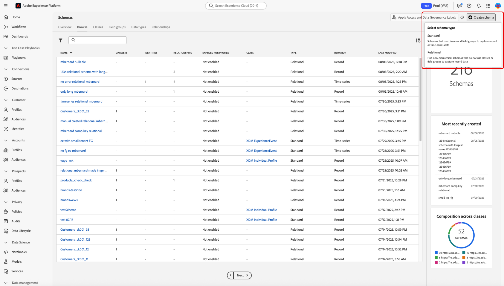

Once you select a class, the [!DNL Schema Editor] appears and the schema's base structure (provided by the class) is shown in the canvas. From here, you can use the right rail to add a **[!UICONTROL Display name]** and **[!UICONTROL Description]** for the schema.

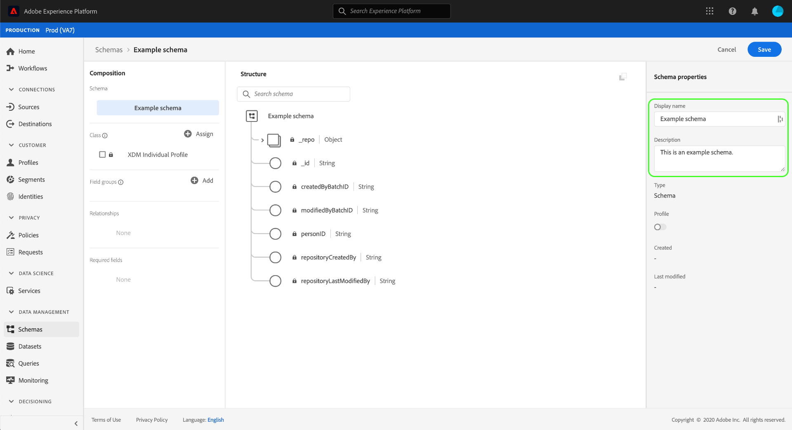

You can now start building the structure of the schema by [adding schema field groups](#add-field-groups).

## Edit an existing schema {#edit}

>[!NOTE]
>
>Once a schema has been saved and used in data ingestion, only additive changes can be made to it. See the [rules of schema evolution](../../schema/composition.md#evolution) for more information.

To edit an existing schema, select the **[!UICONTROL Browse]** tab, and then select the name of the schema you want to edit.

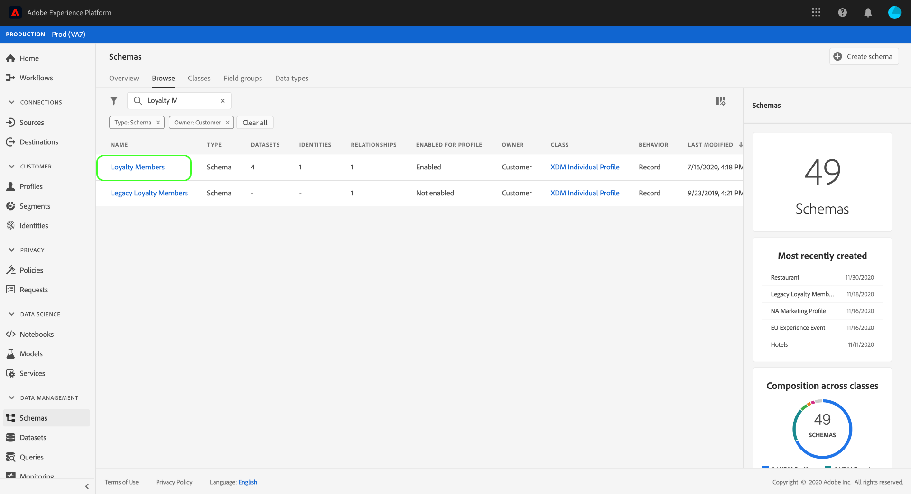

>[!TIP]
>
>You can use the workspace's search and filtering capabilities to help find the schema easier. See the guide on [exploring XDM resources](../explore.md) for more information.

Once you select a schema, the [!DNL Schema Editor] appears with the schema's structure shown in the canvas. You can now [add field groups](#add-field-groups) to the schema (or [add individual fields](#add-individual-fields) from those groups), [edit field display names](#display-names), or [edit existing custom field groups](./field-groups.md#edit) if the schema employs any.

## Add field groups to a schema {#add-field-groups}

>[!NOTE]
>
>This section covers how to add existing field groups to a schema. If you want to create a new custom field group, see the guide on [creating and editing field groups](./field-groups.md#create) instead.

Once you have opened a schema within the [!DNL Schema Editor], you can add fields to the schema through the use of field groups. To start, select **[!UICONTROL Add]** next to **[!UICONTROL Field groups]** in the left rail.

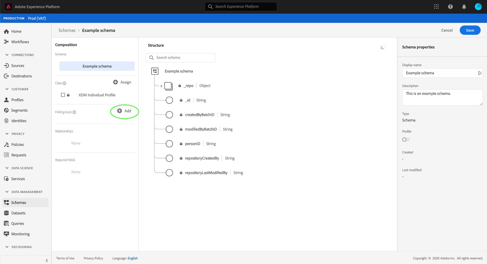

A dialog appears, showing a list of field groups that you can select for the schema. Since field groups are only compatible with one class, only those field groups that are associated with the schema's selected class will be listed. By default, listed field groups are sorted based on their usage popularity within your organization.

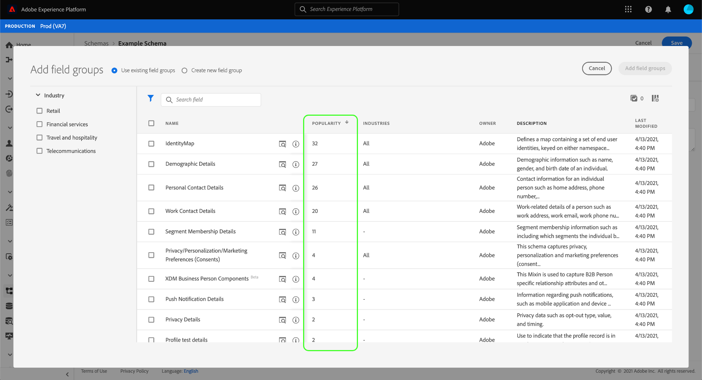

If you know the general activity or business area of the fields you want to add, select one or more of the industry-vertical categories in the left rail to filter the displayed list of field groups.

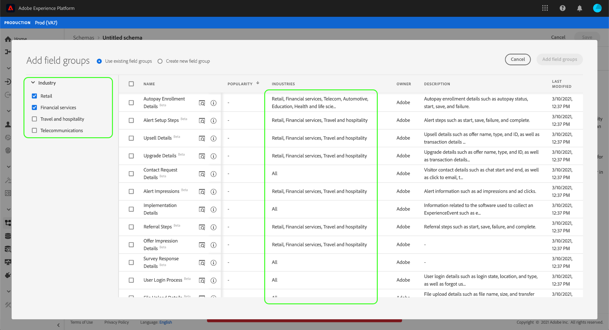

>[!NOTE]
>
>For more information on best practices for industry-specific data modeling in XDM, see the documentation on [industry data models](../../schema/industries/overview.md).

You can also use the search bar to help locate your desired field group. Field groups whose name matches the query appear at the top of the list. Under **[!UICONTROL Standard Fields]**, field groups containing fields that describe desired data attributes are displayed.

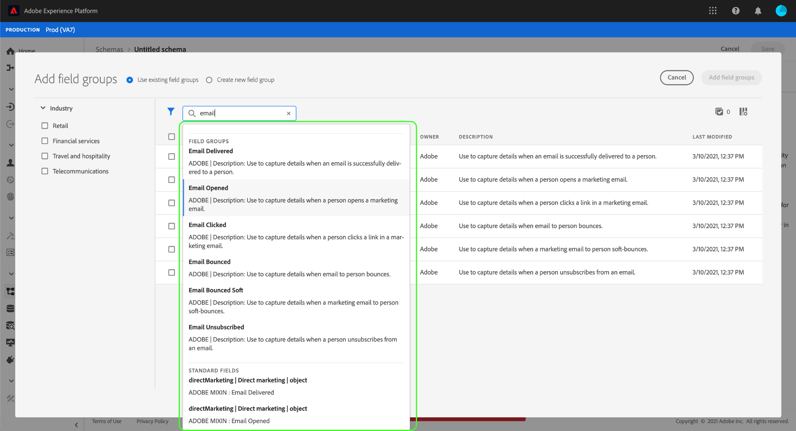

Select the checkbox next to the name of the field group that you wish to add to the schema. You can select multiple field groups from the list, with each selected field group appearing in the right rail.

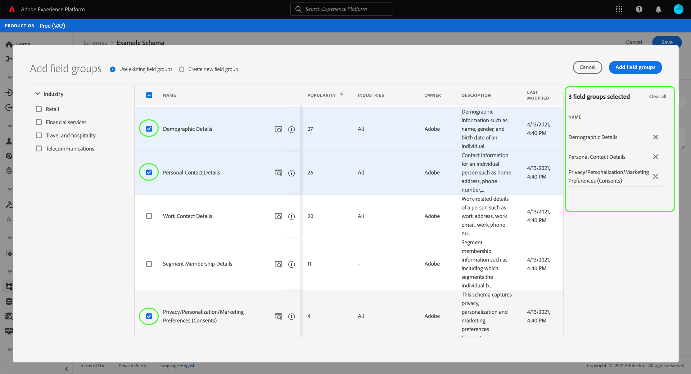

>[!TIP]
>
>For any listed field group, you can hover or focus on the information icon () to view a brief description of the kind of data the field group captures. You can also select the preview icon () to view the structure of the fields that the field group provides before you decide to add it to the schema.

Once you have chosen your field groups, select **[!UICONTROL Add field groups]** to add them to the schema.

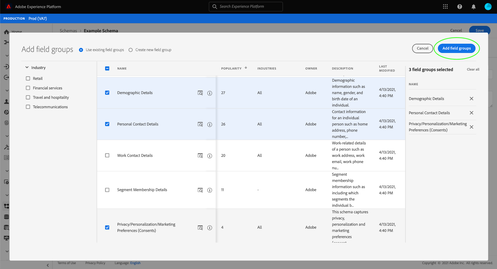

The [!DNL Schema Editor] reappears with the field-group-provided fields represented in the canvas.

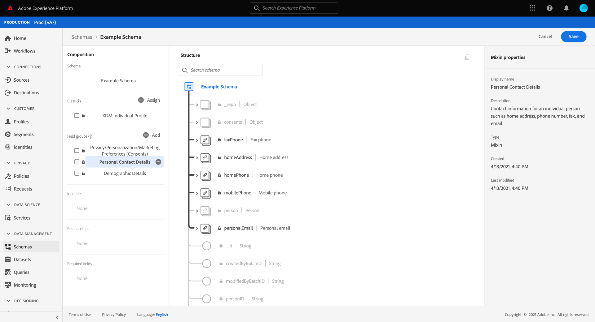

After adding a field group to a schema, you can optionally [remove existing fields](#remove-fields) or [add new custom fields](#add-fields) to those groups, depending on your needs.

### Remove fields added from field groups {#remove-fields}

After you have added a field group to a schema, you can remove any fields that you do not need. 

>[!NOTE]
>
>Removing fields from a field group only affects the schema being worked on and does not affect the field group itself. If you remove fields in one schema, those fields are still available in all other schemas that employ the same field group.

In the following example, the standard field group **[!UICONTROL Demographic Details]** has been added to a schema. To remove a single field such as `taxId`, select the field in the canvas and then select **[!UICONTROL Remove]** in the right rail.

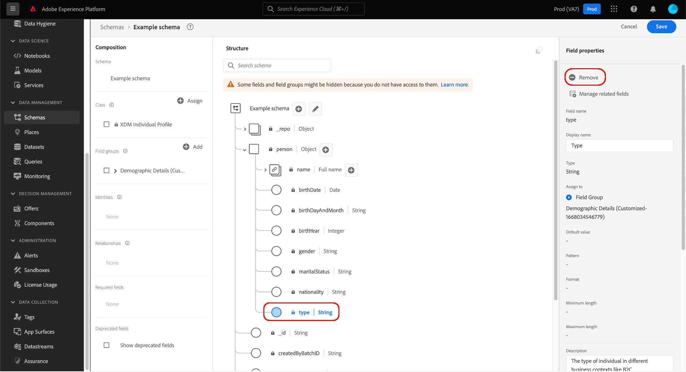

If there are multiple fields you wish to remove, you can manage the field group as a whole. Select a field belonging to the group in the canvas, then select **[!UICONTROL Manage related fields]** in the right rail.

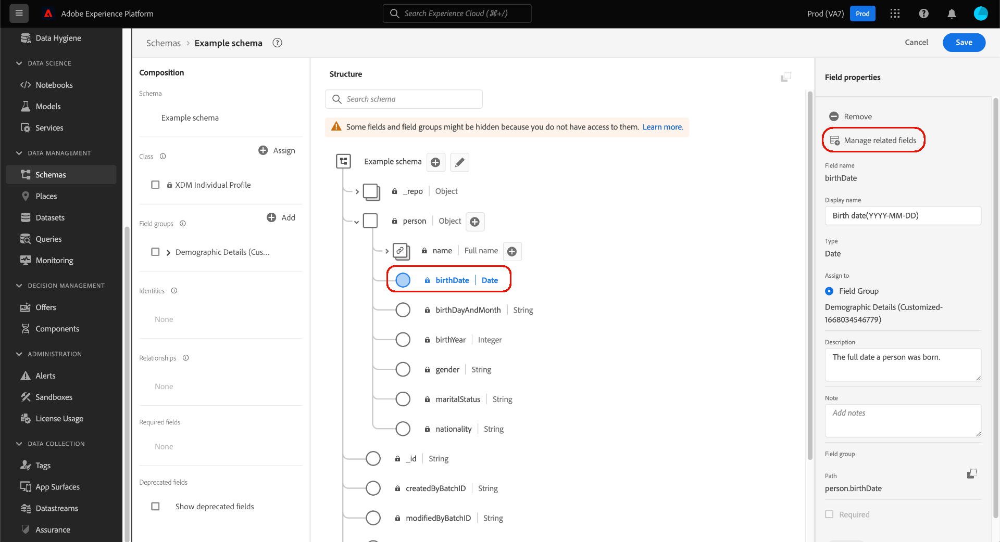

A dialog appears showing the structure of the field group in question. From here you can use the provided checkboxes to select or deselect the fields that you require. When you are satisfied, select **[!UICONTROL Confirm]**.

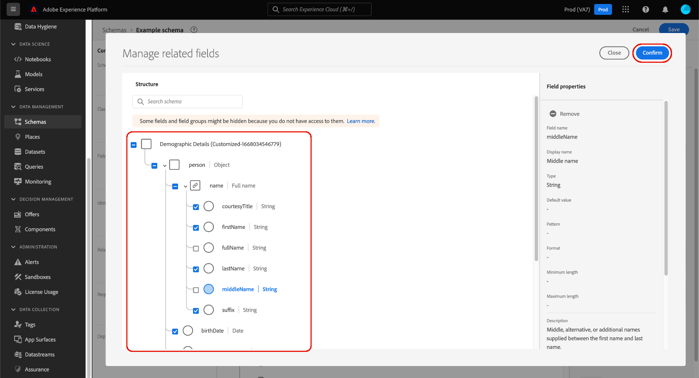

The canvas reappears with only the selected fields present in the schema structure.

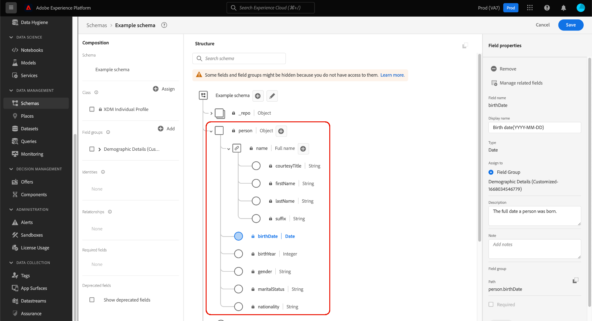

### Add custom fields to field groups {#add-fields}

After you have added a field group to a schema, you can define additional fields for that group. However, any fields added to a field group in one schema will also appear in all other schemas that employ that same field group.

In addition, if a custom field is added to a standard field group, that field group will be converted to a custom field group and the original standard field group will no longer be available.

If you want to add a custom field to a standard field group, refer to the [section below](#custom-fields-for-standard-groups) for specific instructions. If you are adding fields to a custom field group, refer to section on [editing custom field groups](./field-groups.md) in the field groups UI guide.

If you do not want to alter any existing field groups, you can [create a new custom field group](./field-groups.md#create) to define additional fields instead.

## Add individual fields to a schema {#add-individual-fields}

The Schema Editor allows you to add individual fields directly to a schema if you want to avoid adding an entire field group for a specific use case. You can [add individual fields from standard field groups](#add-standard-fields) or [add your own custom fields](#add-custom-fields) instead.

>[!IMPORTANT]
>
>Even though the Schema Editor functionally allows you to add individual fields directly to a schema, this does not change the fact that all fields in an XDM schema must be provided by its class or a field group that is compatible with that class. As the sections below explain, all individual fields are still associated with a field group as a key step when they are added to a schema.

### Add standard fields {#add-standard-fields}

You can add fields from standard field groups directly to a schema without needing to know their corresponding field group beforehand. To add a standard field to a schema, select the plus (**+**) icon next to the schema's name in the canvas. An **[!UICONTROL Untitled Field]** placeholder appears in the schema structure and the right rail updates to reveal controls to configure the field.

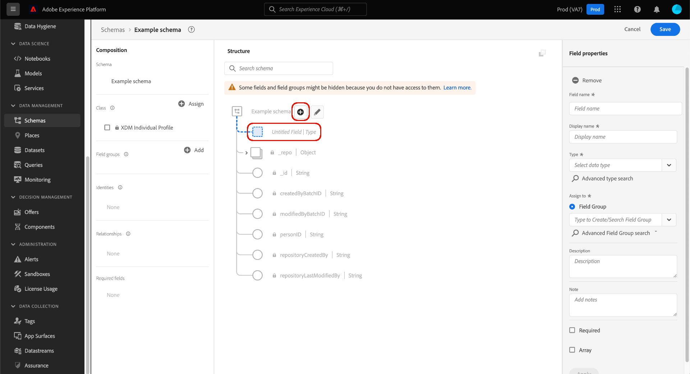

Under **[!UICONTROL Field name]**, start typing the name of the field you wish to add. The system automatically searches for standard fields that match the query and lists them under **[!UICONTROL Recommended Standard Fields]**, including the field groups that they belong to.

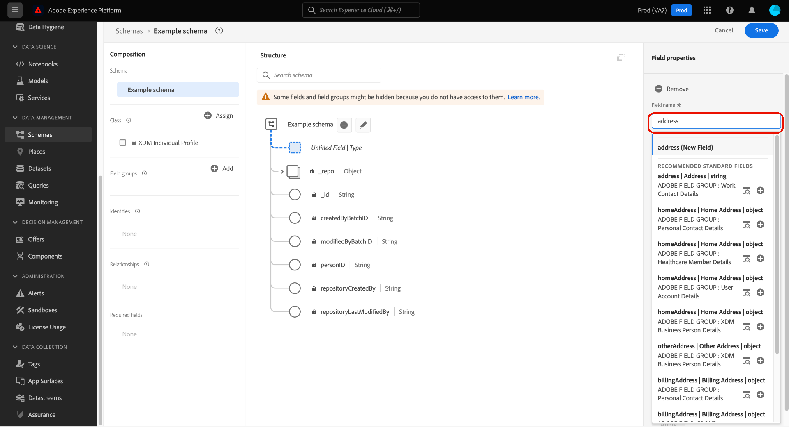

While some standard fields share the same name, their structure may vary depending on the field group they come from. If a standard field is nested within a parent object in the field group structure, the parent field will also be included in the schema if the child field is added.

Select the preview icon () next to a standard field to view the structure of its field group and better understand how it might be nested. To add the standard field to the schema, select the plus icon ().

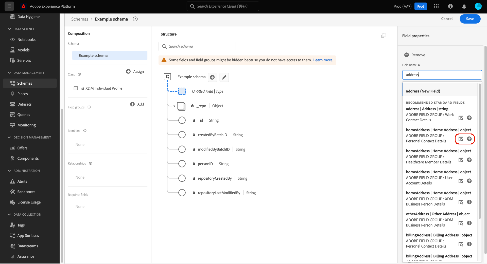

The canvas updates to show the standard field added to the schema, including any parent fields that it is nested under within the field group structure. The name of the field group is also listed under **[!UICONTROL Field groups]** in the left rail. If you want to add more fields from the same field group, select **[!UICONTROL Manage related fields]** in the right rail.

### Add custom fields {#add-custom-fields}

Similar to the workflow for standard fields, you can also add your own custom fields directly to a schema. 

To add fields to the root level of a schema, select the plus (**+**) icon next to the schema's name in the canvas. An **[!UICONTROL Untitled Field]** placeholder appears in the schema structure and the right rail updates to reveal controls to configure the field.

Start typing in the name of the field you wish to add, and the system automatically starts searching for matching standard fields. To create a new custom field instead, select the top option appended with **([!UICONTROL New Field])**.

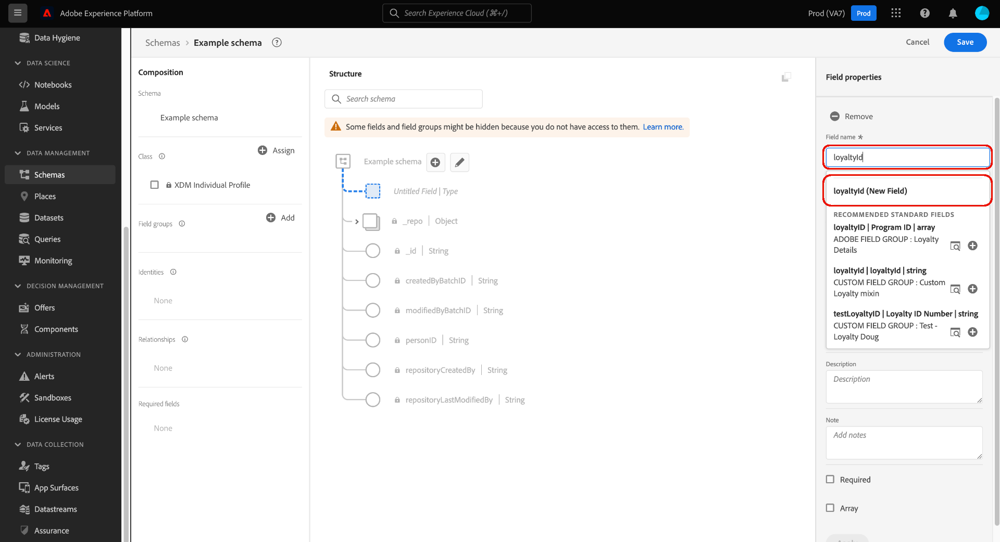

From here, provide a display name and data type for the field. Under **[!UICONTROL Assign field group]**, you must select a field group for the new field to be associated with. Start typing in the name of the field group, and if you have previously [created custom field groups](./field-groups.md#create) they will appear in the dropdown list. Alternatively, you can type a unique name into the field to create a new field group instead.

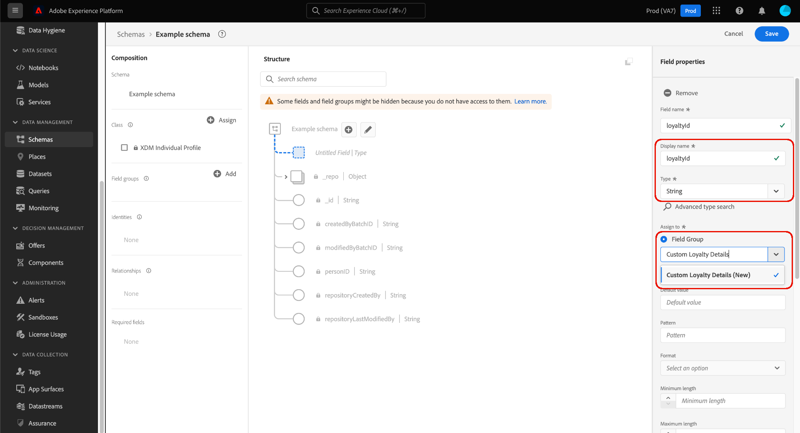

>[!WARNING]
>
>If you select an existing custom field group, any other schemas that employ that field group will also inherit the newly added field after you save your changes. For this reason, only select an existing field group if you want this type of propagation. Otherwise, you should opt to create a new custom field group instead.

When finished, select **[!UICONTROL Apply]**.

The new field is added to the canvas, and is namespaced under your [tenant ID](../../api/getting-started.md#know-your-tenant_id) to avoid conflicts with standard XDM fields. The field group that you associated the new field with also appears under **[!UICONTROL Field groups]** in the left rail. 

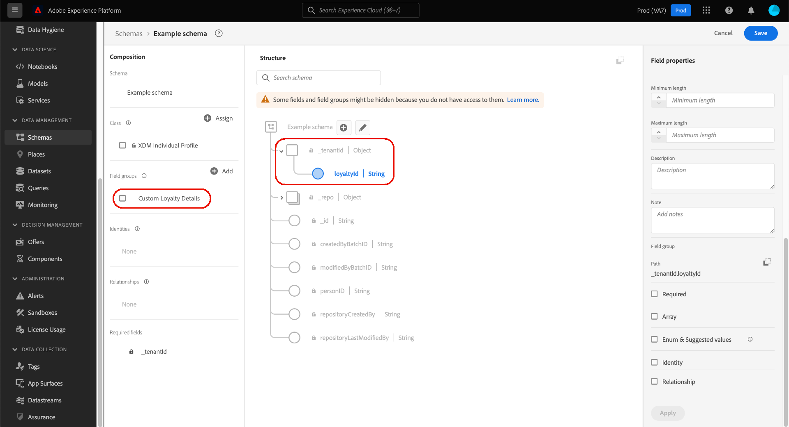

>[!NOTE]
>
>The rest of the fields provided by the selected custom field group are removed from the schema by default. If you want to add some of these fields to the schema, select a field belonging to the group and then select **[!UICONTROL Manage related fields]** in the right rail.

#### Add custom fields to the structure of standard field groups {#custom-fields-for-standard-groups}

If the schema you are working on has an object-type field provided by a standard field group, you can add your own custom fields to that standard object.

>[!WARNING]
>
>Any fields added to a field group in one schema will also appear in all other schemas that employ that same field group. In addition, if a custom field is added to a standard field group, that field group will be converted to a custom field group and the original standard field group will no longer be available.
>
>If you participated in the beta for this feature, you will receive a dialog informing you of the standard field groups that you have previously customized. Once you select **[!UICONTROL Acknowledge]**, the listed resources are converted to custom field groups.
>
>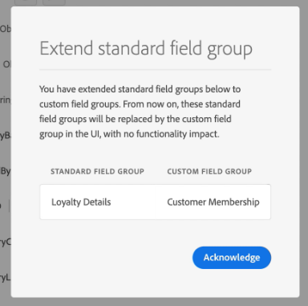

To start, select the plus (**+**) icon next to the root of the object provided by the standard field group.

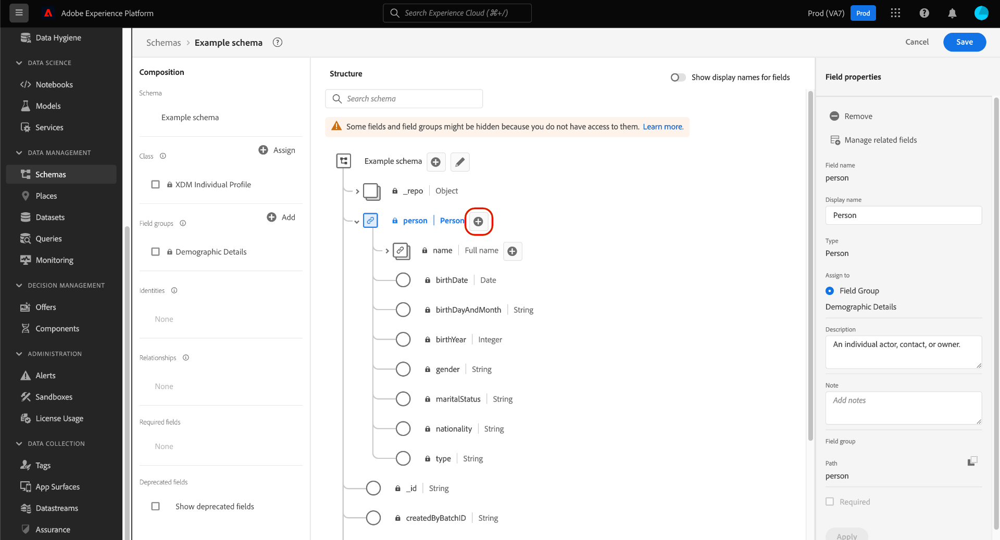

A warning message appears, prompting you to confirm whether you want to convert the standard field group. Select **[!UICONTROL Continue creating field group]** to proceed.

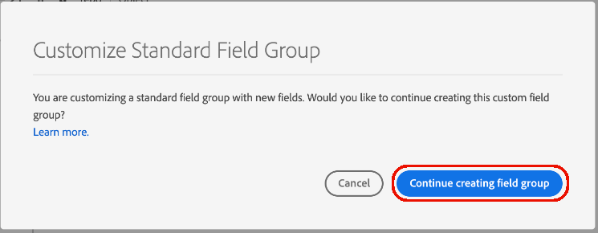

The canvas reappears with an untitled placeholder for the new field. Note that the name of the standard field group has been appended with "([!UICONTROL Extended])" to indicate that it has been modified from the original version. From here, use the controls in the right rail to define the field's properties.

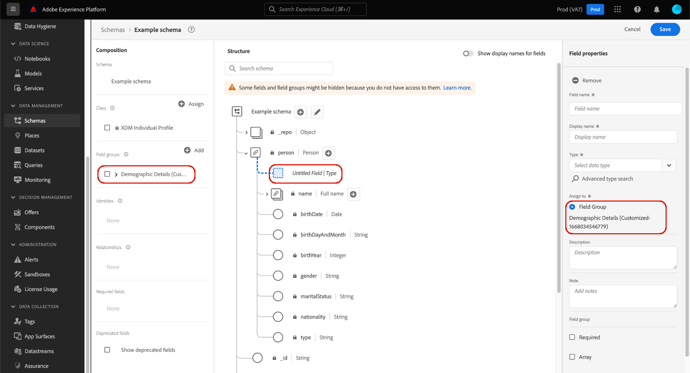

After applying your changes, the new field appears under your tenant ID namespace within the standard object. This nested namespace prevents field-name conflicts within the field group itself in order to avoid breaking changes in other schemas that use the same field group.

## Enable a schema for Real-time Customer Profile {#profile}

>[!CONTEXTUALHELP]
>id="platform_schemas_enableforprofile"
>title="Enable a schema for Profile"
>abstract="When a schema is enabled for Profile, any datasets created from this schema participate in Real-time Customer Profile, which merges data from disparate sources to construct a complete view of each customer. Once a schema is used to ingest data into Profile, it cannot be disabled. See the documentation for more information."

[Real-time Customer Profile](../../../profile/home.md) merges data from disparate sources to construct a complete view of each individual customer. If you want the data captured by a schema to participate in this process, you must enable the schema for use in [!DNL Profile].

>[!IMPORTANT]
>
>In order to enable a schema for [!DNL Profile], it must have a primary identity field defined. See the guide on [defining identity fields](../fields/identity.md) for more information.

To enable the schema, start by selecting the schema's name in the left rail, then select the **[!UICONTROL Profile]** toggle in the right rail.

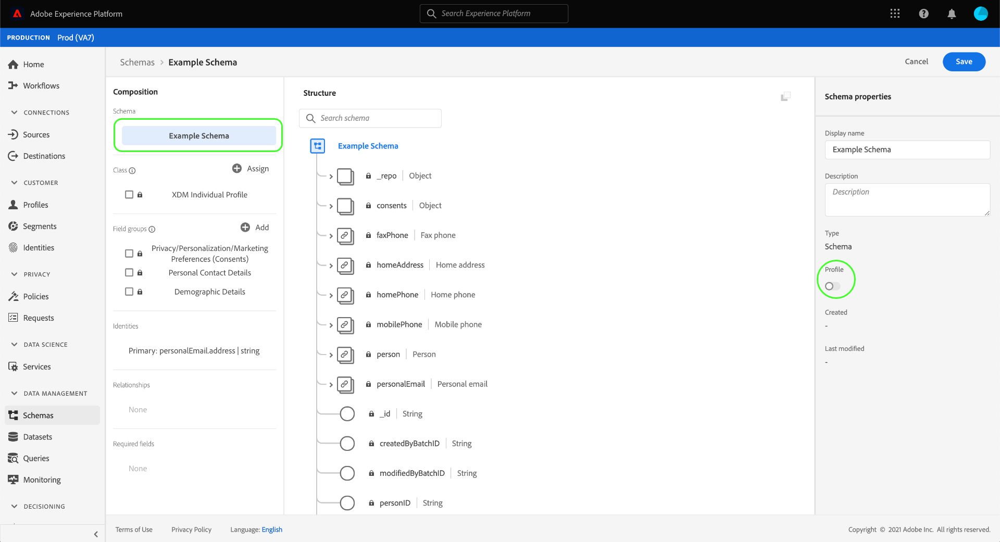

A popover appears, warning you that once a schema has been enabled and saved, it cannot be disabled. Select **[!UICONTROL Enable]** to continue.

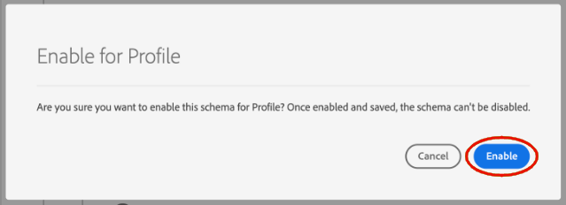

The canvas reappears with the [!UICONTROL Profile] toggle enabled.

>[!IMPORTANT]
>
>Since the schema is not saved yet, this is the point of no return if you change your mind about letting the schema participate in Real-time Customer Profile: once you save an enabled schema, it can no longer be disabled. Select the **[!UICONTROL Profile]** toggle again to disable the schema.

To finish the process, select **[!UICONTROL Save]** to save the schema.

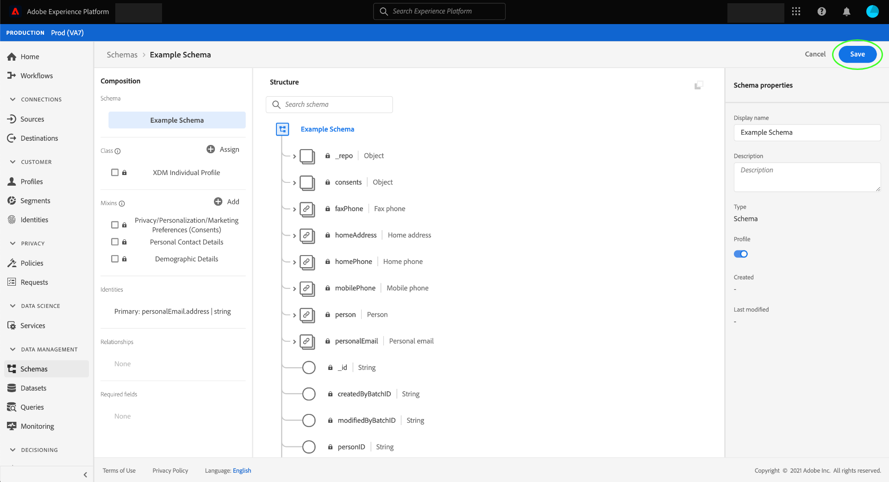

The schema is now enabled for use in Real-time Customer Profile. When Platform ingests data into datasets based on this schema, that data will be incorporated into your amalgamated Profile data.

## Edit display names for schema fields {#display-names}

Once you have assigned a class and added field groups to a schema, you can edit the display names of any of the schema's fields, regardless of whether those fields have been provided by standard or custom XDM resources.

>[!NOTE]
>
>Keep in mind that the display names of fields that belong to standard classes or field groups can only be edited in the context of a specific schema. In other words, changing the display name of a standard field in one schema does not affect other schemas that employ the same associated class or field group.
>
>Once you make changes the display names for a schema's fields, those changes are immediately reflected in any existing datasets based on that schema.

To edit the display name of a schema field, select the field in the canvas. In the right rail, provide the new name under **[!UICONTROL Display name]**.

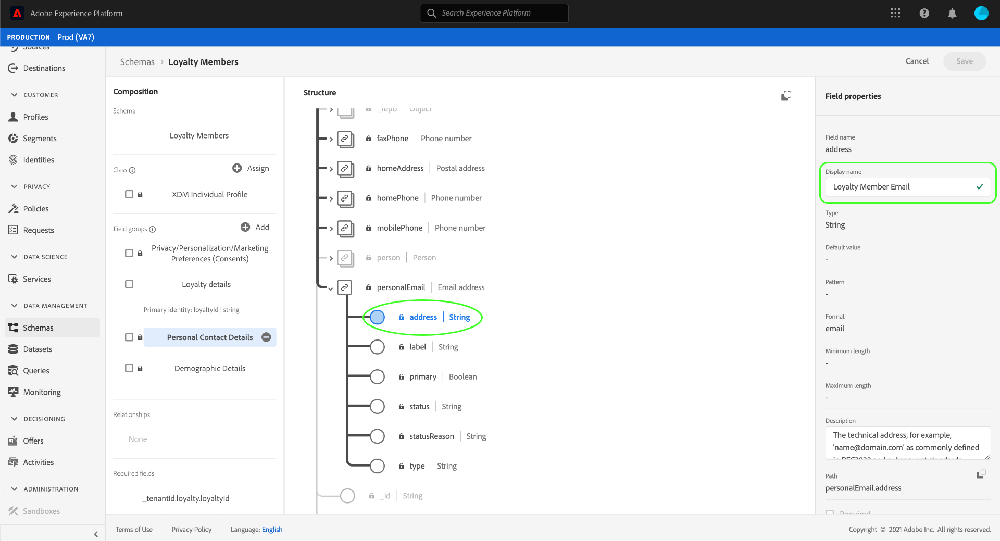

Select **[!UICONTROL Apply]** in the right rail, and the canvas updates to show the field's new display name. Select **[!UICONTROL Save]** to apply the changes to the schema.

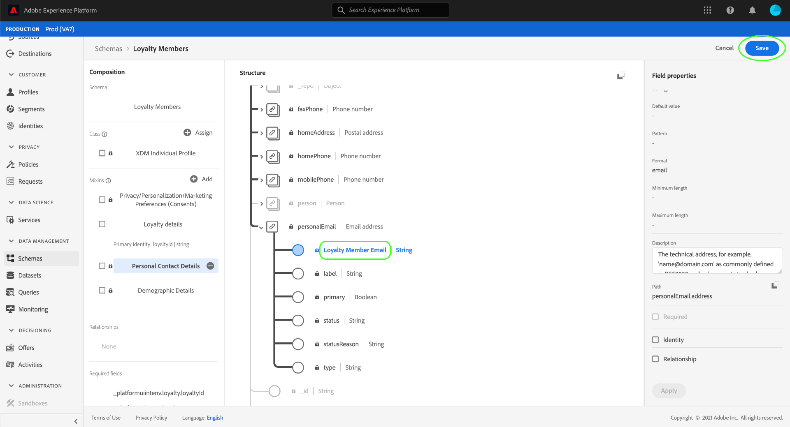

## Change a schema's class {#change-class}

You can change the class of a schema at any point during the initial composition process before the schema has been saved.

>[!WARNING]
>
>Reassigning the class for a schema should be done with extreme caution. Field groups are only compatible with certain classes, and therefore changing the class will reset the canvas and any fields you have added. 

To reassign a class, select **[!UICONTROL Assign]** in the left-hand side of the canvas.

A dialog appears that displays a list of all available classes, including any defined by your organization (the owner being "[!UICONTROL Customer]") as well as standard classes defined by Adobe. 

Select a class from the list to display its description on the right-hand side of the dialog. You can also select **[!UICONTROL Preview class structure]** to see the fields and metadata associated with the class. Select **[!UICONTROL Assign class]** to continue.

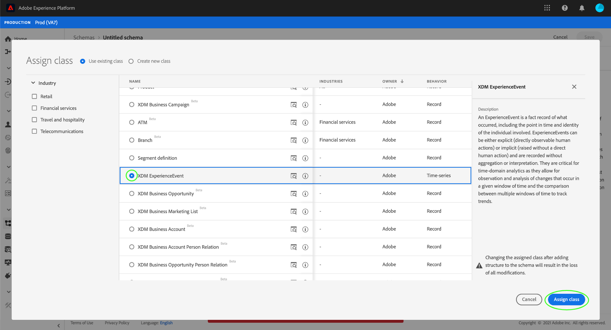

A new dialog opens, asking you to confirm that you wish to assign a new class. Select **[!UICONTROL Assign]** to confirm.

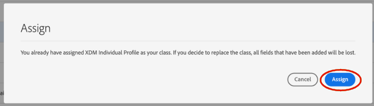

After confirming the class change, the canvas will be reset and all composition progress will be lost.

## Next steps

This document covered the basics of creating and editing schemas in the Platform UI. It is strongly recommended that you review the [schema creation tutorial](../../tutorials/create-schema-ui.md) for a comprehensive workflow for building a complete schema in the UI, including creating custom field groups and data types for unique use cases.

For more information on the capabilities of the [!UICONTROL Schemas] workspace, see the [[!UICONTROL Schemas] workspace overview](../overview.md).

To learn how to manage schemas in the [!DNL Schema Registry] API, see the [schemas endpoint guide](../../api/schemas.md).
