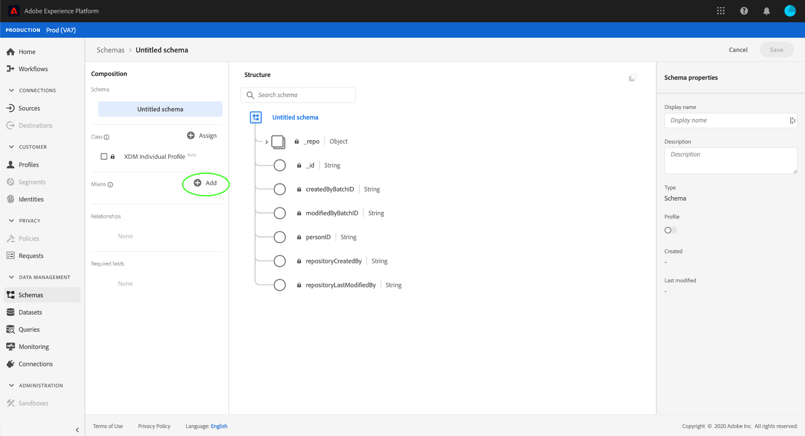
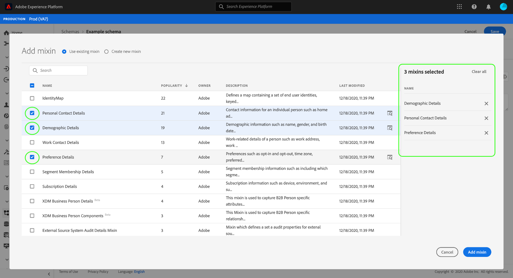
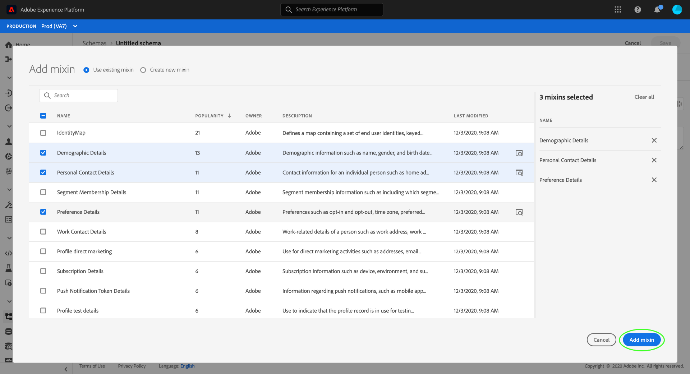
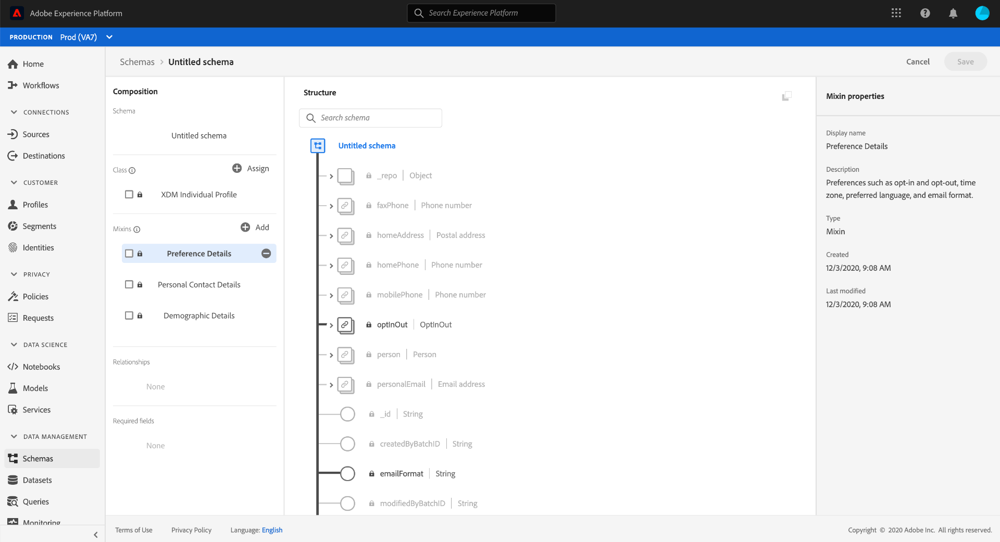

# Create and edit schemas in the UI

This document provides an overview of how to create, edit, and manage custom Experience Data Model (XDM) schemas for your organization in the Adobe Experience Platform UI.

>[!IMPORTANT]
>
>XDM schemas are extremely customizable, and therefore the steps involved in creating a schema can vary depending on what kind of data you want the schema to capture. As a result, this document only covers the basic interactions you can make with schemas in the UI, and excludes related steps such as customizing classes, mixins, data types, and fields.
>
>For a full tour of the schema creation process, follow along with the [schema creation tutorial](../../tutorials/create-schema-ui.md) to create a complete example schema and familiarize yourself with the many capabilities of the [!DNL Schema Editor].

## Prerequisites

This guide requires a working understanding of XDM System. Refer to the [XDM overview](../../home.md) for an introduction to the role of XDM within the Experience Platform ecosystem, and the [basics of schema composition](../../schema/composition.md) for an overview of how schemas are constructed.

## Create a new schema {#create}

In the [!UICONTROL Schemas] workspace, select **[!UICONTROL Create schema]** in the top-right corner. In the dropdown that appears, you can choose between **[!UICONTROL XDM Individual Profile]** and **[!UICONTROL XDM ExperienceEvent]** as the base class for the schema. Alternatively, you can select **[!UICONTROL Browse]** to select from the full list of available classes, or [create a new custom class](./classes.md#create) instead.

Once you select a class, the [!DNL Schema Editor] appears and the schema's base structure (provided by the class) is shown in the canvas. From here, you can start to [add mixins](#add-mixin) to the schema.

## Edit an existing schema {#edit}

To edit an existing schema, select the **[!UICONTROL Browse]** tab, and then select the name of the schema you want to edit.

>[!TIP]
>
>You can use the workspace's search and filtering capabilities to help find the schema easier. See the guide on [exploring XDM resources](../explore.md) for more information.

Once you select a schema, the [!DNL Schema Editor] appears with the schema's structure shown in the canvas. You can now [add mixins](#add-mixin) to the schema, or [edit existing custom mixins](./mixins.md#edit) if the schema employs any.

>[!NOTE]
>
>Keep in mind that once a schema has been saved and used in data ingestion, only additive changes can be made to it. See the [rules of schema evolution](../../schema/composition.md#evolution) for more information.

## Add mixins to a schema {#add-mixin}

>[!NOTE]
>
>This section covers how to add existing mixins to a schema. If you want to create a new custom mixin, see the guide on [creating and editing mixins](./mixins.md#create) instead.

Once you have opened a schema within the [!DNL Schema Editor], you can add fields to the schema through the use of mixins. To start, select **[!UICONTROL Add]** next to to **[!UICONTROL Mixins]** in the left rail.

In the dialog that appears, you can select the desired mixins from the list. You can select multiple mixins from the list, with each selected mixin appearing in the right rail.

>[!TIP]
>
>For any listed mixin, you can select the preview icon () to view the structure of the fields that the mixin provides before you decide to add it to the schema.

Once you have finished choosing mixin, select **[!UICONTROL Add mixin]** to add them to the schema.

The [!DNL Schema Editor] reappears with the mixin-provided fields represented in the canvas.

## Change a schema's class {#change-class}

You can change the class of a schema at any point during the initial composition process before the schema has been saved.

>[!WARNING]
>
>Reassigning the class for a schema should be done with extreme caution. Mixins are only compatible with certain classes, and therefore changing the class will reset the canvas and any fields you have added. 

To reassign a class, select **[!UICONTROL Assign]** in the left-hand side of the canvas.

A dialog appears that displays a list of all available classes, including any defined by your organization (the owner being "[!UICONTROL Customer]") as well as standard classes defined by Adobe. 

Select a class from the list to display its description on the right-hand side of the dialog. You can also select **[!UICONTROL Preview class structure]** to see the fields and metadata associated with the class. Select **[!UICONTROL Assign class]** to continue.

A new dialog opens asking you to confirm that you wish to assign a new class. Select **[!UICONTROL Assign]** to confirm.

After confirming the class change, the canvas will be reset and all composition progress will be lost.

## Next steps

This document covered the basics of creating and editing schemas in the Platform UI. It is strongly recommended that you review the [schema creation tutorial](../../tutorials/create-schema-ui.md) for a comprehensive workflow for building a complete schema in the UI, including creating custom mixins and data types for unique use cases.

For more information on the capabilities of the [!UICONTROL Schemas] workspace, see the [[!UICONTROL Schemas] workspace overview](../overview.md).

To learn how to manage schemas in the [!DNL Schema Registry] API, see the [schemas endpoint guide](../../api/schemas.md).